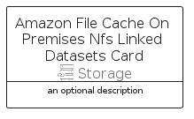

# AmazonFileCacheOnPremisesNfsLinkedDatasets


```text
aws-q1-2025/Resource/Storage/AmazonFileCacheOnPremisesNfsLinkedDatasets
```

```text
include('aws-q1-2025/Resource/Storage/AmazonFileCacheOnPremisesNfsLinkedDatasets')
```


| Illustration | AmazonFileCacheOnPremisesNfsLinkedDatasets | AmazonFileCacheOnPremisesNfsLinkedDatasetsCard | AmazonFileCacheOnPremisesNfsLinkedDatasetsGroup |
| :---: | :---: | :---: | :---: |
|  |  |  |  |


## Sprites
The item provides the following sriptes:

- `<$AmazonFileCacheOnPremisesNfsLinkedDatasetsXs>`
- `<$AmazonFileCacheOnPremisesNfsLinkedDatasetsSm>`
- `<$AmazonFileCacheOnPremisesNfsLinkedDatasetsMd>`
- `<$AmazonFileCacheOnPremisesNfsLinkedDatasetsLg>`


## AmazonFileCacheOnPremisesNfsLinkedDatasets

### Load remotely
```plantuml
@startuml
' configures the library
!global $LIB_BASE_LOCATION="https://raw.githubusercontent.com/tmorin/plantuml-libs/master/distribution"

' loads the library's bootstrap
!include $LIB_BASE_LOCATION/bootstrap.puml

' loads the package bootstrap
include('aws-q1-2025/bootstrap')

' loads the Item which embeds the element AmazonFileCacheOnPremisesNfsLinkedDatasets
include('aws-q1-2025/Resource/Storage/AmazonFileCacheOnPremisesNfsLinkedDatasets')

' renders the element
AmazonFileCacheOnPremisesNfsLinkedDatasets('AmazonFileCacheOnPremisesNfsLinkedDatasets', 'Amazon File Cache On Premises Nfs Linked Datasets', 'an optional tech label', 'an optional description')
@enduml
```

### Load locally
```plantuml
@startuml
' configures the library
!global $INCLUSION_MODE="local"
!global $LIB_BASE_LOCATION="../../.."

' loads the library's bootstrap
!include $LIB_BASE_LOCATION/bootstrap.puml

' loads the package bootstrap
include('aws-q1-2025/bootstrap')

' loads the Item which embeds the element AmazonFileCacheOnPremisesNfsLinkedDatasets
include('aws-q1-2025/Resource/Storage/AmazonFileCacheOnPremisesNfsLinkedDatasets')

' renders the element
AmazonFileCacheOnPremisesNfsLinkedDatasets('AmazonFileCacheOnPremisesNfsLinkedDatasets', 'Amazon File Cache On Premises Nfs Linked Datasets', 'an optional tech label', 'an optional description')
@enduml
```

## AmazonFileCacheOnPremisesNfsLinkedDatasetsCard

### Load remotely
```plantuml
@startuml
' configures the library
!global $LIB_BASE_LOCATION="https://raw.githubusercontent.com/tmorin/plantuml-libs/master/distribution"

' loads the library's bootstrap
!include $LIB_BASE_LOCATION/bootstrap.puml

' loads the package bootstrap
include('aws-q1-2025/bootstrap')

' loads the Item which embeds the element AmazonFileCacheOnPremisesNfsLinkedDatasetsCard
include('aws-q1-2025/Resource/Storage/AmazonFileCacheOnPremisesNfsLinkedDatasets')

' renders the element
AmazonFileCacheOnPremisesNfsLinkedDatasetsCard('AmazonFileCacheOnPremisesNfsLinkedDatasetsCard', 'Amazon File Cache On Premises Nfs Linked Datasets Card', 'an optional description')
@enduml
```

### Load locally
```plantuml
@startuml
' configures the library
!global $INCLUSION_MODE="local"
!global $LIB_BASE_LOCATION="../../.."

' loads the library's bootstrap
!include $LIB_BASE_LOCATION/bootstrap.puml

' loads the package bootstrap
include('aws-q1-2025/bootstrap')

' loads the Item which embeds the element AmazonFileCacheOnPremisesNfsLinkedDatasetsCard
include('aws-q1-2025/Resource/Storage/AmazonFileCacheOnPremisesNfsLinkedDatasets')

' renders the element
AmazonFileCacheOnPremisesNfsLinkedDatasetsCard('AmazonFileCacheOnPremisesNfsLinkedDatasetsCard', 'Amazon File Cache On Premises Nfs Linked Datasets Card', 'an optional description')
@enduml
```

## AmazonFileCacheOnPremisesNfsLinkedDatasetsGroup

### Load remotely
```plantuml
@startuml
' configures the library
!global $LIB_BASE_LOCATION="https://raw.githubusercontent.com/tmorin/plantuml-libs/master/distribution"

' loads the library's bootstrap
!include $LIB_BASE_LOCATION/bootstrap.puml

' loads the package bootstrap
include('aws-q1-2025/bootstrap')

' loads the Item which embeds the element AmazonFileCacheOnPremisesNfsLinkedDatasetsGroup
include('aws-q1-2025/Resource/Storage/AmazonFileCacheOnPremisesNfsLinkedDatasets')

' renders the element
AmazonFileCacheOnPremisesNfsLinkedDatasetsGroup('AmazonFileCacheOnPremisesNfsLinkedDatasetsGroup', 'Amazon File Cache On Premises Nfs Linked Datasets Group', 'an optional tech label') {
    note as note
        the content of the group
    end note
}
@enduml
```

### Load locally
```plantuml
@startuml
' configures the library
!global $INCLUSION_MODE="local"
!global $LIB_BASE_LOCATION="../../.."

' loads the library's bootstrap
!include $LIB_BASE_LOCATION/bootstrap.puml

' loads the package bootstrap
include('aws-q1-2025/bootstrap')

' loads the Item which embeds the element AmazonFileCacheOnPremisesNfsLinkedDatasetsGroup
include('aws-q1-2025/Resource/Storage/AmazonFileCacheOnPremisesNfsLinkedDatasets')

' renders the element
AmazonFileCacheOnPremisesNfsLinkedDatasetsGroup('AmazonFileCacheOnPremisesNfsLinkedDatasetsGroup', 'Amazon File Cache On Premises Nfs Linked Datasets Group', 'an optional tech label') {
    note as note
        the content of the group
    end note
}
@enduml
```

