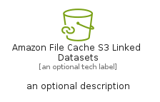
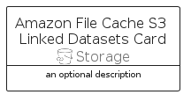

# AmazonFileCacheS3LinkedDatasets


```text
aws-q1-2025/Resource/Storage/AmazonFileCacheS3LinkedDatasets
```

```text
include('aws-q1-2025/Resource/Storage/AmazonFileCacheS3LinkedDatasets')
```


| Illustration | AmazonFileCacheS3LinkedDatasets | AmazonFileCacheS3LinkedDatasetsCard | AmazonFileCacheS3LinkedDatasetsGroup |
| :---: | :---: | :---: | :---: |
|  |  |  |  |


## Sprites
The item provides the following sriptes:

- `<$AmazonFileCacheS3LinkedDatasetsXs>`
- `<$AmazonFileCacheS3LinkedDatasetsSm>`
- `<$AmazonFileCacheS3LinkedDatasetsMd>`
- `<$AmazonFileCacheS3LinkedDatasetsLg>`


## AmazonFileCacheS3LinkedDatasets

### Load remotely
```plantuml
@startuml
' configures the library
!global $LIB_BASE_LOCATION="https://raw.githubusercontent.com/tmorin/plantuml-libs/master/distribution"

' loads the library's bootstrap
!include $LIB_BASE_LOCATION/bootstrap.puml

' loads the package bootstrap
include('aws-q1-2025/bootstrap')

' loads the Item which embeds the element AmazonFileCacheS3LinkedDatasets
include('aws-q1-2025/Resource/Storage/AmazonFileCacheS3LinkedDatasets')

' renders the element
AmazonFileCacheS3LinkedDatasets('AmazonFileCacheS3LinkedDatasets', 'Amazon File Cache S3 Linked Datasets', 'an optional tech label', 'an optional description')
@enduml
```

### Load locally
```plantuml
@startuml
' configures the library
!global $INCLUSION_MODE="local"
!global $LIB_BASE_LOCATION="../../.."

' loads the library's bootstrap
!include $LIB_BASE_LOCATION/bootstrap.puml

' loads the package bootstrap
include('aws-q1-2025/bootstrap')

' loads the Item which embeds the element AmazonFileCacheS3LinkedDatasets
include('aws-q1-2025/Resource/Storage/AmazonFileCacheS3LinkedDatasets')

' renders the element
AmazonFileCacheS3LinkedDatasets('AmazonFileCacheS3LinkedDatasets', 'Amazon File Cache S3 Linked Datasets', 'an optional tech label', 'an optional description')
@enduml
```

## AmazonFileCacheS3LinkedDatasetsCard

### Load remotely
```plantuml
@startuml
' configures the library
!global $LIB_BASE_LOCATION="https://raw.githubusercontent.com/tmorin/plantuml-libs/master/distribution"

' loads the library's bootstrap
!include $LIB_BASE_LOCATION/bootstrap.puml

' loads the package bootstrap
include('aws-q1-2025/bootstrap')

' loads the Item which embeds the element AmazonFileCacheS3LinkedDatasetsCard
include('aws-q1-2025/Resource/Storage/AmazonFileCacheS3LinkedDatasets')

' renders the element
AmazonFileCacheS3LinkedDatasetsCard('AmazonFileCacheS3LinkedDatasetsCard', 'Amazon File Cache S3 Linked Datasets Card', 'an optional description')
@enduml
```

### Load locally
```plantuml
@startuml
' configures the library
!global $INCLUSION_MODE="local"
!global $LIB_BASE_LOCATION="../../.."

' loads the library's bootstrap
!include $LIB_BASE_LOCATION/bootstrap.puml

' loads the package bootstrap
include('aws-q1-2025/bootstrap')

' loads the Item which embeds the element AmazonFileCacheS3LinkedDatasetsCard
include('aws-q1-2025/Resource/Storage/AmazonFileCacheS3LinkedDatasets')

' renders the element
AmazonFileCacheS3LinkedDatasetsCard('AmazonFileCacheS3LinkedDatasetsCard', 'Amazon File Cache S3 Linked Datasets Card', 'an optional description')
@enduml
```

## AmazonFileCacheS3LinkedDatasetsGroup

### Load remotely
```plantuml
@startuml
' configures the library
!global $LIB_BASE_LOCATION="https://raw.githubusercontent.com/tmorin/plantuml-libs/master/distribution"

' loads the library's bootstrap
!include $LIB_BASE_LOCATION/bootstrap.puml

' loads the package bootstrap
include('aws-q1-2025/bootstrap')

' loads the Item which embeds the element AmazonFileCacheS3LinkedDatasetsGroup
include('aws-q1-2025/Resource/Storage/AmazonFileCacheS3LinkedDatasets')

' renders the element
AmazonFileCacheS3LinkedDatasetsGroup('AmazonFileCacheS3LinkedDatasetsGroup', 'Amazon File Cache S3 Linked Datasets Group', 'an optional tech label') {
    note as note
        the content of the group
    end note
}
@enduml
```

### Load locally
```plantuml
@startuml
' configures the library
!global $INCLUSION_MODE="local"
!global $LIB_BASE_LOCATION="../../.."

' loads the library's bootstrap
!include $LIB_BASE_LOCATION/bootstrap.puml

' loads the package bootstrap
include('aws-q1-2025/bootstrap')

' loads the Item which embeds the element AmazonFileCacheS3LinkedDatasetsGroup
include('aws-q1-2025/Resource/Storage/AmazonFileCacheS3LinkedDatasets')

' renders the element
AmazonFileCacheS3LinkedDatasetsGroup('AmazonFileCacheS3LinkedDatasetsGroup', 'Amazon File Cache S3 Linked Datasets Group', 'an optional tech label') {
    note as note
        the content of the group
    end note
}
@enduml
```

