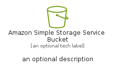
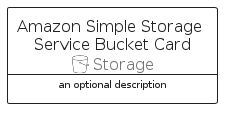

# AmazonSimpleStorageServiceBucket


```text
aws-q1-2025/Resource/Storage/AmazonSimpleStorageServiceBucket
```

```text
include('aws-q1-2025/Resource/Storage/AmazonSimpleStorageServiceBucket')
```


| Illustration | AmazonSimpleStorageServiceBucket | AmazonSimpleStorageServiceBucketCard | AmazonSimpleStorageServiceBucketGroup |
| :---: | :---: | :---: | :---: |
|  |  |  |  |


## Sprites
The item provides the following sriptes:

- `<$AmazonSimpleStorageServiceBucketXs>`
- `<$AmazonSimpleStorageServiceBucketSm>`
- `<$AmazonSimpleStorageServiceBucketMd>`
- `<$AmazonSimpleStorageServiceBucketLg>`


## AmazonSimpleStorageServiceBucket

### Load remotely
```plantuml
@startuml
' configures the library
!global $LIB_BASE_LOCATION="https://raw.githubusercontent.com/tmorin/plantuml-libs/master/distribution"

' loads the library's bootstrap
!include $LIB_BASE_LOCATION/bootstrap.puml

' loads the package bootstrap
include('aws-q1-2025/bootstrap')

' loads the Item which embeds the element AmazonSimpleStorageServiceBucket
include('aws-q1-2025/Resource/Storage/AmazonSimpleStorageServiceBucket')

' renders the element
AmazonSimpleStorageServiceBucket('AmazonSimpleStorageServiceBucket', 'Amazon Simple Storage Service Bucket', 'an optional tech label', 'an optional description')
@enduml
```

### Load locally
```plantuml
@startuml
' configures the library
!global $INCLUSION_MODE="local"
!global $LIB_BASE_LOCATION="../../.."

' loads the library's bootstrap
!include $LIB_BASE_LOCATION/bootstrap.puml

' loads the package bootstrap
include('aws-q1-2025/bootstrap')

' loads the Item which embeds the element AmazonSimpleStorageServiceBucket
include('aws-q1-2025/Resource/Storage/AmazonSimpleStorageServiceBucket')

' renders the element
AmazonSimpleStorageServiceBucket('AmazonSimpleStorageServiceBucket', 'Amazon Simple Storage Service Bucket', 'an optional tech label', 'an optional description')
@enduml
```

## AmazonSimpleStorageServiceBucketCard

### Load remotely
```plantuml
@startuml
' configures the library
!global $LIB_BASE_LOCATION="https://raw.githubusercontent.com/tmorin/plantuml-libs/master/distribution"

' loads the library's bootstrap
!include $LIB_BASE_LOCATION/bootstrap.puml

' loads the package bootstrap
include('aws-q1-2025/bootstrap')

' loads the Item which embeds the element AmazonSimpleStorageServiceBucketCard
include('aws-q1-2025/Resource/Storage/AmazonSimpleStorageServiceBucket')

' renders the element
AmazonSimpleStorageServiceBucketCard('AmazonSimpleStorageServiceBucketCard', 'Amazon Simple Storage Service Bucket Card', 'an optional description')
@enduml
```

### Load locally
```plantuml
@startuml
' configures the library
!global $INCLUSION_MODE="local"
!global $LIB_BASE_LOCATION="../../.."

' loads the library's bootstrap
!include $LIB_BASE_LOCATION/bootstrap.puml

' loads the package bootstrap
include('aws-q1-2025/bootstrap')

' loads the Item which embeds the element AmazonSimpleStorageServiceBucketCard
include('aws-q1-2025/Resource/Storage/AmazonSimpleStorageServiceBucket')

' renders the element
AmazonSimpleStorageServiceBucketCard('AmazonSimpleStorageServiceBucketCard', 'Amazon Simple Storage Service Bucket Card', 'an optional description')
@enduml
```

## AmazonSimpleStorageServiceBucketGroup

### Load remotely
```plantuml
@startuml
' configures the library
!global $LIB_BASE_LOCATION="https://raw.githubusercontent.com/tmorin/plantuml-libs/master/distribution"

' loads the library's bootstrap
!include $LIB_BASE_LOCATION/bootstrap.puml

' loads the package bootstrap
include('aws-q1-2025/bootstrap')

' loads the Item which embeds the element AmazonSimpleStorageServiceBucketGroup
include('aws-q1-2025/Resource/Storage/AmazonSimpleStorageServiceBucket')

' renders the element
AmazonSimpleStorageServiceBucketGroup('AmazonSimpleStorageServiceBucketGroup', 'Amazon Simple Storage Service Bucket Group', 'an optional tech label') {
    note as note
        the content of the group
    end note
}
@enduml
```

### Load locally
```plantuml
@startuml
' configures the library
!global $INCLUSION_MODE="local"
!global $LIB_BASE_LOCATION="../../.."

' loads the library's bootstrap
!include $LIB_BASE_LOCATION/bootstrap.puml

' loads the package bootstrap
include('aws-q1-2025/bootstrap')

' loads the Item which embeds the element AmazonSimpleStorageServiceBucketGroup
include('aws-q1-2025/Resource/Storage/AmazonSimpleStorageServiceBucket')

' renders the element
AmazonSimpleStorageServiceBucketGroup('AmazonSimpleStorageServiceBucketGroup', 'Amazon Simple Storage Service Bucket Group', 'an optional tech label') {
    note as note
        the content of the group
    end note
}
@enduml
```

