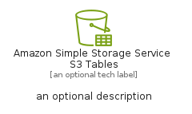
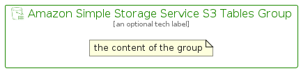

# AmazonSimpleStorageServiceS3Tables


```text
aws-q1-2025/Resource/Storage/AmazonSimpleStorageServiceS3Tables
```

```text
include('aws-q1-2025/Resource/Storage/AmazonSimpleStorageServiceS3Tables')
```


| Illustration | AmazonSimpleStorageServiceS3Tables | AmazonSimpleStorageServiceS3TablesCard | AmazonSimpleStorageServiceS3TablesGroup |
| :---: | :---: | :---: | :---: |
|  |  |  |  |


## Sprites
The item provides the following sriptes:

- `<$AmazonSimpleStorageServiceS3TablesXs>`
- `<$AmazonSimpleStorageServiceS3TablesSm>`
- `<$AmazonSimpleStorageServiceS3TablesMd>`
- `<$AmazonSimpleStorageServiceS3TablesLg>`


## AmazonSimpleStorageServiceS3Tables

### Load remotely
```plantuml
@startuml
' configures the library
!global $LIB_BASE_LOCATION="https://raw.githubusercontent.com/tmorin/plantuml-libs/master/distribution"

' loads the library's bootstrap
!include $LIB_BASE_LOCATION/bootstrap.puml

' loads the package bootstrap
include('aws-q1-2025/bootstrap')

' loads the Item which embeds the element AmazonSimpleStorageServiceS3Tables
include('aws-q1-2025/Resource/Storage/AmazonSimpleStorageServiceS3Tables')

' renders the element
AmazonSimpleStorageServiceS3Tables('AmazonSimpleStorageServiceS3Tables', 'Amazon Simple Storage Service S3 Tables', 'an optional tech label', 'an optional description')
@enduml
```

### Load locally
```plantuml
@startuml
' configures the library
!global $INCLUSION_MODE="local"
!global $LIB_BASE_LOCATION="../../.."

' loads the library's bootstrap
!include $LIB_BASE_LOCATION/bootstrap.puml

' loads the package bootstrap
include('aws-q1-2025/bootstrap')

' loads the Item which embeds the element AmazonSimpleStorageServiceS3Tables
include('aws-q1-2025/Resource/Storage/AmazonSimpleStorageServiceS3Tables')

' renders the element
AmazonSimpleStorageServiceS3Tables('AmazonSimpleStorageServiceS3Tables', 'Amazon Simple Storage Service S3 Tables', 'an optional tech label', 'an optional description')
@enduml
```

## AmazonSimpleStorageServiceS3TablesCard

### Load remotely
```plantuml
@startuml
' configures the library
!global $LIB_BASE_LOCATION="https://raw.githubusercontent.com/tmorin/plantuml-libs/master/distribution"

' loads the library's bootstrap
!include $LIB_BASE_LOCATION/bootstrap.puml

' loads the package bootstrap
include('aws-q1-2025/bootstrap')

' loads the Item which embeds the element AmazonSimpleStorageServiceS3TablesCard
include('aws-q1-2025/Resource/Storage/AmazonSimpleStorageServiceS3Tables')

' renders the element
AmazonSimpleStorageServiceS3TablesCard('AmazonSimpleStorageServiceS3TablesCard', 'Amazon Simple Storage Service S3 Tables Card', 'an optional description')
@enduml
```

### Load locally
```plantuml
@startuml
' configures the library
!global $INCLUSION_MODE="local"
!global $LIB_BASE_LOCATION="../../.."

' loads the library's bootstrap
!include $LIB_BASE_LOCATION/bootstrap.puml

' loads the package bootstrap
include('aws-q1-2025/bootstrap')

' loads the Item which embeds the element AmazonSimpleStorageServiceS3TablesCard
include('aws-q1-2025/Resource/Storage/AmazonSimpleStorageServiceS3Tables')

' renders the element
AmazonSimpleStorageServiceS3TablesCard('AmazonSimpleStorageServiceS3TablesCard', 'Amazon Simple Storage Service S3 Tables Card', 'an optional description')
@enduml
```

## AmazonSimpleStorageServiceS3TablesGroup

### Load remotely
```plantuml
@startuml
' configures the library
!global $LIB_BASE_LOCATION="https://raw.githubusercontent.com/tmorin/plantuml-libs/master/distribution"

' loads the library's bootstrap
!include $LIB_BASE_LOCATION/bootstrap.puml

' loads the package bootstrap
include('aws-q1-2025/bootstrap')

' loads the Item which embeds the element AmazonSimpleStorageServiceS3TablesGroup
include('aws-q1-2025/Resource/Storage/AmazonSimpleStorageServiceS3Tables')

' renders the element
AmazonSimpleStorageServiceS3TablesGroup('AmazonSimpleStorageServiceS3TablesGroup', 'Amazon Simple Storage Service S3 Tables Group', 'an optional tech label') {
    note as note
        the content of the group
    end note
}
@enduml
```

### Load locally
```plantuml
@startuml
' configures the library
!global $INCLUSION_MODE="local"
!global $LIB_BASE_LOCATION="../../.."

' loads the library's bootstrap
!include $LIB_BASE_LOCATION/bootstrap.puml

' loads the package bootstrap
include('aws-q1-2025/bootstrap')

' loads the Item which embeds the element AmazonSimpleStorageServiceS3TablesGroup
include('aws-q1-2025/Resource/Storage/AmazonSimpleStorageServiceS3Tables')

' renders the element
AmazonSimpleStorageServiceS3TablesGroup('AmazonSimpleStorageServiceS3TablesGroup', 'Amazon Simple Storage Service S3 Tables Group', 'an optional tech label') {
    note as note
        the content of the group
    end note
}
@enduml
```

