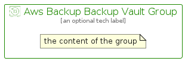

# AwsBackupBackupVault


```text
aws-q1-2025/Resource/Storage/AwsBackupBackupVault
```

```text
include('aws-q1-2025/Resource/Storage/AwsBackupBackupVault')
```


| Illustration | AwsBackupBackupVault | AwsBackupBackupVaultCard | AwsBackupBackupVaultGroup |
| :---: | :---: | :---: | :---: |
|  |  |  |  |


## Sprites
The item provides the following sriptes:

- `<$AwsBackupBackupVaultXs>`
- `<$AwsBackupBackupVaultSm>`
- `<$AwsBackupBackupVaultMd>`
- `<$AwsBackupBackupVaultLg>`


## AwsBackupBackupVault

### Load remotely
```plantuml
@startuml
' configures the library
!global $LIB_BASE_LOCATION="https://raw.githubusercontent.com/tmorin/plantuml-libs/master/distribution"

' loads the library's bootstrap
!include $LIB_BASE_LOCATION/bootstrap.puml

' loads the package bootstrap
include('aws-q1-2025/bootstrap')

' loads the Item which embeds the element AwsBackupBackupVault
include('aws-q1-2025/Resource/Storage/AwsBackupBackupVault')

' renders the element
AwsBackupBackupVault('AwsBackupBackupVault', 'Aws Backup Backup Vault', 'an optional tech label', 'an optional description')
@enduml
```

### Load locally
```plantuml
@startuml
' configures the library
!global $INCLUSION_MODE="local"
!global $LIB_BASE_LOCATION="../../.."

' loads the library's bootstrap
!include $LIB_BASE_LOCATION/bootstrap.puml

' loads the package bootstrap
include('aws-q1-2025/bootstrap')

' loads the Item which embeds the element AwsBackupBackupVault
include('aws-q1-2025/Resource/Storage/AwsBackupBackupVault')

' renders the element
AwsBackupBackupVault('AwsBackupBackupVault', 'Aws Backup Backup Vault', 'an optional tech label', 'an optional description')
@enduml
```

## AwsBackupBackupVaultCard

### Load remotely
```plantuml
@startuml
' configures the library
!global $LIB_BASE_LOCATION="https://raw.githubusercontent.com/tmorin/plantuml-libs/master/distribution"

' loads the library's bootstrap
!include $LIB_BASE_LOCATION/bootstrap.puml

' loads the package bootstrap
include('aws-q1-2025/bootstrap')

' loads the Item which embeds the element AwsBackupBackupVaultCard
include('aws-q1-2025/Resource/Storage/AwsBackupBackupVault')

' renders the element
AwsBackupBackupVaultCard('AwsBackupBackupVaultCard', 'Aws Backup Backup Vault Card', 'an optional description')
@enduml
```

### Load locally
```plantuml
@startuml
' configures the library
!global $INCLUSION_MODE="local"
!global $LIB_BASE_LOCATION="../../.."

' loads the library's bootstrap
!include $LIB_BASE_LOCATION/bootstrap.puml

' loads the package bootstrap
include('aws-q1-2025/bootstrap')

' loads the Item which embeds the element AwsBackupBackupVaultCard
include('aws-q1-2025/Resource/Storage/AwsBackupBackupVault')

' renders the element
AwsBackupBackupVaultCard('AwsBackupBackupVaultCard', 'Aws Backup Backup Vault Card', 'an optional description')
@enduml
```

## AwsBackupBackupVaultGroup

### Load remotely
```plantuml
@startuml
' configures the library
!global $LIB_BASE_LOCATION="https://raw.githubusercontent.com/tmorin/plantuml-libs/master/distribution"

' loads the library's bootstrap
!include $LIB_BASE_LOCATION/bootstrap.puml

' loads the package bootstrap
include('aws-q1-2025/bootstrap')

' loads the Item which embeds the element AwsBackupBackupVaultGroup
include('aws-q1-2025/Resource/Storage/AwsBackupBackupVault')

' renders the element
AwsBackupBackupVaultGroup('AwsBackupBackupVaultGroup', 'Aws Backup Backup Vault Group', 'an optional tech label') {
    note as note
        the content of the group
    end note
}
@enduml
```

### Load locally
```plantuml
@startuml
' configures the library
!global $INCLUSION_MODE="local"
!global $LIB_BASE_LOCATION="../../.."

' loads the library's bootstrap
!include $LIB_BASE_LOCATION/bootstrap.puml

' loads the package bootstrap
include('aws-q1-2025/bootstrap')

' loads the Item which embeds the element AwsBackupBackupVaultGroup
include('aws-q1-2025/Resource/Storage/AwsBackupBackupVault')

' renders the element
AwsBackupBackupVaultGroup('AwsBackupBackupVaultGroup', 'Aws Backup Backup Vault Group', 'an optional tech label') {
    note as note
        the content of the group
    end note
}
@enduml
```

