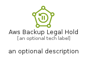
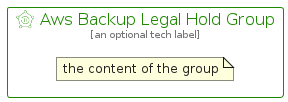

# AwsBackupLegalHold


```text
aws-q1-2025/Resource/Storage/AwsBackupLegalHold
```

```text
include('aws-q1-2025/Resource/Storage/AwsBackupLegalHold')
```


| Illustration | AwsBackupLegalHold | AwsBackupLegalHoldCard | AwsBackupLegalHoldGroup |
| :---: | :---: | :---: | :---: |
|  |  |  |  |


## Sprites
The item provides the following sriptes:

- `<$AwsBackupLegalHoldXs>`
- `<$AwsBackupLegalHoldSm>`
- `<$AwsBackupLegalHoldMd>`
- `<$AwsBackupLegalHoldLg>`


## AwsBackupLegalHold

### Load remotely
```plantuml
@startuml
' configures the library
!global $LIB_BASE_LOCATION="https://raw.githubusercontent.com/tmorin/plantuml-libs/master/distribution"

' loads the library's bootstrap
!include $LIB_BASE_LOCATION/bootstrap.puml

' loads the package bootstrap
include('aws-q1-2025/bootstrap')

' loads the Item which embeds the element AwsBackupLegalHold
include('aws-q1-2025/Resource/Storage/AwsBackupLegalHold')

' renders the element
AwsBackupLegalHold('AwsBackupLegalHold', 'Aws Backup Legal Hold', 'an optional tech label', 'an optional description')
@enduml
```

### Load locally
```plantuml
@startuml
' configures the library
!global $INCLUSION_MODE="local"
!global $LIB_BASE_LOCATION="../../.."

' loads the library's bootstrap
!include $LIB_BASE_LOCATION/bootstrap.puml

' loads the package bootstrap
include('aws-q1-2025/bootstrap')

' loads the Item which embeds the element AwsBackupLegalHold
include('aws-q1-2025/Resource/Storage/AwsBackupLegalHold')

' renders the element
AwsBackupLegalHold('AwsBackupLegalHold', 'Aws Backup Legal Hold', 'an optional tech label', 'an optional description')
@enduml
```

## AwsBackupLegalHoldCard

### Load remotely
```plantuml
@startuml
' configures the library
!global $LIB_BASE_LOCATION="https://raw.githubusercontent.com/tmorin/plantuml-libs/master/distribution"

' loads the library's bootstrap
!include $LIB_BASE_LOCATION/bootstrap.puml

' loads the package bootstrap
include('aws-q1-2025/bootstrap')

' loads the Item which embeds the element AwsBackupLegalHoldCard
include('aws-q1-2025/Resource/Storage/AwsBackupLegalHold')

' renders the element
AwsBackupLegalHoldCard('AwsBackupLegalHoldCard', 'Aws Backup Legal Hold Card', 'an optional description')
@enduml
```

### Load locally
```plantuml
@startuml
' configures the library
!global $INCLUSION_MODE="local"
!global $LIB_BASE_LOCATION="../../.."

' loads the library's bootstrap
!include $LIB_BASE_LOCATION/bootstrap.puml

' loads the package bootstrap
include('aws-q1-2025/bootstrap')

' loads the Item which embeds the element AwsBackupLegalHoldCard
include('aws-q1-2025/Resource/Storage/AwsBackupLegalHold')

' renders the element
AwsBackupLegalHoldCard('AwsBackupLegalHoldCard', 'Aws Backup Legal Hold Card', 'an optional description')
@enduml
```

## AwsBackupLegalHoldGroup

### Load remotely
```plantuml
@startuml
' configures the library
!global $LIB_BASE_LOCATION="https://raw.githubusercontent.com/tmorin/plantuml-libs/master/distribution"

' loads the library's bootstrap
!include $LIB_BASE_LOCATION/bootstrap.puml

' loads the package bootstrap
include('aws-q1-2025/bootstrap')

' loads the Item which embeds the element AwsBackupLegalHoldGroup
include('aws-q1-2025/Resource/Storage/AwsBackupLegalHold')

' renders the element
AwsBackupLegalHoldGroup('AwsBackupLegalHoldGroup', 'Aws Backup Legal Hold Group', 'an optional tech label') {
    note as note
        the content of the group
    end note
}
@enduml
```

### Load locally
```plantuml
@startuml
' configures the library
!global $INCLUSION_MODE="local"
!global $LIB_BASE_LOCATION="../../.."

' loads the library's bootstrap
!include $LIB_BASE_LOCATION/bootstrap.puml

' loads the package bootstrap
include('aws-q1-2025/bootstrap')

' loads the Item which embeds the element AwsBackupLegalHoldGroup
include('aws-q1-2025/Resource/Storage/AwsBackupLegalHold')

' renders the element
AwsBackupLegalHoldGroup('AwsBackupLegalHoldGroup', 'Aws Backup Legal Hold Group', 'an optional tech label') {
    note as note
        the content of the group
    end note
}
@enduml
```

