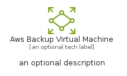
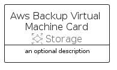

# AwsBackupVirtualMachine


```text
aws-q1-2025/Resource/Storage/AwsBackupVirtualMachine
```

```text
include('aws-q1-2025/Resource/Storage/AwsBackupVirtualMachine')
```


| Illustration | AwsBackupVirtualMachine | AwsBackupVirtualMachineCard | AwsBackupVirtualMachineGroup |
| :---: | :---: | :---: | :---: |
|  |  |  |  |


## Sprites
The item provides the following sriptes:

- `<$AwsBackupVirtualMachineXs>`
- `<$AwsBackupVirtualMachineSm>`
- `<$AwsBackupVirtualMachineMd>`
- `<$AwsBackupVirtualMachineLg>`


## AwsBackupVirtualMachine

### Load remotely
```plantuml
@startuml
' configures the library
!global $LIB_BASE_LOCATION="https://raw.githubusercontent.com/tmorin/plantuml-libs/master/distribution"

' loads the library's bootstrap
!include $LIB_BASE_LOCATION/bootstrap.puml

' loads the package bootstrap
include('aws-q1-2025/bootstrap')

' loads the Item which embeds the element AwsBackupVirtualMachine
include('aws-q1-2025/Resource/Storage/AwsBackupVirtualMachine')

' renders the element
AwsBackupVirtualMachine('AwsBackupVirtualMachine', 'Aws Backup Virtual Machine', 'an optional tech label', 'an optional description')
@enduml
```

### Load locally
```plantuml
@startuml
' configures the library
!global $INCLUSION_MODE="local"
!global $LIB_BASE_LOCATION="../../.."

' loads the library's bootstrap
!include $LIB_BASE_LOCATION/bootstrap.puml

' loads the package bootstrap
include('aws-q1-2025/bootstrap')

' loads the Item which embeds the element AwsBackupVirtualMachine
include('aws-q1-2025/Resource/Storage/AwsBackupVirtualMachine')

' renders the element
AwsBackupVirtualMachine('AwsBackupVirtualMachine', 'Aws Backup Virtual Machine', 'an optional tech label', 'an optional description')
@enduml
```

## AwsBackupVirtualMachineCard

### Load remotely
```plantuml
@startuml
' configures the library
!global $LIB_BASE_LOCATION="https://raw.githubusercontent.com/tmorin/plantuml-libs/master/distribution"

' loads the library's bootstrap
!include $LIB_BASE_LOCATION/bootstrap.puml

' loads the package bootstrap
include('aws-q1-2025/bootstrap')

' loads the Item which embeds the element AwsBackupVirtualMachineCard
include('aws-q1-2025/Resource/Storage/AwsBackupVirtualMachine')

' renders the element
AwsBackupVirtualMachineCard('AwsBackupVirtualMachineCard', 'Aws Backup Virtual Machine Card', 'an optional description')
@enduml
```

### Load locally
```plantuml
@startuml
' configures the library
!global $INCLUSION_MODE="local"
!global $LIB_BASE_LOCATION="../../.."

' loads the library's bootstrap
!include $LIB_BASE_LOCATION/bootstrap.puml

' loads the package bootstrap
include('aws-q1-2025/bootstrap')

' loads the Item which embeds the element AwsBackupVirtualMachineCard
include('aws-q1-2025/Resource/Storage/AwsBackupVirtualMachine')

' renders the element
AwsBackupVirtualMachineCard('AwsBackupVirtualMachineCard', 'Aws Backup Virtual Machine Card', 'an optional description')
@enduml
```

## AwsBackupVirtualMachineGroup

### Load remotely
```plantuml
@startuml
' configures the library
!global $LIB_BASE_LOCATION="https://raw.githubusercontent.com/tmorin/plantuml-libs/master/distribution"

' loads the library's bootstrap
!include $LIB_BASE_LOCATION/bootstrap.puml

' loads the package bootstrap
include('aws-q1-2025/bootstrap')

' loads the Item which embeds the element AwsBackupVirtualMachineGroup
include('aws-q1-2025/Resource/Storage/AwsBackupVirtualMachine')

' renders the element
AwsBackupVirtualMachineGroup('AwsBackupVirtualMachineGroup', 'Aws Backup Virtual Machine Group', 'an optional tech label') {
    note as note
        the content of the group
    end note
}
@enduml
```

### Load locally
```plantuml
@startuml
' configures the library
!global $INCLUSION_MODE="local"
!global $LIB_BASE_LOCATION="../../.."

' loads the library's bootstrap
!include $LIB_BASE_LOCATION/bootstrap.puml

' loads the package bootstrap
include('aws-q1-2025/bootstrap')

' loads the Item which embeds the element AwsBackupVirtualMachineGroup
include('aws-q1-2025/Resource/Storage/AwsBackupVirtualMachine')

' renders the element
AwsBackupVirtualMachineGroup('AwsBackupVirtualMachineGroup', 'Aws Backup Virtual Machine Group', 'an optional tech label') {
    note as note
        the content of the group
    end note
}
@enduml
```

