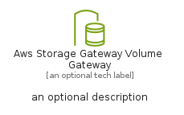

# AwsStorageGatewayVolumeGateway


```text
aws-q1-2025/Resource/Storage/AwsStorageGatewayVolumeGateway
```

```text
include('aws-q1-2025/Resource/Storage/AwsStorageGatewayVolumeGateway')
```


| Illustration | AwsStorageGatewayVolumeGateway | AwsStorageGatewayVolumeGatewayCard | AwsStorageGatewayVolumeGatewayGroup |
| :---: | :---: | :---: | :---: |
|  |  |  |  |


## Sprites
The item provides the following sriptes:

- `<$AwsStorageGatewayVolumeGatewayXs>`
- `<$AwsStorageGatewayVolumeGatewaySm>`
- `<$AwsStorageGatewayVolumeGatewayMd>`
- `<$AwsStorageGatewayVolumeGatewayLg>`


## AwsStorageGatewayVolumeGateway

### Load remotely
```plantuml
@startuml
' configures the library
!global $LIB_BASE_LOCATION="https://raw.githubusercontent.com/tmorin/plantuml-libs/master/distribution"

' loads the library's bootstrap
!include $LIB_BASE_LOCATION/bootstrap.puml

' loads the package bootstrap
include('aws-q1-2025/bootstrap')

' loads the Item which embeds the element AwsStorageGatewayVolumeGateway
include('aws-q1-2025/Resource/Storage/AwsStorageGatewayVolumeGateway')

' renders the element
AwsStorageGatewayVolumeGateway('AwsStorageGatewayVolumeGateway', 'Aws Storage Gateway Volume Gateway', 'an optional tech label', 'an optional description')
@enduml
```

### Load locally
```plantuml
@startuml
' configures the library
!global $INCLUSION_MODE="local"
!global $LIB_BASE_LOCATION="../../.."

' loads the library's bootstrap
!include $LIB_BASE_LOCATION/bootstrap.puml

' loads the package bootstrap
include('aws-q1-2025/bootstrap')

' loads the Item which embeds the element AwsStorageGatewayVolumeGateway
include('aws-q1-2025/Resource/Storage/AwsStorageGatewayVolumeGateway')

' renders the element
AwsStorageGatewayVolumeGateway('AwsStorageGatewayVolumeGateway', 'Aws Storage Gateway Volume Gateway', 'an optional tech label', 'an optional description')
@enduml
```

## AwsStorageGatewayVolumeGatewayCard

### Load remotely
```plantuml
@startuml
' configures the library
!global $LIB_BASE_LOCATION="https://raw.githubusercontent.com/tmorin/plantuml-libs/master/distribution"

' loads the library's bootstrap
!include $LIB_BASE_LOCATION/bootstrap.puml

' loads the package bootstrap
include('aws-q1-2025/bootstrap')

' loads the Item which embeds the element AwsStorageGatewayVolumeGatewayCard
include('aws-q1-2025/Resource/Storage/AwsStorageGatewayVolumeGateway')

' renders the element
AwsStorageGatewayVolumeGatewayCard('AwsStorageGatewayVolumeGatewayCard', 'Aws Storage Gateway Volume Gateway Card', 'an optional description')
@enduml
```

### Load locally
```plantuml
@startuml
' configures the library
!global $INCLUSION_MODE="local"
!global $LIB_BASE_LOCATION="../../.."

' loads the library's bootstrap
!include $LIB_BASE_LOCATION/bootstrap.puml

' loads the package bootstrap
include('aws-q1-2025/bootstrap')

' loads the Item which embeds the element AwsStorageGatewayVolumeGatewayCard
include('aws-q1-2025/Resource/Storage/AwsStorageGatewayVolumeGateway')

' renders the element
AwsStorageGatewayVolumeGatewayCard('AwsStorageGatewayVolumeGatewayCard', 'Aws Storage Gateway Volume Gateway Card', 'an optional description')
@enduml
```

## AwsStorageGatewayVolumeGatewayGroup

### Load remotely
```plantuml
@startuml
' configures the library
!global $LIB_BASE_LOCATION="https://raw.githubusercontent.com/tmorin/plantuml-libs/master/distribution"

' loads the library's bootstrap
!include $LIB_BASE_LOCATION/bootstrap.puml

' loads the package bootstrap
include('aws-q1-2025/bootstrap')

' loads the Item which embeds the element AwsStorageGatewayVolumeGatewayGroup
include('aws-q1-2025/Resource/Storage/AwsStorageGatewayVolumeGateway')

' renders the element
AwsStorageGatewayVolumeGatewayGroup('AwsStorageGatewayVolumeGatewayGroup', 'Aws Storage Gateway Volume Gateway Group', 'an optional tech label') {
    note as note
        the content of the group
    end note
}
@enduml
```

### Load locally
```plantuml
@startuml
' configures the library
!global $INCLUSION_MODE="local"
!global $LIB_BASE_LOCATION="../../.."

' loads the library's bootstrap
!include $LIB_BASE_LOCATION/bootstrap.puml

' loads the package bootstrap
include('aws-q1-2025/bootstrap')

' loads the Item which embeds the element AwsStorageGatewayVolumeGatewayGroup
include('aws-q1-2025/Resource/Storage/AwsStorageGatewayVolumeGateway')

' renders the element
AwsStorageGatewayVolumeGatewayGroup('AwsStorageGatewayVolumeGatewayGroup', 'Aws Storage Gateway Volume Gateway Group', 'an optional tech label') {
    note as note
        the content of the group
    end note
}
@enduml
```

