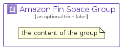

# AmazonFinSpace


```text
aws-q2-2022/Architecture/Analytics/AmazonFinSpace
```

```text
include('aws-q2-2022/Architecture/Analytics/AmazonFinSpace')
```


| Illustration | AmazonFinSpace | AmazonFinSpaceCard | AmazonFinSpaceGroup |
| :---: | :---: | :---: | :---: |
|  |  |  |  |


## AmazonFinSpace

### Load remotely
```plantuml
@startuml
' configures the library
!global $LIB_BASE_LOCATION="https://raw.githubusercontent.com/tmorin/plantuml-libs/master/distribution"

' loads the library's bootstrap
!include $LIB_BASE_LOCATION/bootstrap.puml

' loads the package bootstrap
include('aws-q2-2022/bootstrap')

' loads the Item which embeds the element AmazonFinSpace
include('aws-q2-2022/Architecture/Analytics/AmazonFinSpace')

' renders the element
AmazonFinSpace('AmazonFinSpace', 'Amazon Fin Space', 'an optional tech label')
@enduml
```

### Load locally
```plantuml
@startuml
' configures the library
!global $INCLUSION_MODE="local"
!global $LIB_BASE_LOCATION="../../.."

' loads the library's bootstrap
!include $LIB_BASE_LOCATION/bootstrap.puml

' loads the package bootstrap
include('aws-q2-2022/bootstrap')

' loads the Item which embeds the element AmazonFinSpace
include('aws-q2-2022/Architecture/Analytics/AmazonFinSpace')

' renders the element
AmazonFinSpace('AmazonFinSpace', 'Amazon Fin Space', 'an optional tech label')
@enduml
```

## AmazonFinSpaceCard

### Load remotely
```plantuml
@startuml
' configures the library
!global $LIB_BASE_LOCATION="https://raw.githubusercontent.com/tmorin/plantuml-libs/master/distribution"

' loads the library's bootstrap
!include $LIB_BASE_LOCATION/bootstrap.puml

' loads the package bootstrap
include('aws-q2-2022/bootstrap')

' loads the Item which embeds the element AmazonFinSpaceCard
include('aws-q2-2022/Architecture/Analytics/AmazonFinSpace')

' renders the element
AmazonFinSpaceCard('AmazonFinSpaceCard', 'Amazon Fin Space Card', 'an optional description')
@enduml
```

### Load locally
```plantuml
@startuml
' configures the library
!global $INCLUSION_MODE="local"
!global $LIB_BASE_LOCATION="../../.."

' loads the library's bootstrap
!include $LIB_BASE_LOCATION/bootstrap.puml

' loads the package bootstrap
include('aws-q2-2022/bootstrap')

' loads the Item which embeds the element AmazonFinSpaceCard
include('aws-q2-2022/Architecture/Analytics/AmazonFinSpace')

' renders the element
AmazonFinSpaceCard('AmazonFinSpaceCard', 'Amazon Fin Space Card', 'an optional description')
@enduml
```

## AmazonFinSpaceGroup

### Load remotely
```plantuml
@startuml
' configures the library
!global $LIB_BASE_LOCATION="https://raw.githubusercontent.com/tmorin/plantuml-libs/master/distribution"

' loads the library's bootstrap
!include $LIB_BASE_LOCATION/bootstrap.puml

' loads the package bootstrap
include('aws-q2-2022/bootstrap')

' loads the Item which embeds the element AmazonFinSpaceGroup
include('aws-q2-2022/Architecture/Analytics/AmazonFinSpace')

' renders the element
AmazonFinSpaceGroup('AmazonFinSpaceGroup', 'Amazon Fin Space Group', 'an optional tech label') {
    note as note
        the content of the group
    end note
}
@enduml
```

### Load locally
```plantuml
@startuml
' configures the library
!global $INCLUSION_MODE="local"
!global $LIB_BASE_LOCATION="../../.."

' loads the library's bootstrap
!include $LIB_BASE_LOCATION/bootstrap.puml

' loads the package bootstrap
include('aws-q2-2022/bootstrap')

' loads the Item which embeds the element AmazonFinSpaceGroup
include('aws-q2-2022/Architecture/Analytics/AmazonFinSpace')

' renders the element
AmazonFinSpaceGroup('AmazonFinSpaceGroup', 'Amazon Fin Space Group', 'an optional tech label') {
    note as note
        the content of the group
    end note
}
@enduml
```

