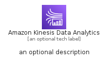
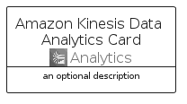
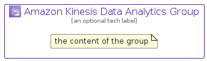

# AmazonKinesisDataAnalytics


```text
aws-q2-2022/Architecture/Analytics/AmazonKinesisDataAnalytics
```

```text
include('aws-q2-2022/Architecture/Analytics/AmazonKinesisDataAnalytics')
```


| Illustration | AmazonKinesisDataAnalytics | AmazonKinesisDataAnalyticsCard | AmazonKinesisDataAnalyticsGroup |
| :---: | :---: | :---: | :---: |
|  |  |  |  |


## AmazonKinesisDataAnalytics

### Load remotely
```plantuml
@startuml
' configures the library
!global $LIB_BASE_LOCATION="https://raw.githubusercontent.com/tmorin/plantuml-libs/master/distribution"

' loads the library's bootstrap
!include $LIB_BASE_LOCATION/bootstrap.puml

' loads the package bootstrap
include('aws-q2-2022/bootstrap')

' loads the Item which embeds the element AmazonKinesisDataAnalytics
include('aws-q2-2022/Architecture/Analytics/AmazonKinesisDataAnalytics')

' renders the element
AmazonKinesisDataAnalytics('AmazonKinesisDataAnalytics', 'Amazon Kinesis Data Analytics', 'an optional tech label', 'an optional description')
@enduml
```

### Load locally
```plantuml
@startuml
' configures the library
!global $INCLUSION_MODE="local"
!global $LIB_BASE_LOCATION="../../.."

' loads the library's bootstrap
!include $LIB_BASE_LOCATION/bootstrap.puml

' loads the package bootstrap
include('aws-q2-2022/bootstrap')

' loads the Item which embeds the element AmazonKinesisDataAnalytics
include('aws-q2-2022/Architecture/Analytics/AmazonKinesisDataAnalytics')

' renders the element
AmazonKinesisDataAnalytics('AmazonKinesisDataAnalytics', 'Amazon Kinesis Data Analytics', 'an optional tech label', 'an optional description')
@enduml
```

## AmazonKinesisDataAnalyticsCard

### Load remotely
```plantuml
@startuml
' configures the library
!global $LIB_BASE_LOCATION="https://raw.githubusercontent.com/tmorin/plantuml-libs/master/distribution"

' loads the library's bootstrap
!include $LIB_BASE_LOCATION/bootstrap.puml

' loads the package bootstrap
include('aws-q2-2022/bootstrap')

' loads the Item which embeds the element AmazonKinesisDataAnalyticsCard
include('aws-q2-2022/Architecture/Analytics/AmazonKinesisDataAnalytics')

' renders the element
AmazonKinesisDataAnalyticsCard('AmazonKinesisDataAnalyticsCard', 'Amazon Kinesis Data Analytics Card', 'an optional description')
@enduml
```

### Load locally
```plantuml
@startuml
' configures the library
!global $INCLUSION_MODE="local"
!global $LIB_BASE_LOCATION="../../.."

' loads the library's bootstrap
!include $LIB_BASE_LOCATION/bootstrap.puml

' loads the package bootstrap
include('aws-q2-2022/bootstrap')

' loads the Item which embeds the element AmazonKinesisDataAnalyticsCard
include('aws-q2-2022/Architecture/Analytics/AmazonKinesisDataAnalytics')

' renders the element
AmazonKinesisDataAnalyticsCard('AmazonKinesisDataAnalyticsCard', 'Amazon Kinesis Data Analytics Card', 'an optional description')
@enduml
```

## AmazonKinesisDataAnalyticsGroup

### Load remotely
```plantuml
@startuml
' configures the library
!global $LIB_BASE_LOCATION="https://raw.githubusercontent.com/tmorin/plantuml-libs/master/distribution"

' loads the library's bootstrap
!include $LIB_BASE_LOCATION/bootstrap.puml

' loads the package bootstrap
include('aws-q2-2022/bootstrap')

' loads the Item which embeds the element AmazonKinesisDataAnalyticsGroup
include('aws-q2-2022/Architecture/Analytics/AmazonKinesisDataAnalytics')

' renders the element
AmazonKinesisDataAnalyticsGroup('AmazonKinesisDataAnalyticsGroup', 'Amazon Kinesis Data Analytics Group', 'an optional tech label') {
    note as note
        the content of the group
    end note
}
@enduml
```

### Load locally
```plantuml
@startuml
' configures the library
!global $INCLUSION_MODE="local"
!global $LIB_BASE_LOCATION="../../.."

' loads the library's bootstrap
!include $LIB_BASE_LOCATION/bootstrap.puml

' loads the package bootstrap
include('aws-q2-2022/bootstrap')

' loads the Item which embeds the element AmazonKinesisDataAnalyticsGroup
include('aws-q2-2022/Architecture/Analytics/AmazonKinesisDataAnalytics')

' renders the element
AmazonKinesisDataAnalyticsGroup('AmazonKinesisDataAnalyticsGroup', 'Amazon Kinesis Data Analytics Group', 'an optional tech label') {
    note as note
        the content of the group
    end note
}
@enduml
```

