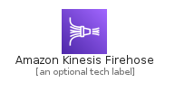
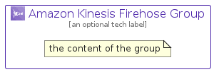

# AmazonKinesisFirehose


```text
aws-q2-2022/Architecture/Analytics/AmazonKinesisFirehose
```

```text
include('aws-q2-2022/Architecture/Analytics/AmazonKinesisFirehose')
```


| Illustration | AmazonKinesisFirehose | AmazonKinesisFirehoseCard | AmazonKinesisFirehoseGroup |
| :---: | :---: | :---: | :---: |
|  |  |  |  |


## AmazonKinesisFirehose

### Load remotely
```plantuml
@startuml
' configures the library
!global $LIB_BASE_LOCATION="https://raw.githubusercontent.com/tmorin/plantuml-libs/master/distribution"

' loads the library's bootstrap
!include $LIB_BASE_LOCATION/bootstrap.puml

' loads the package bootstrap
include('aws-q2-2022/bootstrap')

' loads the Item which embeds the element AmazonKinesisFirehose
include('aws-q2-2022/Architecture/Analytics/AmazonKinesisFirehose')

' renders the element
AmazonKinesisFirehose('AmazonKinesisFirehose', 'Amazon Kinesis Firehose', 'an optional tech label', 'an optional description')
@enduml
```

### Load locally
```plantuml
@startuml
' configures the library
!global $INCLUSION_MODE="local"
!global $LIB_BASE_LOCATION="../../.."

' loads the library's bootstrap
!include $LIB_BASE_LOCATION/bootstrap.puml

' loads the package bootstrap
include('aws-q2-2022/bootstrap')

' loads the Item which embeds the element AmazonKinesisFirehose
include('aws-q2-2022/Architecture/Analytics/AmazonKinesisFirehose')

' renders the element
AmazonKinesisFirehose('AmazonKinesisFirehose', 'Amazon Kinesis Firehose', 'an optional tech label', 'an optional description')
@enduml
```

## AmazonKinesisFirehoseCard

### Load remotely
```plantuml
@startuml
' configures the library
!global $LIB_BASE_LOCATION="https://raw.githubusercontent.com/tmorin/plantuml-libs/master/distribution"

' loads the library's bootstrap
!include $LIB_BASE_LOCATION/bootstrap.puml

' loads the package bootstrap
include('aws-q2-2022/bootstrap')

' loads the Item which embeds the element AmazonKinesisFirehoseCard
include('aws-q2-2022/Architecture/Analytics/AmazonKinesisFirehose')

' renders the element
AmazonKinesisFirehoseCard('AmazonKinesisFirehoseCard', 'Amazon Kinesis Firehose Card', 'an optional description')
@enduml
```

### Load locally
```plantuml
@startuml
' configures the library
!global $INCLUSION_MODE="local"
!global $LIB_BASE_LOCATION="../../.."

' loads the library's bootstrap
!include $LIB_BASE_LOCATION/bootstrap.puml

' loads the package bootstrap
include('aws-q2-2022/bootstrap')

' loads the Item which embeds the element AmazonKinesisFirehoseCard
include('aws-q2-2022/Architecture/Analytics/AmazonKinesisFirehose')

' renders the element
AmazonKinesisFirehoseCard('AmazonKinesisFirehoseCard', 'Amazon Kinesis Firehose Card', 'an optional description')
@enduml
```

## AmazonKinesisFirehoseGroup

### Load remotely
```plantuml
@startuml
' configures the library
!global $LIB_BASE_LOCATION="https://raw.githubusercontent.com/tmorin/plantuml-libs/master/distribution"

' loads the library's bootstrap
!include $LIB_BASE_LOCATION/bootstrap.puml

' loads the package bootstrap
include('aws-q2-2022/bootstrap')

' loads the Item which embeds the element AmazonKinesisFirehoseGroup
include('aws-q2-2022/Architecture/Analytics/AmazonKinesisFirehose')

' renders the element
AmazonKinesisFirehoseGroup('AmazonKinesisFirehoseGroup', 'Amazon Kinesis Firehose Group', 'an optional tech label') {
    note as note
        the content of the group
    end note
}
@enduml
```

### Load locally
```plantuml
@startuml
' configures the library
!global $INCLUSION_MODE="local"
!global $LIB_BASE_LOCATION="../../.."

' loads the library's bootstrap
!include $LIB_BASE_LOCATION/bootstrap.puml

' loads the package bootstrap
include('aws-q2-2022/bootstrap')

' loads the Item which embeds the element AmazonKinesisFirehoseGroup
include('aws-q2-2022/Architecture/Analytics/AmazonKinesisFirehose')

' renders the element
AmazonKinesisFirehoseGroup('AmazonKinesisFirehoseGroup', 'Amazon Kinesis Firehose Group', 'an optional tech label') {
    note as note
        the content of the group
    end note
}
@enduml
```

