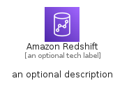
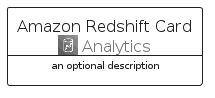
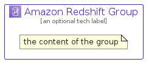

# AmazonRedshift


```text
aws-q2-2022/Architecture/Analytics/AmazonRedshift
```

```text
include('aws-q2-2022/Architecture/Analytics/AmazonRedshift')
```


| Illustration | AmazonRedshift | AmazonRedshiftCard | AmazonRedshiftGroup |
| :---: | :---: | :---: | :---: |
|  |  |  |  |


## AmazonRedshift

### Load remotely
```plantuml
@startuml
' configures the library
!global $LIB_BASE_LOCATION="https://raw.githubusercontent.com/tmorin/plantuml-libs/master/distribution"

' loads the library's bootstrap
!include $LIB_BASE_LOCATION/bootstrap.puml

' loads the package bootstrap
include('aws-q2-2022/bootstrap')

' loads the Item which embeds the element AmazonRedshift
include('aws-q2-2022/Architecture/Analytics/AmazonRedshift')

' renders the element
AmazonRedshift('AmazonRedshift', 'Amazon Redshift', 'an optional tech label')
@enduml
```

### Load locally
```plantuml
@startuml
' configures the library
!global $INCLUSION_MODE="local"
!global $LIB_BASE_LOCATION="../../.."

' loads the library's bootstrap
!include $LIB_BASE_LOCATION/bootstrap.puml

' loads the package bootstrap
include('aws-q2-2022/bootstrap')

' loads the Item which embeds the element AmazonRedshift
include('aws-q2-2022/Architecture/Analytics/AmazonRedshift')

' renders the element
AmazonRedshift('AmazonRedshift', 'Amazon Redshift', 'an optional tech label')
@enduml
```

## AmazonRedshiftCard

### Load remotely
```plantuml
@startuml
' configures the library
!global $LIB_BASE_LOCATION="https://raw.githubusercontent.com/tmorin/plantuml-libs/master/distribution"

' loads the library's bootstrap
!include $LIB_BASE_LOCATION/bootstrap.puml

' loads the package bootstrap
include('aws-q2-2022/bootstrap')

' loads the Item which embeds the element AmazonRedshiftCard
include('aws-q2-2022/Architecture/Analytics/AmazonRedshift')

' renders the element
AmazonRedshiftCard('AmazonRedshiftCard', 'Amazon Redshift Card', 'an optional description')
@enduml
```

### Load locally
```plantuml
@startuml
' configures the library
!global $INCLUSION_MODE="local"
!global $LIB_BASE_LOCATION="../../.."

' loads the library's bootstrap
!include $LIB_BASE_LOCATION/bootstrap.puml

' loads the package bootstrap
include('aws-q2-2022/bootstrap')

' loads the Item which embeds the element AmazonRedshiftCard
include('aws-q2-2022/Architecture/Analytics/AmazonRedshift')

' renders the element
AmazonRedshiftCard('AmazonRedshiftCard', 'Amazon Redshift Card', 'an optional description')
@enduml
```

## AmazonRedshiftGroup

### Load remotely
```plantuml
@startuml
' configures the library
!global $LIB_BASE_LOCATION="https://raw.githubusercontent.com/tmorin/plantuml-libs/master/distribution"

' loads the library's bootstrap
!include $LIB_BASE_LOCATION/bootstrap.puml

' loads the package bootstrap
include('aws-q2-2022/bootstrap')

' loads the Item which embeds the element AmazonRedshiftGroup
include('aws-q2-2022/Architecture/Analytics/AmazonRedshift')

' renders the element
AmazonRedshiftGroup('AmazonRedshiftGroup', 'Amazon Redshift Group', 'an optional tech label') {
    note as note
        the content of the group
    end note
}
@enduml
```

### Load locally
```plantuml
@startuml
' configures the library
!global $INCLUSION_MODE="local"
!global $LIB_BASE_LOCATION="../../.."

' loads the library's bootstrap
!include $LIB_BASE_LOCATION/bootstrap.puml

' loads the package bootstrap
include('aws-q2-2022/bootstrap')

' loads the Item which embeds the element AmazonRedshiftGroup
include('aws-q2-2022/Architecture/Analytics/AmazonRedshift')

' renders the element
AmazonRedshiftGroup('AmazonRedshiftGroup', 'Amazon Redshift Group', 'an optional tech label') {
    note as note
        the content of the group
    end note
}
@enduml
```

