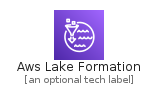
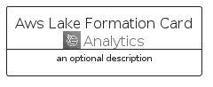
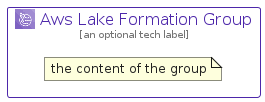

# AwsLakeFormation


```text
aws-q2-2022/Architecture/Analytics/AwsLakeFormation
```

```text
include('aws-q2-2022/Architecture/Analytics/AwsLakeFormation')
```


| Illustration | AwsLakeFormation | AwsLakeFormationCard | AwsLakeFormationGroup |
| :---: | :---: | :---: | :---: |
|  |  |  |  |


## AwsLakeFormation

### Load remotely
```plantuml
@startuml
' configures the library
!global $LIB_BASE_LOCATION="https://raw.githubusercontent.com/tmorin/plantuml-libs/master/distribution"

' loads the library's bootstrap
!include $LIB_BASE_LOCATION/bootstrap.puml

' loads the package bootstrap
include('aws-q2-2022/bootstrap')

' loads the Item which embeds the element AwsLakeFormation
include('aws-q2-2022/Architecture/Analytics/AwsLakeFormation')

' renders the element
AwsLakeFormation('AwsLakeFormation', 'Aws Lake Formation', 'an optional tech label', 'an optional description')
@enduml
```

### Load locally
```plantuml
@startuml
' configures the library
!global $INCLUSION_MODE="local"
!global $LIB_BASE_LOCATION="../../.."

' loads the library's bootstrap
!include $LIB_BASE_LOCATION/bootstrap.puml

' loads the package bootstrap
include('aws-q2-2022/bootstrap')

' loads the Item which embeds the element AwsLakeFormation
include('aws-q2-2022/Architecture/Analytics/AwsLakeFormation')

' renders the element
AwsLakeFormation('AwsLakeFormation', 'Aws Lake Formation', 'an optional tech label', 'an optional description')
@enduml
```

## AwsLakeFormationCard

### Load remotely
```plantuml
@startuml
' configures the library
!global $LIB_BASE_LOCATION="https://raw.githubusercontent.com/tmorin/plantuml-libs/master/distribution"

' loads the library's bootstrap
!include $LIB_BASE_LOCATION/bootstrap.puml

' loads the package bootstrap
include('aws-q2-2022/bootstrap')

' loads the Item which embeds the element AwsLakeFormationCard
include('aws-q2-2022/Architecture/Analytics/AwsLakeFormation')

' renders the element
AwsLakeFormationCard('AwsLakeFormationCard', 'Aws Lake Formation Card', 'an optional description')
@enduml
```

### Load locally
```plantuml
@startuml
' configures the library
!global $INCLUSION_MODE="local"
!global $LIB_BASE_LOCATION="../../.."

' loads the library's bootstrap
!include $LIB_BASE_LOCATION/bootstrap.puml

' loads the package bootstrap
include('aws-q2-2022/bootstrap')

' loads the Item which embeds the element AwsLakeFormationCard
include('aws-q2-2022/Architecture/Analytics/AwsLakeFormation')

' renders the element
AwsLakeFormationCard('AwsLakeFormationCard', 'Aws Lake Formation Card', 'an optional description')
@enduml
```

## AwsLakeFormationGroup

### Load remotely
```plantuml
@startuml
' configures the library
!global $LIB_BASE_LOCATION="https://raw.githubusercontent.com/tmorin/plantuml-libs/master/distribution"

' loads the library's bootstrap
!include $LIB_BASE_LOCATION/bootstrap.puml

' loads the package bootstrap
include('aws-q2-2022/bootstrap')

' loads the Item which embeds the element AwsLakeFormationGroup
include('aws-q2-2022/Architecture/Analytics/AwsLakeFormation')

' renders the element
AwsLakeFormationGroup('AwsLakeFormationGroup', 'Aws Lake Formation Group', 'an optional tech label') {
    note as note
        the content of the group
    end note
}
@enduml
```

### Load locally
```plantuml
@startuml
' configures the library
!global $INCLUSION_MODE="local"
!global $LIB_BASE_LOCATION="../../.."

' loads the library's bootstrap
!include $LIB_BASE_LOCATION/bootstrap.puml

' loads the package bootstrap
include('aws-q2-2022/bootstrap')

' loads the Item which embeds the element AwsLakeFormationGroup
include('aws-q2-2022/Architecture/Analytics/AwsLakeFormation')

' renders the element
AwsLakeFormationGroup('AwsLakeFormationGroup', 'Aws Lake Formation Group', 'an optional tech label') {
    note as note
        the content of the group
    end note
}
@enduml
```

