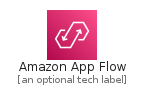
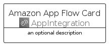
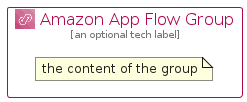

# AmazonAppFlow


```text
aws-q2-2022/Architecture/AppIntegration/AmazonAppFlow
```

```text
include('aws-q2-2022/Architecture/AppIntegration/AmazonAppFlow')
```


| Illustration | AmazonAppFlow | AmazonAppFlowCard | AmazonAppFlowGroup |
| :---: | :---: | :---: | :---: |
|  |  |  |  |


## AmazonAppFlow

### Load remotely
```plantuml
@startuml
' configures the library
!global $LIB_BASE_LOCATION="https://raw.githubusercontent.com/tmorin/plantuml-libs/master/distribution"

' loads the library's bootstrap
!include $LIB_BASE_LOCATION/bootstrap.puml

' loads the package bootstrap
include('aws-q2-2022/bootstrap')

' loads the Item which embeds the element AmazonAppFlow
include('aws-q2-2022/Architecture/AppIntegration/AmazonAppFlow')

' renders the element
AmazonAppFlow('AmazonAppFlow', 'Amazon App Flow', 'an optional tech label', 'an optional description')
@enduml
```

### Load locally
```plantuml
@startuml
' configures the library
!global $INCLUSION_MODE="local"
!global $LIB_BASE_LOCATION="../../.."

' loads the library's bootstrap
!include $LIB_BASE_LOCATION/bootstrap.puml

' loads the package bootstrap
include('aws-q2-2022/bootstrap')

' loads the Item which embeds the element AmazonAppFlow
include('aws-q2-2022/Architecture/AppIntegration/AmazonAppFlow')

' renders the element
AmazonAppFlow('AmazonAppFlow', 'Amazon App Flow', 'an optional tech label', 'an optional description')
@enduml
```

## AmazonAppFlowCard

### Load remotely
```plantuml
@startuml
' configures the library
!global $LIB_BASE_LOCATION="https://raw.githubusercontent.com/tmorin/plantuml-libs/master/distribution"

' loads the library's bootstrap
!include $LIB_BASE_LOCATION/bootstrap.puml

' loads the package bootstrap
include('aws-q2-2022/bootstrap')

' loads the Item which embeds the element AmazonAppFlowCard
include('aws-q2-2022/Architecture/AppIntegration/AmazonAppFlow')

' renders the element
AmazonAppFlowCard('AmazonAppFlowCard', 'Amazon App Flow Card', 'an optional description')
@enduml
```

### Load locally
```plantuml
@startuml
' configures the library
!global $INCLUSION_MODE="local"
!global $LIB_BASE_LOCATION="../../.."

' loads the library's bootstrap
!include $LIB_BASE_LOCATION/bootstrap.puml

' loads the package bootstrap
include('aws-q2-2022/bootstrap')

' loads the Item which embeds the element AmazonAppFlowCard
include('aws-q2-2022/Architecture/AppIntegration/AmazonAppFlow')

' renders the element
AmazonAppFlowCard('AmazonAppFlowCard', 'Amazon App Flow Card', 'an optional description')
@enduml
```

## AmazonAppFlowGroup

### Load remotely
```plantuml
@startuml
' configures the library
!global $LIB_BASE_LOCATION="https://raw.githubusercontent.com/tmorin/plantuml-libs/master/distribution"

' loads the library's bootstrap
!include $LIB_BASE_LOCATION/bootstrap.puml

' loads the package bootstrap
include('aws-q2-2022/bootstrap')

' loads the Item which embeds the element AmazonAppFlowGroup
include('aws-q2-2022/Architecture/AppIntegration/AmazonAppFlow')

' renders the element
AmazonAppFlowGroup('AmazonAppFlowGroup', 'Amazon App Flow Group', 'an optional tech label') {
    note as note
        the content of the group
    end note
}
@enduml
```

### Load locally
```plantuml
@startuml
' configures the library
!global $INCLUSION_MODE="local"
!global $LIB_BASE_LOCATION="../../.."

' loads the library's bootstrap
!include $LIB_BASE_LOCATION/bootstrap.puml

' loads the package bootstrap
include('aws-q2-2022/bootstrap')

' loads the Item which embeds the element AmazonAppFlowGroup
include('aws-q2-2022/Architecture/AppIntegration/AmazonAppFlow')

' renders the element
AmazonAppFlowGroup('AmazonAppFlowGroup', 'Amazon App Flow Group', 'an optional tech label') {
    note as note
        the content of the group
    end note
}
@enduml
```

