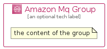

# AmazonMq


```text
aws-q2-2022/Architecture/AppIntegration/AmazonMq
```

```text
include('aws-q2-2022/Architecture/AppIntegration/AmazonMq')
```


| Illustration | AmazonMq | AmazonMqCard | AmazonMqGroup |
| :---: | :---: | :---: | :---: |
|  |  |  |  |


## AmazonMq

### Load remotely
```plantuml
@startuml
' configures the library
!global $LIB_BASE_LOCATION="https://raw.githubusercontent.com/tmorin/plantuml-libs/master/distribution"

' loads the library's bootstrap
!include $LIB_BASE_LOCATION/bootstrap.puml

' loads the package bootstrap
include('aws-q2-2022/bootstrap')

' loads the Item which embeds the element AmazonMq
include('aws-q2-2022/Architecture/AppIntegration/AmazonMq')

' renders the element
AmazonMq('AmazonMq', 'Amazon Mq', 'an optional tech label')
@enduml
```

### Load locally
```plantuml
@startuml
' configures the library
!global $INCLUSION_MODE="local"
!global $LIB_BASE_LOCATION="../../.."

' loads the library's bootstrap
!include $LIB_BASE_LOCATION/bootstrap.puml

' loads the package bootstrap
include('aws-q2-2022/bootstrap')

' loads the Item which embeds the element AmazonMq
include('aws-q2-2022/Architecture/AppIntegration/AmazonMq')

' renders the element
AmazonMq('AmazonMq', 'Amazon Mq', 'an optional tech label')
@enduml
```

## AmazonMqCard

### Load remotely
```plantuml
@startuml
' configures the library
!global $LIB_BASE_LOCATION="https://raw.githubusercontent.com/tmorin/plantuml-libs/master/distribution"

' loads the library's bootstrap
!include $LIB_BASE_LOCATION/bootstrap.puml

' loads the package bootstrap
include('aws-q2-2022/bootstrap')

' loads the Item which embeds the element AmazonMqCard
include('aws-q2-2022/Architecture/AppIntegration/AmazonMq')

' renders the element
AmazonMqCard('AmazonMqCard', 'Amazon Mq Card', 'an optional description')
@enduml
```

### Load locally
```plantuml
@startuml
' configures the library
!global $INCLUSION_MODE="local"
!global $LIB_BASE_LOCATION="../../.."

' loads the library's bootstrap
!include $LIB_BASE_LOCATION/bootstrap.puml

' loads the package bootstrap
include('aws-q2-2022/bootstrap')

' loads the Item which embeds the element AmazonMqCard
include('aws-q2-2022/Architecture/AppIntegration/AmazonMq')

' renders the element
AmazonMqCard('AmazonMqCard', 'Amazon Mq Card', 'an optional description')
@enduml
```

## AmazonMqGroup

### Load remotely
```plantuml
@startuml
' configures the library
!global $LIB_BASE_LOCATION="https://raw.githubusercontent.com/tmorin/plantuml-libs/master/distribution"

' loads the library's bootstrap
!include $LIB_BASE_LOCATION/bootstrap.puml

' loads the package bootstrap
include('aws-q2-2022/bootstrap')

' loads the Item which embeds the element AmazonMqGroup
include('aws-q2-2022/Architecture/AppIntegration/AmazonMq')

' renders the element
AmazonMqGroup('AmazonMqGroup', 'Amazon Mq Group', 'an optional tech label') {
    note as note
        the content of the group
    end note
}
@enduml
```

### Load locally
```plantuml
@startuml
' configures the library
!global $INCLUSION_MODE="local"
!global $LIB_BASE_LOCATION="../../.."

' loads the library's bootstrap
!include $LIB_BASE_LOCATION/bootstrap.puml

' loads the package bootstrap
include('aws-q2-2022/bootstrap')

' loads the Item which embeds the element AmazonMqGroup
include('aws-q2-2022/Architecture/AppIntegration/AmazonMq')

' renders the element
AmazonMqGroup('AmazonMqGroup', 'Amazon Mq Group', 'an optional tech label') {
    note as note
        the content of the group
    end note
}
@enduml
```

