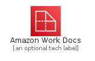
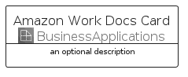
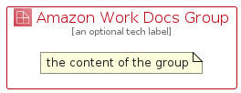

# AmazonWorkDocs


```text
aws-q2-2022/Architecture/BusinessApplications/AmazonWorkDocs
```

```text
include('aws-q2-2022/Architecture/BusinessApplications/AmazonWorkDocs')
```


| Illustration | AmazonWorkDocs | AmazonWorkDocsCard | AmazonWorkDocsGroup |
| :---: | :---: | :---: | :---: |
|  |  |  |  |


## AmazonWorkDocs

### Load remotely
```plantuml
@startuml
' configures the library
!global $LIB_BASE_LOCATION="https://raw.githubusercontent.com/tmorin/plantuml-libs/master/distribution"

' loads the library's bootstrap
!include $LIB_BASE_LOCATION/bootstrap.puml

' loads the package bootstrap
include('aws-q2-2022/bootstrap')

' loads the Item which embeds the element AmazonWorkDocs
include('aws-q2-2022/Architecture/BusinessApplications/AmazonWorkDocs')

' renders the element
AmazonWorkDocs('AmazonWorkDocs', 'Amazon Work Docs', 'an optional tech label')
@enduml
```

### Load locally
```plantuml
@startuml
' configures the library
!global $INCLUSION_MODE="local"
!global $LIB_BASE_LOCATION="../../.."

' loads the library's bootstrap
!include $LIB_BASE_LOCATION/bootstrap.puml

' loads the package bootstrap
include('aws-q2-2022/bootstrap')

' loads the Item which embeds the element AmazonWorkDocs
include('aws-q2-2022/Architecture/BusinessApplications/AmazonWorkDocs')

' renders the element
AmazonWorkDocs('AmazonWorkDocs', 'Amazon Work Docs', 'an optional tech label')
@enduml
```

## AmazonWorkDocsCard

### Load remotely
```plantuml
@startuml
' configures the library
!global $LIB_BASE_LOCATION="https://raw.githubusercontent.com/tmorin/plantuml-libs/master/distribution"

' loads the library's bootstrap
!include $LIB_BASE_LOCATION/bootstrap.puml

' loads the package bootstrap
include('aws-q2-2022/bootstrap')

' loads the Item which embeds the element AmazonWorkDocsCard
include('aws-q2-2022/Architecture/BusinessApplications/AmazonWorkDocs')

' renders the element
AmazonWorkDocsCard('AmazonWorkDocsCard', 'Amazon Work Docs Card', 'an optional description')
@enduml
```

### Load locally
```plantuml
@startuml
' configures the library
!global $INCLUSION_MODE="local"
!global $LIB_BASE_LOCATION="../../.."

' loads the library's bootstrap
!include $LIB_BASE_LOCATION/bootstrap.puml

' loads the package bootstrap
include('aws-q2-2022/bootstrap')

' loads the Item which embeds the element AmazonWorkDocsCard
include('aws-q2-2022/Architecture/BusinessApplications/AmazonWorkDocs')

' renders the element
AmazonWorkDocsCard('AmazonWorkDocsCard', 'Amazon Work Docs Card', 'an optional description')
@enduml
```

## AmazonWorkDocsGroup

### Load remotely
```plantuml
@startuml
' configures the library
!global $LIB_BASE_LOCATION="https://raw.githubusercontent.com/tmorin/plantuml-libs/master/distribution"

' loads the library's bootstrap
!include $LIB_BASE_LOCATION/bootstrap.puml

' loads the package bootstrap
include('aws-q2-2022/bootstrap')

' loads the Item which embeds the element AmazonWorkDocsGroup
include('aws-q2-2022/Architecture/BusinessApplications/AmazonWorkDocs')

' renders the element
AmazonWorkDocsGroup('AmazonWorkDocsGroup', 'Amazon Work Docs Group', 'an optional tech label') {
    note as note
        the content of the group
    end note
}
@enduml
```

### Load locally
```plantuml
@startuml
' configures the library
!global $INCLUSION_MODE="local"
!global $LIB_BASE_LOCATION="../../.."

' loads the library's bootstrap
!include $LIB_BASE_LOCATION/bootstrap.puml

' loads the package bootstrap
include('aws-q2-2022/bootstrap')

' loads the Item which embeds the element AmazonWorkDocsGroup
include('aws-q2-2022/Architecture/BusinessApplications/AmazonWorkDocs')

' renders the element
AmazonWorkDocsGroup('AmazonWorkDocsGroup', 'Amazon Work Docs Group', 'an optional tech label') {
    note as note
        the content of the group
    end note
}
@enduml
```

