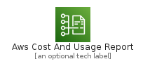
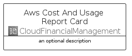
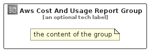

# AwsCostAndUsageReport


```text
aws-q2-2022/Architecture/CloudFinancialManagement/AwsCostAndUsageReport
```

```text
include('aws-q2-2022/Architecture/CloudFinancialManagement/AwsCostAndUsageReport')
```


| Illustration | AwsCostAndUsageReport | AwsCostAndUsageReportCard | AwsCostAndUsageReportGroup |
| :---: | :---: | :---: | :---: |
|  |  |  |  |


## AwsCostAndUsageReport

### Load remotely
```plantuml
@startuml
' configures the library
!global $LIB_BASE_LOCATION="https://raw.githubusercontent.com/tmorin/plantuml-libs/master/distribution"

' loads the library's bootstrap
!include $LIB_BASE_LOCATION/bootstrap.puml

' loads the package bootstrap
include('aws-q2-2022/bootstrap')

' loads the Item which embeds the element AwsCostAndUsageReport
include('aws-q2-2022/Architecture/CloudFinancialManagement/AwsCostAndUsageReport')

' renders the element
AwsCostAndUsageReport('AwsCostAndUsageReport', 'Aws Cost And Usage Report', 'an optional tech label', 'an optional description')
@enduml
```

### Load locally
```plantuml
@startuml
' configures the library
!global $INCLUSION_MODE="local"
!global $LIB_BASE_LOCATION="../../.."

' loads the library's bootstrap
!include $LIB_BASE_LOCATION/bootstrap.puml

' loads the package bootstrap
include('aws-q2-2022/bootstrap')

' loads the Item which embeds the element AwsCostAndUsageReport
include('aws-q2-2022/Architecture/CloudFinancialManagement/AwsCostAndUsageReport')

' renders the element
AwsCostAndUsageReport('AwsCostAndUsageReport', 'Aws Cost And Usage Report', 'an optional tech label', 'an optional description')
@enduml
```

## AwsCostAndUsageReportCard

### Load remotely
```plantuml
@startuml
' configures the library
!global $LIB_BASE_LOCATION="https://raw.githubusercontent.com/tmorin/plantuml-libs/master/distribution"

' loads the library's bootstrap
!include $LIB_BASE_LOCATION/bootstrap.puml

' loads the package bootstrap
include('aws-q2-2022/bootstrap')

' loads the Item which embeds the element AwsCostAndUsageReportCard
include('aws-q2-2022/Architecture/CloudFinancialManagement/AwsCostAndUsageReport')

' renders the element
AwsCostAndUsageReportCard('AwsCostAndUsageReportCard', 'Aws Cost And Usage Report Card', 'an optional description')
@enduml
```

### Load locally
```plantuml
@startuml
' configures the library
!global $INCLUSION_MODE="local"
!global $LIB_BASE_LOCATION="../../.."

' loads the library's bootstrap
!include $LIB_BASE_LOCATION/bootstrap.puml

' loads the package bootstrap
include('aws-q2-2022/bootstrap')

' loads the Item which embeds the element AwsCostAndUsageReportCard
include('aws-q2-2022/Architecture/CloudFinancialManagement/AwsCostAndUsageReport')

' renders the element
AwsCostAndUsageReportCard('AwsCostAndUsageReportCard', 'Aws Cost And Usage Report Card', 'an optional description')
@enduml
```

## AwsCostAndUsageReportGroup

### Load remotely
```plantuml
@startuml
' configures the library
!global $LIB_BASE_LOCATION="https://raw.githubusercontent.com/tmorin/plantuml-libs/master/distribution"

' loads the library's bootstrap
!include $LIB_BASE_LOCATION/bootstrap.puml

' loads the package bootstrap
include('aws-q2-2022/bootstrap')

' loads the Item which embeds the element AwsCostAndUsageReportGroup
include('aws-q2-2022/Architecture/CloudFinancialManagement/AwsCostAndUsageReport')

' renders the element
AwsCostAndUsageReportGroup('AwsCostAndUsageReportGroup', 'Aws Cost And Usage Report Group', 'an optional tech label') {
    note as note
        the content of the group
    end note
}
@enduml
```

### Load locally
```plantuml
@startuml
' configures the library
!global $INCLUSION_MODE="local"
!global $LIB_BASE_LOCATION="../../.."

' loads the library's bootstrap
!include $LIB_BASE_LOCATION/bootstrap.puml

' loads the package bootstrap
include('aws-q2-2022/bootstrap')

' loads the Item which embeds the element AwsCostAndUsageReportGroup
include('aws-q2-2022/Architecture/CloudFinancialManagement/AwsCostAndUsageReport')

' renders the element
AwsCostAndUsageReportGroup('AwsCostAndUsageReportGroup', 'Aws Cost And Usage Report Group', 'an optional tech label') {
    note as note
        the content of the group
    end note
}
@enduml
```

