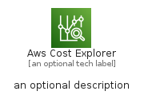
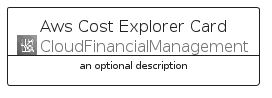
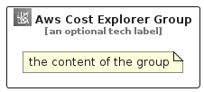

# AwsCostExplorer


```text
aws-q2-2022/Architecture/CloudFinancialManagement/AwsCostExplorer
```

```text
include('aws-q2-2022/Architecture/CloudFinancialManagement/AwsCostExplorer')
```


| Illustration | AwsCostExplorer | AwsCostExplorerCard | AwsCostExplorerGroup |
| :---: | :---: | :---: | :---: |
|  |  |  |  |


## AwsCostExplorer

### Load remotely
```plantuml
@startuml
' configures the library
!global $LIB_BASE_LOCATION="https://raw.githubusercontent.com/tmorin/plantuml-libs/master/distribution"

' loads the library's bootstrap
!include $LIB_BASE_LOCATION/bootstrap.puml

' loads the package bootstrap
include('aws-q2-2022/bootstrap')

' loads the Item which embeds the element AwsCostExplorer
include('aws-q2-2022/Architecture/CloudFinancialManagement/AwsCostExplorer')

' renders the element
AwsCostExplorer('AwsCostExplorer', 'Aws Cost Explorer', 'an optional tech label', 'an optional description')
@enduml
```

### Load locally
```plantuml
@startuml
' configures the library
!global $INCLUSION_MODE="local"
!global $LIB_BASE_LOCATION="../../.."

' loads the library's bootstrap
!include $LIB_BASE_LOCATION/bootstrap.puml

' loads the package bootstrap
include('aws-q2-2022/bootstrap')

' loads the Item which embeds the element AwsCostExplorer
include('aws-q2-2022/Architecture/CloudFinancialManagement/AwsCostExplorer')

' renders the element
AwsCostExplorer('AwsCostExplorer', 'Aws Cost Explorer', 'an optional tech label', 'an optional description')
@enduml
```

## AwsCostExplorerCard

### Load remotely
```plantuml
@startuml
' configures the library
!global $LIB_BASE_LOCATION="https://raw.githubusercontent.com/tmorin/plantuml-libs/master/distribution"

' loads the library's bootstrap
!include $LIB_BASE_LOCATION/bootstrap.puml

' loads the package bootstrap
include('aws-q2-2022/bootstrap')

' loads the Item which embeds the element AwsCostExplorerCard
include('aws-q2-2022/Architecture/CloudFinancialManagement/AwsCostExplorer')

' renders the element
AwsCostExplorerCard('AwsCostExplorerCard', 'Aws Cost Explorer Card', 'an optional description')
@enduml
```

### Load locally
```plantuml
@startuml
' configures the library
!global $INCLUSION_MODE="local"
!global $LIB_BASE_LOCATION="../../.."

' loads the library's bootstrap
!include $LIB_BASE_LOCATION/bootstrap.puml

' loads the package bootstrap
include('aws-q2-2022/bootstrap')

' loads the Item which embeds the element AwsCostExplorerCard
include('aws-q2-2022/Architecture/CloudFinancialManagement/AwsCostExplorer')

' renders the element
AwsCostExplorerCard('AwsCostExplorerCard', 'Aws Cost Explorer Card', 'an optional description')
@enduml
```

## AwsCostExplorerGroup

### Load remotely
```plantuml
@startuml
' configures the library
!global $LIB_BASE_LOCATION="https://raw.githubusercontent.com/tmorin/plantuml-libs/master/distribution"

' loads the library's bootstrap
!include $LIB_BASE_LOCATION/bootstrap.puml

' loads the package bootstrap
include('aws-q2-2022/bootstrap')

' loads the Item which embeds the element AwsCostExplorerGroup
include('aws-q2-2022/Architecture/CloudFinancialManagement/AwsCostExplorer')

' renders the element
AwsCostExplorerGroup('AwsCostExplorerGroup', 'Aws Cost Explorer Group', 'an optional tech label') {
    note as note
        the content of the group
    end note
}
@enduml
```

### Load locally
```plantuml
@startuml
' configures the library
!global $INCLUSION_MODE="local"
!global $LIB_BASE_LOCATION="../../.."

' loads the library's bootstrap
!include $LIB_BASE_LOCATION/bootstrap.puml

' loads the package bootstrap
include('aws-q2-2022/bootstrap')

' loads the Item which embeds the element AwsCostExplorerGroup
include('aws-q2-2022/Architecture/CloudFinancialManagement/AwsCostExplorer')

' renders the element
AwsCostExplorerGroup('AwsCostExplorerGroup', 'Aws Cost Explorer Group', 'an optional tech label') {
    note as note
        the content of the group
    end note
}
@enduml
```

