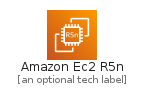
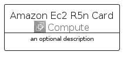
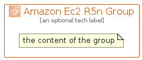

# AmazonEc2R5N


```text
aws-q2-2022/Architecture/Compute/AmazonEc2R5N
```

```text
include('aws-q2-2022/Architecture/Compute/AmazonEc2R5N')
```


| Illustration | AmazonEc2R5N | AmazonEc2R5NCard | AmazonEc2R5NGroup |
| :---: | :---: | :---: | :---: |
|  |  |  |  |


## AmazonEc2R5N

### Load remotely
```plantuml
@startuml
' configures the library
!global $LIB_BASE_LOCATION="https://raw.githubusercontent.com/tmorin/plantuml-libs/master/distribution"

' loads the library's bootstrap
!include $LIB_BASE_LOCATION/bootstrap.puml

' loads the package bootstrap
include('aws-q2-2022/bootstrap')

' loads the Item which embeds the element AmazonEc2R5N
include('aws-q2-2022/Architecture/Compute/AmazonEc2R5N')

' renders the element
AmazonEc2R5N('AmazonEc2R5n', 'Amazon Ec2 R5n', 'an optional tech label', 'an optional description')
@enduml
```

### Load locally
```plantuml
@startuml
' configures the library
!global $INCLUSION_MODE="local"
!global $LIB_BASE_LOCATION="../../.."

' loads the library's bootstrap
!include $LIB_BASE_LOCATION/bootstrap.puml

' loads the package bootstrap
include('aws-q2-2022/bootstrap')

' loads the Item which embeds the element AmazonEc2R5N
include('aws-q2-2022/Architecture/Compute/AmazonEc2R5N')

' renders the element
AmazonEc2R5N('AmazonEc2R5n', 'Amazon Ec2 R5n', 'an optional tech label', 'an optional description')
@enduml
```

## AmazonEc2R5NCard

### Load remotely
```plantuml
@startuml
' configures the library
!global $LIB_BASE_LOCATION="https://raw.githubusercontent.com/tmorin/plantuml-libs/master/distribution"

' loads the library's bootstrap
!include $LIB_BASE_LOCATION/bootstrap.puml

' loads the package bootstrap
include('aws-q2-2022/bootstrap')

' loads the Item which embeds the element AmazonEc2R5NCard
include('aws-q2-2022/Architecture/Compute/AmazonEc2R5N')

' renders the element
AmazonEc2R5NCard('AmazonEc2R5nCard', 'Amazon Ec2 R5n Card', 'an optional description')
@enduml
```

### Load locally
```plantuml
@startuml
' configures the library
!global $INCLUSION_MODE="local"
!global $LIB_BASE_LOCATION="../../.."

' loads the library's bootstrap
!include $LIB_BASE_LOCATION/bootstrap.puml

' loads the package bootstrap
include('aws-q2-2022/bootstrap')

' loads the Item which embeds the element AmazonEc2R5NCard
include('aws-q2-2022/Architecture/Compute/AmazonEc2R5N')

' renders the element
AmazonEc2R5NCard('AmazonEc2R5nCard', 'Amazon Ec2 R5n Card', 'an optional description')
@enduml
```

## AmazonEc2R5NGroup

### Load remotely
```plantuml
@startuml
' configures the library
!global $LIB_BASE_LOCATION="https://raw.githubusercontent.com/tmorin/plantuml-libs/master/distribution"

' loads the library's bootstrap
!include $LIB_BASE_LOCATION/bootstrap.puml

' loads the package bootstrap
include('aws-q2-2022/bootstrap')

' loads the Item which embeds the element AmazonEc2R5NGroup
include('aws-q2-2022/Architecture/Compute/AmazonEc2R5N')

' renders the element
AmazonEc2R5NGroup('AmazonEc2R5nGroup', 'Amazon Ec2 R5n Group', 'an optional tech label') {
    note as note
        the content of the group
    end note
}
@enduml
```

### Load locally
```plantuml
@startuml
' configures the library
!global $INCLUSION_MODE="local"
!global $LIB_BASE_LOCATION="../../.."

' loads the library's bootstrap
!include $LIB_BASE_LOCATION/bootstrap.puml

' loads the package bootstrap
include('aws-q2-2022/bootstrap')

' loads the Item which embeds the element AmazonEc2R5NGroup
include('aws-q2-2022/Architecture/Compute/AmazonEc2R5N')

' renders the element
AmazonEc2R5NGroup('AmazonEc2R5nGroup', 'Amazon Ec2 R5n Group', 'an optional tech label') {
    note as note
        the content of the group
    end note
}
@enduml
```

