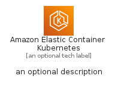
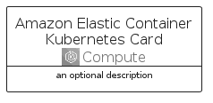

# AmazonElasticContainerKubernetes


```text
aws-q2-2022/Architecture/Compute/AmazonElasticContainerKubernetes
```

```text
include('aws-q2-2022/Architecture/Compute/AmazonElasticContainerKubernetes')
```


| Illustration | AmazonElasticContainerKubernetes | AmazonElasticContainerKubernetesCard | AmazonElasticContainerKubernetesGroup |
| :---: | :---: | :---: | :---: |
|  |  |  |  |


## AmazonElasticContainerKubernetes

### Load remotely
```plantuml
@startuml
' configures the library
!global $LIB_BASE_LOCATION="https://raw.githubusercontent.com/tmorin/plantuml-libs/master/distribution"

' loads the library's bootstrap
!include $LIB_BASE_LOCATION/bootstrap.puml

' loads the package bootstrap
include('aws-q2-2022/bootstrap')

' loads the Item which embeds the element AmazonElasticContainerKubernetes
include('aws-q2-2022/Architecture/Compute/AmazonElasticContainerKubernetes')

' renders the element
AmazonElasticContainerKubernetes('AmazonElasticContainerKubernetes', 'Amazon Elastic Container Kubernetes', 'an optional tech label')
@enduml
```

### Load locally
```plantuml
@startuml
' configures the library
!global $INCLUSION_MODE="local"
!global $LIB_BASE_LOCATION="../../.."

' loads the library's bootstrap
!include $LIB_BASE_LOCATION/bootstrap.puml

' loads the package bootstrap
include('aws-q2-2022/bootstrap')

' loads the Item which embeds the element AmazonElasticContainerKubernetes
include('aws-q2-2022/Architecture/Compute/AmazonElasticContainerKubernetes')

' renders the element
AmazonElasticContainerKubernetes('AmazonElasticContainerKubernetes', 'Amazon Elastic Container Kubernetes', 'an optional tech label')
@enduml
```

## AmazonElasticContainerKubernetesCard

### Load remotely
```plantuml
@startuml
' configures the library
!global $LIB_BASE_LOCATION="https://raw.githubusercontent.com/tmorin/plantuml-libs/master/distribution"

' loads the library's bootstrap
!include $LIB_BASE_LOCATION/bootstrap.puml

' loads the package bootstrap
include('aws-q2-2022/bootstrap')

' loads the Item which embeds the element AmazonElasticContainerKubernetesCard
include('aws-q2-2022/Architecture/Compute/AmazonElasticContainerKubernetes')

' renders the element
AmazonElasticContainerKubernetesCard('AmazonElasticContainerKubernetesCard', 'Amazon Elastic Container Kubernetes Card', 'an optional description')
@enduml
```

### Load locally
```plantuml
@startuml
' configures the library
!global $INCLUSION_MODE="local"
!global $LIB_BASE_LOCATION="../../.."

' loads the library's bootstrap
!include $LIB_BASE_LOCATION/bootstrap.puml

' loads the package bootstrap
include('aws-q2-2022/bootstrap')

' loads the Item which embeds the element AmazonElasticContainerKubernetesCard
include('aws-q2-2022/Architecture/Compute/AmazonElasticContainerKubernetes')

' renders the element
AmazonElasticContainerKubernetesCard('AmazonElasticContainerKubernetesCard', 'Amazon Elastic Container Kubernetes Card', 'an optional description')
@enduml
```

## AmazonElasticContainerKubernetesGroup

### Load remotely
```plantuml
@startuml
' configures the library
!global $LIB_BASE_LOCATION="https://raw.githubusercontent.com/tmorin/plantuml-libs/master/distribution"

' loads the library's bootstrap
!include $LIB_BASE_LOCATION/bootstrap.puml

' loads the package bootstrap
include('aws-q2-2022/bootstrap')

' loads the Item which embeds the element AmazonElasticContainerKubernetesGroup
include('aws-q2-2022/Architecture/Compute/AmazonElasticContainerKubernetes')

' renders the element
AmazonElasticContainerKubernetesGroup('AmazonElasticContainerKubernetesGroup', 'Amazon Elastic Container Kubernetes Group', 'an optional tech label') {
    note as note
        the content of the group
    end note
}
@enduml
```

### Load locally
```plantuml
@startuml
' configures the library
!global $INCLUSION_MODE="local"
!global $LIB_BASE_LOCATION="../../.."

' loads the library's bootstrap
!include $LIB_BASE_LOCATION/bootstrap.puml

' loads the package bootstrap
include('aws-q2-2022/bootstrap')

' loads the Item which embeds the element AmazonElasticContainerKubernetesGroup
include('aws-q2-2022/Architecture/Compute/AmazonElasticContainerKubernetes')

' renders the element
AmazonElasticContainerKubernetesGroup('AmazonElasticContainerKubernetesGroup', 'Amazon Elastic Container Kubernetes Group', 'an optional tech label') {
    note as note
        the content of the group
    end note
}
@enduml
```

