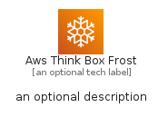
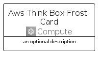
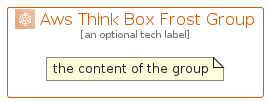

# AwsThinkBoxFrost


```text
aws-q2-2022/Architecture/Compute/AwsThinkBoxFrost
```

```text
include('aws-q2-2022/Architecture/Compute/AwsThinkBoxFrost')
```


| Illustration | AwsThinkBoxFrost | AwsThinkBoxFrostCard | AwsThinkBoxFrostGroup |
| :---: | :---: | :---: | :---: |
|  |  |  |  |


## AwsThinkBoxFrost

### Load remotely
```plantuml
@startuml
' configures the library
!global $LIB_BASE_LOCATION="https://raw.githubusercontent.com/tmorin/plantuml-libs/master/distribution"

' loads the library's bootstrap
!include $LIB_BASE_LOCATION/bootstrap.puml

' loads the package bootstrap
include('aws-q2-2022/bootstrap')

' loads the Item which embeds the element AwsThinkBoxFrost
include('aws-q2-2022/Architecture/Compute/AwsThinkBoxFrost')

' renders the element
AwsThinkBoxFrost('AwsThinkBoxFrost', 'Aws Think Box Frost', 'an optional tech label')
@enduml
```

### Load locally
```plantuml
@startuml
' configures the library
!global $INCLUSION_MODE="local"
!global $LIB_BASE_LOCATION="../../.."

' loads the library's bootstrap
!include $LIB_BASE_LOCATION/bootstrap.puml

' loads the package bootstrap
include('aws-q2-2022/bootstrap')

' loads the Item which embeds the element AwsThinkBoxFrost
include('aws-q2-2022/Architecture/Compute/AwsThinkBoxFrost')

' renders the element
AwsThinkBoxFrost('AwsThinkBoxFrost', 'Aws Think Box Frost', 'an optional tech label')
@enduml
```

## AwsThinkBoxFrostCard

### Load remotely
```plantuml
@startuml
' configures the library
!global $LIB_BASE_LOCATION="https://raw.githubusercontent.com/tmorin/plantuml-libs/master/distribution"

' loads the library's bootstrap
!include $LIB_BASE_LOCATION/bootstrap.puml

' loads the package bootstrap
include('aws-q2-2022/bootstrap')

' loads the Item which embeds the element AwsThinkBoxFrostCard
include('aws-q2-2022/Architecture/Compute/AwsThinkBoxFrost')

' renders the element
AwsThinkBoxFrostCard('AwsThinkBoxFrostCard', 'Aws Think Box Frost Card', 'an optional description')
@enduml
```

### Load locally
```plantuml
@startuml
' configures the library
!global $INCLUSION_MODE="local"
!global $LIB_BASE_LOCATION="../../.."

' loads the library's bootstrap
!include $LIB_BASE_LOCATION/bootstrap.puml

' loads the package bootstrap
include('aws-q2-2022/bootstrap')

' loads the Item which embeds the element AwsThinkBoxFrostCard
include('aws-q2-2022/Architecture/Compute/AwsThinkBoxFrost')

' renders the element
AwsThinkBoxFrostCard('AwsThinkBoxFrostCard', 'Aws Think Box Frost Card', 'an optional description')
@enduml
```

## AwsThinkBoxFrostGroup

### Load remotely
```plantuml
@startuml
' configures the library
!global $LIB_BASE_LOCATION="https://raw.githubusercontent.com/tmorin/plantuml-libs/master/distribution"

' loads the library's bootstrap
!include $LIB_BASE_LOCATION/bootstrap.puml

' loads the package bootstrap
include('aws-q2-2022/bootstrap')

' loads the Item which embeds the element AwsThinkBoxFrostGroup
include('aws-q2-2022/Architecture/Compute/AwsThinkBoxFrost')

' renders the element
AwsThinkBoxFrostGroup('AwsThinkBoxFrostGroup', 'Aws Think Box Frost Group', 'an optional tech label') {
    note as note
        the content of the group
    end note
}
@enduml
```

### Load locally
```plantuml
@startuml
' configures the library
!global $INCLUSION_MODE="local"
!global $LIB_BASE_LOCATION="../../.."

' loads the library's bootstrap
!include $LIB_BASE_LOCATION/bootstrap.puml

' loads the package bootstrap
include('aws-q2-2022/bootstrap')

' loads the Item which embeds the element AwsThinkBoxFrostGroup
include('aws-q2-2022/Architecture/Compute/AwsThinkBoxFrost')

' renders the element
AwsThinkBoxFrostGroup('AwsThinkBoxFrostGroup', 'Aws Think Box Frost Group', 'an optional tech label') {
    note as note
        the content of the group
    end note
}
@enduml
```

