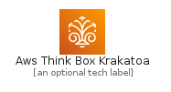
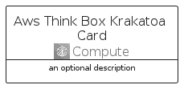
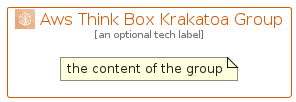

# AwsThinkBoxKrakatoa


```text
aws-q2-2022/Architecture/Compute/AwsThinkBoxKrakatoa
```

```text
include('aws-q2-2022/Architecture/Compute/AwsThinkBoxKrakatoa')
```


| Illustration | AwsThinkBoxKrakatoa | AwsThinkBoxKrakatoaCard | AwsThinkBoxKrakatoaGroup |
| :---: | :---: | :---: | :---: |
|  |  |  |  |


## AwsThinkBoxKrakatoa

### Load remotely
```plantuml
@startuml
' configures the library
!global $LIB_BASE_LOCATION="https://raw.githubusercontent.com/tmorin/plantuml-libs/master/distribution"

' loads the library's bootstrap
!include $LIB_BASE_LOCATION/bootstrap.puml

' loads the package bootstrap
include('aws-q2-2022/bootstrap')

' loads the Item which embeds the element AwsThinkBoxKrakatoa
include('aws-q2-2022/Architecture/Compute/AwsThinkBoxKrakatoa')

' renders the element
AwsThinkBoxKrakatoa('AwsThinkBoxKrakatoa', 'Aws Think Box Krakatoa', 'an optional tech label')
@enduml
```

### Load locally
```plantuml
@startuml
' configures the library
!global $INCLUSION_MODE="local"
!global $LIB_BASE_LOCATION="../../.."

' loads the library's bootstrap
!include $LIB_BASE_LOCATION/bootstrap.puml

' loads the package bootstrap
include('aws-q2-2022/bootstrap')

' loads the Item which embeds the element AwsThinkBoxKrakatoa
include('aws-q2-2022/Architecture/Compute/AwsThinkBoxKrakatoa')

' renders the element
AwsThinkBoxKrakatoa('AwsThinkBoxKrakatoa', 'Aws Think Box Krakatoa', 'an optional tech label')
@enduml
```

## AwsThinkBoxKrakatoaCard

### Load remotely
```plantuml
@startuml
' configures the library
!global $LIB_BASE_LOCATION="https://raw.githubusercontent.com/tmorin/plantuml-libs/master/distribution"

' loads the library's bootstrap
!include $LIB_BASE_LOCATION/bootstrap.puml

' loads the package bootstrap
include('aws-q2-2022/bootstrap')

' loads the Item which embeds the element AwsThinkBoxKrakatoaCard
include('aws-q2-2022/Architecture/Compute/AwsThinkBoxKrakatoa')

' renders the element
AwsThinkBoxKrakatoaCard('AwsThinkBoxKrakatoaCard', 'Aws Think Box Krakatoa Card', 'an optional description')
@enduml
```

### Load locally
```plantuml
@startuml
' configures the library
!global $INCLUSION_MODE="local"
!global $LIB_BASE_LOCATION="../../.."

' loads the library's bootstrap
!include $LIB_BASE_LOCATION/bootstrap.puml

' loads the package bootstrap
include('aws-q2-2022/bootstrap')

' loads the Item which embeds the element AwsThinkBoxKrakatoaCard
include('aws-q2-2022/Architecture/Compute/AwsThinkBoxKrakatoa')

' renders the element
AwsThinkBoxKrakatoaCard('AwsThinkBoxKrakatoaCard', 'Aws Think Box Krakatoa Card', 'an optional description')
@enduml
```

## AwsThinkBoxKrakatoaGroup

### Load remotely
```plantuml
@startuml
' configures the library
!global $LIB_BASE_LOCATION="https://raw.githubusercontent.com/tmorin/plantuml-libs/master/distribution"

' loads the library's bootstrap
!include $LIB_BASE_LOCATION/bootstrap.puml

' loads the package bootstrap
include('aws-q2-2022/bootstrap')

' loads the Item which embeds the element AwsThinkBoxKrakatoaGroup
include('aws-q2-2022/Architecture/Compute/AwsThinkBoxKrakatoa')

' renders the element
AwsThinkBoxKrakatoaGroup('AwsThinkBoxKrakatoaGroup', 'Aws Think Box Krakatoa Group', 'an optional tech label') {
    note as note
        the content of the group
    end note
}
@enduml
```

### Load locally
```plantuml
@startuml
' configures the library
!global $INCLUSION_MODE="local"
!global $LIB_BASE_LOCATION="../../.."

' loads the library's bootstrap
!include $LIB_BASE_LOCATION/bootstrap.puml

' loads the package bootstrap
include('aws-q2-2022/bootstrap')

' loads the Item which embeds the element AwsThinkBoxKrakatoaGroup
include('aws-q2-2022/Architecture/Compute/AwsThinkBoxKrakatoa')

' renders the element
AwsThinkBoxKrakatoaGroup('AwsThinkBoxKrakatoaGroup', 'Aws Think Box Krakatoa Group', 'an optional tech label') {
    note as note
        the content of the group
    end note
}
@enduml
```

