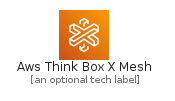
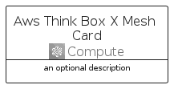
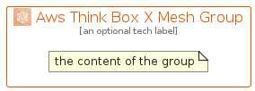

# AwsThinkBoxXMesh


```text
aws-q2-2022/Architecture/Compute/AwsThinkBoxXMesh
```

```text
include('aws-q2-2022/Architecture/Compute/AwsThinkBoxXMesh')
```


| Illustration | AwsThinkBoxXMesh | AwsThinkBoxXMeshCard | AwsThinkBoxXMeshGroup |
| :---: | :---: | :---: | :---: |
|  |  |  |  |


## AwsThinkBoxXMesh

### Load remotely
```plantuml
@startuml
' configures the library
!global $LIB_BASE_LOCATION="https://raw.githubusercontent.com/tmorin/plantuml-libs/master/distribution"

' loads the library's bootstrap
!include $LIB_BASE_LOCATION/bootstrap.puml

' loads the package bootstrap
include('aws-q2-2022/bootstrap')

' loads the Item which embeds the element AwsThinkBoxXMesh
include('aws-q2-2022/Architecture/Compute/AwsThinkBoxXMesh')

' renders the element
AwsThinkBoxXMesh('AwsThinkBoxXMesh', 'Aws Think Box X Mesh', 'an optional tech label', 'an optional description')
@enduml
```

### Load locally
```plantuml
@startuml
' configures the library
!global $INCLUSION_MODE="local"
!global $LIB_BASE_LOCATION="../../.."

' loads the library's bootstrap
!include $LIB_BASE_LOCATION/bootstrap.puml

' loads the package bootstrap
include('aws-q2-2022/bootstrap')

' loads the Item which embeds the element AwsThinkBoxXMesh
include('aws-q2-2022/Architecture/Compute/AwsThinkBoxXMesh')

' renders the element
AwsThinkBoxXMesh('AwsThinkBoxXMesh', 'Aws Think Box X Mesh', 'an optional tech label', 'an optional description')
@enduml
```

## AwsThinkBoxXMeshCard

### Load remotely
```plantuml
@startuml
' configures the library
!global $LIB_BASE_LOCATION="https://raw.githubusercontent.com/tmorin/plantuml-libs/master/distribution"

' loads the library's bootstrap
!include $LIB_BASE_LOCATION/bootstrap.puml

' loads the package bootstrap
include('aws-q2-2022/bootstrap')

' loads the Item which embeds the element AwsThinkBoxXMeshCard
include('aws-q2-2022/Architecture/Compute/AwsThinkBoxXMesh')

' renders the element
AwsThinkBoxXMeshCard('AwsThinkBoxXMeshCard', 'Aws Think Box X Mesh Card', 'an optional description')
@enduml
```

### Load locally
```plantuml
@startuml
' configures the library
!global $INCLUSION_MODE="local"
!global $LIB_BASE_LOCATION="../../.."

' loads the library's bootstrap
!include $LIB_BASE_LOCATION/bootstrap.puml

' loads the package bootstrap
include('aws-q2-2022/bootstrap')

' loads the Item which embeds the element AwsThinkBoxXMeshCard
include('aws-q2-2022/Architecture/Compute/AwsThinkBoxXMesh')

' renders the element
AwsThinkBoxXMeshCard('AwsThinkBoxXMeshCard', 'Aws Think Box X Mesh Card', 'an optional description')
@enduml
```

## AwsThinkBoxXMeshGroup

### Load remotely
```plantuml
@startuml
' configures the library
!global $LIB_BASE_LOCATION="https://raw.githubusercontent.com/tmorin/plantuml-libs/master/distribution"

' loads the library's bootstrap
!include $LIB_BASE_LOCATION/bootstrap.puml

' loads the package bootstrap
include('aws-q2-2022/bootstrap')

' loads the Item which embeds the element AwsThinkBoxXMeshGroup
include('aws-q2-2022/Architecture/Compute/AwsThinkBoxXMesh')

' renders the element
AwsThinkBoxXMeshGroup('AwsThinkBoxXMeshGroup', 'Aws Think Box X Mesh Group', 'an optional tech label') {
    note as note
        the content of the group
    end note
}
@enduml
```

### Load locally
```plantuml
@startuml
' configures the library
!global $INCLUSION_MODE="local"
!global $LIB_BASE_LOCATION="../../.."

' loads the library's bootstrap
!include $LIB_BASE_LOCATION/bootstrap.puml

' loads the package bootstrap
include('aws-q2-2022/bootstrap')

' loads the Item which embeds the element AwsThinkBoxXMeshGroup
include('aws-q2-2022/Architecture/Compute/AwsThinkBoxXMesh')

' renders the element
AwsThinkBoxXMeshGroup('AwsThinkBoxXMeshGroup', 'Aws Think Box X Mesh Group', 'an optional tech label') {
    note as note
        the content of the group
    end note
}
@enduml
```

