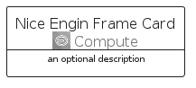
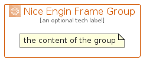

# NiceEnginFrame


```text
aws-q2-2022/Architecture/Compute/NiceEnginFrame
```

```text
include('aws-q2-2022/Architecture/Compute/NiceEnginFrame')
```


| Illustration | NiceEnginFrame | NiceEnginFrameCard | NiceEnginFrameGroup |
| :---: | :---: | :---: | :---: |
|  |  |  |  |


## NiceEnginFrame

### Load remotely
```plantuml
@startuml
' configures the library
!global $LIB_BASE_LOCATION="https://raw.githubusercontent.com/tmorin/plantuml-libs/master/distribution"

' loads the library's bootstrap
!include $LIB_BASE_LOCATION/bootstrap.puml

' loads the package bootstrap
include('aws-q2-2022/bootstrap')

' loads the Item which embeds the element NiceEnginFrame
include('aws-q2-2022/Architecture/Compute/NiceEnginFrame')

' renders the element
NiceEnginFrame('NiceEnginFrame', 'Nice Engin Frame', 'an optional tech label')
@enduml
```

### Load locally
```plantuml
@startuml
' configures the library
!global $INCLUSION_MODE="local"
!global $LIB_BASE_LOCATION="../../.."

' loads the library's bootstrap
!include $LIB_BASE_LOCATION/bootstrap.puml

' loads the package bootstrap
include('aws-q2-2022/bootstrap')

' loads the Item which embeds the element NiceEnginFrame
include('aws-q2-2022/Architecture/Compute/NiceEnginFrame')

' renders the element
NiceEnginFrame('NiceEnginFrame', 'Nice Engin Frame', 'an optional tech label')
@enduml
```

## NiceEnginFrameCard

### Load remotely
```plantuml
@startuml
' configures the library
!global $LIB_BASE_LOCATION="https://raw.githubusercontent.com/tmorin/plantuml-libs/master/distribution"

' loads the library's bootstrap
!include $LIB_BASE_LOCATION/bootstrap.puml

' loads the package bootstrap
include('aws-q2-2022/bootstrap')

' loads the Item which embeds the element NiceEnginFrameCard
include('aws-q2-2022/Architecture/Compute/NiceEnginFrame')

' renders the element
NiceEnginFrameCard('NiceEnginFrameCard', 'Nice Engin Frame Card', 'an optional description')
@enduml
```

### Load locally
```plantuml
@startuml
' configures the library
!global $INCLUSION_MODE="local"
!global $LIB_BASE_LOCATION="../../.."

' loads the library's bootstrap
!include $LIB_BASE_LOCATION/bootstrap.puml

' loads the package bootstrap
include('aws-q2-2022/bootstrap')

' loads the Item which embeds the element NiceEnginFrameCard
include('aws-q2-2022/Architecture/Compute/NiceEnginFrame')

' renders the element
NiceEnginFrameCard('NiceEnginFrameCard', 'Nice Engin Frame Card', 'an optional description')
@enduml
```

## NiceEnginFrameGroup

### Load remotely
```plantuml
@startuml
' configures the library
!global $LIB_BASE_LOCATION="https://raw.githubusercontent.com/tmorin/plantuml-libs/master/distribution"

' loads the library's bootstrap
!include $LIB_BASE_LOCATION/bootstrap.puml

' loads the package bootstrap
include('aws-q2-2022/bootstrap')

' loads the Item which embeds the element NiceEnginFrameGroup
include('aws-q2-2022/Architecture/Compute/NiceEnginFrame')

' renders the element
NiceEnginFrameGroup('NiceEnginFrameGroup', 'Nice Engin Frame Group', 'an optional tech label') {
    note as note
        the content of the group
    end note
}
@enduml
```

### Load locally
```plantuml
@startuml
' configures the library
!global $INCLUSION_MODE="local"
!global $LIB_BASE_LOCATION="../../.."

' loads the library's bootstrap
!include $LIB_BASE_LOCATION/bootstrap.puml

' loads the package bootstrap
include('aws-q2-2022/bootstrap')

' loads the Item which embeds the element NiceEnginFrameGroup
include('aws-q2-2022/Architecture/Compute/NiceEnginFrame')

' renders the element
NiceEnginFrameGroup('NiceEnginFrameGroup', 'Nice Engin Frame Group', 'an optional tech label') {
    note as note
        the content of the group
    end note
}
@enduml
```

