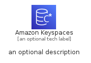
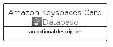
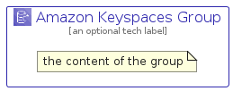

# AmazonKeyspaces


```text
aws-q2-2022/Architecture/Database/AmazonKeyspaces
```

```text
include('aws-q2-2022/Architecture/Database/AmazonKeyspaces')
```


| Illustration | AmazonKeyspaces | AmazonKeyspacesCard | AmazonKeyspacesGroup |
| :---: | :---: | :---: | :---: |
|  |  |  |  |


## AmazonKeyspaces

### Load remotely
```plantuml
@startuml
' configures the library
!global $LIB_BASE_LOCATION="https://raw.githubusercontent.com/tmorin/plantuml-libs/master/distribution"

' loads the library's bootstrap
!include $LIB_BASE_LOCATION/bootstrap.puml

' loads the package bootstrap
include('aws-q2-2022/bootstrap')

' loads the Item which embeds the element AmazonKeyspaces
include('aws-q2-2022/Architecture/Database/AmazonKeyspaces')

' renders the element
AmazonKeyspaces('AmazonKeyspaces', 'Amazon Keyspaces', 'an optional tech label', 'an optional description')
@enduml
```

### Load locally
```plantuml
@startuml
' configures the library
!global $INCLUSION_MODE="local"
!global $LIB_BASE_LOCATION="../../.."

' loads the library's bootstrap
!include $LIB_BASE_LOCATION/bootstrap.puml

' loads the package bootstrap
include('aws-q2-2022/bootstrap')

' loads the Item which embeds the element AmazonKeyspaces
include('aws-q2-2022/Architecture/Database/AmazonKeyspaces')

' renders the element
AmazonKeyspaces('AmazonKeyspaces', 'Amazon Keyspaces', 'an optional tech label', 'an optional description')
@enduml
```

## AmazonKeyspacesCard

### Load remotely
```plantuml
@startuml
' configures the library
!global $LIB_BASE_LOCATION="https://raw.githubusercontent.com/tmorin/plantuml-libs/master/distribution"

' loads the library's bootstrap
!include $LIB_BASE_LOCATION/bootstrap.puml

' loads the package bootstrap
include('aws-q2-2022/bootstrap')

' loads the Item which embeds the element AmazonKeyspacesCard
include('aws-q2-2022/Architecture/Database/AmazonKeyspaces')

' renders the element
AmazonKeyspacesCard('AmazonKeyspacesCard', 'Amazon Keyspaces Card', 'an optional description')
@enduml
```

### Load locally
```plantuml
@startuml
' configures the library
!global $INCLUSION_MODE="local"
!global $LIB_BASE_LOCATION="../../.."

' loads the library's bootstrap
!include $LIB_BASE_LOCATION/bootstrap.puml

' loads the package bootstrap
include('aws-q2-2022/bootstrap')

' loads the Item which embeds the element AmazonKeyspacesCard
include('aws-q2-2022/Architecture/Database/AmazonKeyspaces')

' renders the element
AmazonKeyspacesCard('AmazonKeyspacesCard', 'Amazon Keyspaces Card', 'an optional description')
@enduml
```

## AmazonKeyspacesGroup

### Load remotely
```plantuml
@startuml
' configures the library
!global $LIB_BASE_LOCATION="https://raw.githubusercontent.com/tmorin/plantuml-libs/master/distribution"

' loads the library's bootstrap
!include $LIB_BASE_LOCATION/bootstrap.puml

' loads the package bootstrap
include('aws-q2-2022/bootstrap')

' loads the Item which embeds the element AmazonKeyspacesGroup
include('aws-q2-2022/Architecture/Database/AmazonKeyspaces')

' renders the element
AmazonKeyspacesGroup('AmazonKeyspacesGroup', 'Amazon Keyspaces Group', 'an optional tech label') {
    note as note
        the content of the group
    end note
}
@enduml
```

### Load locally
```plantuml
@startuml
' configures the library
!global $INCLUSION_MODE="local"
!global $LIB_BASE_LOCATION="../../.."

' loads the library's bootstrap
!include $LIB_BASE_LOCATION/bootstrap.puml

' loads the package bootstrap
include('aws-q2-2022/bootstrap')

' loads the Item which embeds the element AmazonKeyspacesGroup
include('aws-q2-2022/Architecture/Database/AmazonKeyspaces')

' renders the element
AmazonKeyspacesGroup('AmazonKeyspacesGroup', 'Amazon Keyspaces Group', 'an optional tech label') {
    note as note
        the content of the group
    end note
}
@enduml
```

