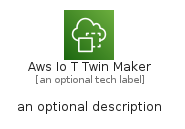
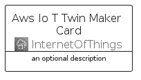
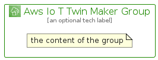

# AwsIoTTwinMaker


```text
aws-q2-2022/Architecture/InternetOfThings/AwsIoTTwinMaker
```

```text
include('aws-q2-2022/Architecture/InternetOfThings/AwsIoTTwinMaker')
```


| Illustration | AwsIoTTwinMaker | AwsIoTTwinMakerCard | AwsIoTTwinMakerGroup |
| :---: | :---: | :---: | :---: |
|  |  |  |  |


## AwsIoTTwinMaker

### Load remotely
```plantuml
@startuml
' configures the library
!global $LIB_BASE_LOCATION="https://raw.githubusercontent.com/tmorin/plantuml-libs/master/distribution"

' loads the library's bootstrap
!include $LIB_BASE_LOCATION/bootstrap.puml

' loads the package bootstrap
include('aws-q2-2022/bootstrap')

' loads the Item which embeds the element AwsIoTTwinMaker
include('aws-q2-2022/Architecture/InternetOfThings/AwsIoTTwinMaker')

' renders the element
AwsIoTTwinMaker('AwsIoTTwinMaker', 'Aws Io T Twin Maker', 'an optional tech label')
@enduml
```

### Load locally
```plantuml
@startuml
' configures the library
!global $INCLUSION_MODE="local"
!global $LIB_BASE_LOCATION="../../.."

' loads the library's bootstrap
!include $LIB_BASE_LOCATION/bootstrap.puml

' loads the package bootstrap
include('aws-q2-2022/bootstrap')

' loads the Item which embeds the element AwsIoTTwinMaker
include('aws-q2-2022/Architecture/InternetOfThings/AwsIoTTwinMaker')

' renders the element
AwsIoTTwinMaker('AwsIoTTwinMaker', 'Aws Io T Twin Maker', 'an optional tech label')
@enduml
```

## AwsIoTTwinMakerCard

### Load remotely
```plantuml
@startuml
' configures the library
!global $LIB_BASE_LOCATION="https://raw.githubusercontent.com/tmorin/plantuml-libs/master/distribution"

' loads the library's bootstrap
!include $LIB_BASE_LOCATION/bootstrap.puml

' loads the package bootstrap
include('aws-q2-2022/bootstrap')

' loads the Item which embeds the element AwsIoTTwinMakerCard
include('aws-q2-2022/Architecture/InternetOfThings/AwsIoTTwinMaker')

' renders the element
AwsIoTTwinMakerCard('AwsIoTTwinMakerCard', 'Aws Io T Twin Maker Card', 'an optional description')
@enduml
```

### Load locally
```plantuml
@startuml
' configures the library
!global $INCLUSION_MODE="local"
!global $LIB_BASE_LOCATION="../../.."

' loads the library's bootstrap
!include $LIB_BASE_LOCATION/bootstrap.puml

' loads the package bootstrap
include('aws-q2-2022/bootstrap')

' loads the Item which embeds the element AwsIoTTwinMakerCard
include('aws-q2-2022/Architecture/InternetOfThings/AwsIoTTwinMaker')

' renders the element
AwsIoTTwinMakerCard('AwsIoTTwinMakerCard', 'Aws Io T Twin Maker Card', 'an optional description')
@enduml
```

## AwsIoTTwinMakerGroup

### Load remotely
```plantuml
@startuml
' configures the library
!global $LIB_BASE_LOCATION="https://raw.githubusercontent.com/tmorin/plantuml-libs/master/distribution"

' loads the library's bootstrap
!include $LIB_BASE_LOCATION/bootstrap.puml

' loads the package bootstrap
include('aws-q2-2022/bootstrap')

' loads the Item which embeds the element AwsIoTTwinMakerGroup
include('aws-q2-2022/Architecture/InternetOfThings/AwsIoTTwinMaker')

' renders the element
AwsIoTTwinMakerGroup('AwsIoTTwinMakerGroup', 'Aws Io T Twin Maker Group', 'an optional tech label') {
    note as note
        the content of the group
    end note
}
@enduml
```

### Load locally
```plantuml
@startuml
' configures the library
!global $INCLUSION_MODE="local"
!global $LIB_BASE_LOCATION="../../.."

' loads the library's bootstrap
!include $LIB_BASE_LOCATION/bootstrap.puml

' loads the package bootstrap
include('aws-q2-2022/bootstrap')

' loads the Item which embeds the element AwsIoTTwinMakerGroup
include('aws-q2-2022/Architecture/InternetOfThings/AwsIoTTwinMaker')

' renders the element
AwsIoTTwinMakerGroup('AwsIoTTwinMakerGroup', 'Aws Io T Twin Maker Group', 'an optional tech label') {
    note as note
        the content of the group
    end note
}
@enduml
```

