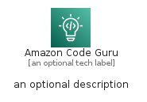
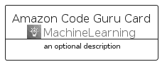
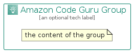

# AmazonCodeGuru


```text
aws-q2-2022/Architecture/MachineLearning/AmazonCodeGuru
```

```text
include('aws-q2-2022/Architecture/MachineLearning/AmazonCodeGuru')
```


| Illustration | AmazonCodeGuru | AmazonCodeGuruCard | AmazonCodeGuruGroup |
| :---: | :---: | :---: | :---: |
|  |  |  |  |


## AmazonCodeGuru

### Load remotely
```plantuml
@startuml
' configures the library
!global $LIB_BASE_LOCATION="https://raw.githubusercontent.com/tmorin/plantuml-libs/master/distribution"

' loads the library's bootstrap
!include $LIB_BASE_LOCATION/bootstrap.puml

' loads the package bootstrap
include('aws-q2-2022/bootstrap')

' loads the Item which embeds the element AmazonCodeGuru
include('aws-q2-2022/Architecture/MachineLearning/AmazonCodeGuru')

' renders the element
AmazonCodeGuru('AmazonCodeGuru', 'Amazon Code Guru', 'an optional tech label')
@enduml
```

### Load locally
```plantuml
@startuml
' configures the library
!global $INCLUSION_MODE="local"
!global $LIB_BASE_LOCATION="../../.."

' loads the library's bootstrap
!include $LIB_BASE_LOCATION/bootstrap.puml

' loads the package bootstrap
include('aws-q2-2022/bootstrap')

' loads the Item which embeds the element AmazonCodeGuru
include('aws-q2-2022/Architecture/MachineLearning/AmazonCodeGuru')

' renders the element
AmazonCodeGuru('AmazonCodeGuru', 'Amazon Code Guru', 'an optional tech label')
@enduml
```

## AmazonCodeGuruCard

### Load remotely
```plantuml
@startuml
' configures the library
!global $LIB_BASE_LOCATION="https://raw.githubusercontent.com/tmorin/plantuml-libs/master/distribution"

' loads the library's bootstrap
!include $LIB_BASE_LOCATION/bootstrap.puml

' loads the package bootstrap
include('aws-q2-2022/bootstrap')

' loads the Item which embeds the element AmazonCodeGuruCard
include('aws-q2-2022/Architecture/MachineLearning/AmazonCodeGuru')

' renders the element
AmazonCodeGuruCard('AmazonCodeGuruCard', 'Amazon Code Guru Card', 'an optional description')
@enduml
```

### Load locally
```plantuml
@startuml
' configures the library
!global $INCLUSION_MODE="local"
!global $LIB_BASE_LOCATION="../../.."

' loads the library's bootstrap
!include $LIB_BASE_LOCATION/bootstrap.puml

' loads the package bootstrap
include('aws-q2-2022/bootstrap')

' loads the Item which embeds the element AmazonCodeGuruCard
include('aws-q2-2022/Architecture/MachineLearning/AmazonCodeGuru')

' renders the element
AmazonCodeGuruCard('AmazonCodeGuruCard', 'Amazon Code Guru Card', 'an optional description')
@enduml
```

## AmazonCodeGuruGroup

### Load remotely
```plantuml
@startuml
' configures the library
!global $LIB_BASE_LOCATION="https://raw.githubusercontent.com/tmorin/plantuml-libs/master/distribution"

' loads the library's bootstrap
!include $LIB_BASE_LOCATION/bootstrap.puml

' loads the package bootstrap
include('aws-q2-2022/bootstrap')

' loads the Item which embeds the element AmazonCodeGuruGroup
include('aws-q2-2022/Architecture/MachineLearning/AmazonCodeGuru')

' renders the element
AmazonCodeGuruGroup('AmazonCodeGuruGroup', 'Amazon Code Guru Group', 'an optional tech label') {
    note as note
        the content of the group
    end note
}
@enduml
```

### Load locally
```plantuml
@startuml
' configures the library
!global $INCLUSION_MODE="local"
!global $LIB_BASE_LOCATION="../../.."

' loads the library's bootstrap
!include $LIB_BASE_LOCATION/bootstrap.puml

' loads the package bootstrap
include('aws-q2-2022/bootstrap')

' loads the Item which embeds the element AmazonCodeGuruGroup
include('aws-q2-2022/Architecture/MachineLearning/AmazonCodeGuru')

' renders the element
AmazonCodeGuruGroup('AmazonCodeGuruGroup', 'Amazon Code Guru Group', 'an optional tech label') {
    note as note
        the content of the group
    end note
}
@enduml
```

