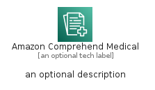
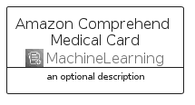
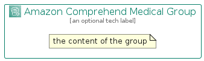

# AmazonComprehendMedical


```text
aws-q2-2022/Architecture/MachineLearning/AmazonComprehendMedical
```

```text
include('aws-q2-2022/Architecture/MachineLearning/AmazonComprehendMedical')
```


| Illustration | AmazonComprehendMedical | AmazonComprehendMedicalCard | AmazonComprehendMedicalGroup |
| :---: | :---: | :---: | :---: |
|  |  |  |  |


## AmazonComprehendMedical

### Load remotely
```plantuml
@startuml
' configures the library
!global $LIB_BASE_LOCATION="https://raw.githubusercontent.com/tmorin/plantuml-libs/master/distribution"

' loads the library's bootstrap
!include $LIB_BASE_LOCATION/bootstrap.puml

' loads the package bootstrap
include('aws-q2-2022/bootstrap')

' loads the Item which embeds the element AmazonComprehendMedical
include('aws-q2-2022/Architecture/MachineLearning/AmazonComprehendMedical')

' renders the element
AmazonComprehendMedical('AmazonComprehendMedical', 'Amazon Comprehend Medical', 'an optional tech label')
@enduml
```

### Load locally
```plantuml
@startuml
' configures the library
!global $INCLUSION_MODE="local"
!global $LIB_BASE_LOCATION="../../.."

' loads the library's bootstrap
!include $LIB_BASE_LOCATION/bootstrap.puml

' loads the package bootstrap
include('aws-q2-2022/bootstrap')

' loads the Item which embeds the element AmazonComprehendMedical
include('aws-q2-2022/Architecture/MachineLearning/AmazonComprehendMedical')

' renders the element
AmazonComprehendMedical('AmazonComprehendMedical', 'Amazon Comprehend Medical', 'an optional tech label')
@enduml
```

## AmazonComprehendMedicalCard

### Load remotely
```plantuml
@startuml
' configures the library
!global $LIB_BASE_LOCATION="https://raw.githubusercontent.com/tmorin/plantuml-libs/master/distribution"

' loads the library's bootstrap
!include $LIB_BASE_LOCATION/bootstrap.puml

' loads the package bootstrap
include('aws-q2-2022/bootstrap')

' loads the Item which embeds the element AmazonComprehendMedicalCard
include('aws-q2-2022/Architecture/MachineLearning/AmazonComprehendMedical')

' renders the element
AmazonComprehendMedicalCard('AmazonComprehendMedicalCard', 'Amazon Comprehend Medical Card', 'an optional description')
@enduml
```

### Load locally
```plantuml
@startuml
' configures the library
!global $INCLUSION_MODE="local"
!global $LIB_BASE_LOCATION="../../.."

' loads the library's bootstrap
!include $LIB_BASE_LOCATION/bootstrap.puml

' loads the package bootstrap
include('aws-q2-2022/bootstrap')

' loads the Item which embeds the element AmazonComprehendMedicalCard
include('aws-q2-2022/Architecture/MachineLearning/AmazonComprehendMedical')

' renders the element
AmazonComprehendMedicalCard('AmazonComprehendMedicalCard', 'Amazon Comprehend Medical Card', 'an optional description')
@enduml
```

## AmazonComprehendMedicalGroup

### Load remotely
```plantuml
@startuml
' configures the library
!global $LIB_BASE_LOCATION="https://raw.githubusercontent.com/tmorin/plantuml-libs/master/distribution"

' loads the library's bootstrap
!include $LIB_BASE_LOCATION/bootstrap.puml

' loads the package bootstrap
include('aws-q2-2022/bootstrap')

' loads the Item which embeds the element AmazonComprehendMedicalGroup
include('aws-q2-2022/Architecture/MachineLearning/AmazonComprehendMedical')

' renders the element
AmazonComprehendMedicalGroup('AmazonComprehendMedicalGroup', 'Amazon Comprehend Medical Group', 'an optional tech label') {
    note as note
        the content of the group
    end note
}
@enduml
```

### Load locally
```plantuml
@startuml
' configures the library
!global $INCLUSION_MODE="local"
!global $LIB_BASE_LOCATION="../../.."

' loads the library's bootstrap
!include $LIB_BASE_LOCATION/bootstrap.puml

' loads the package bootstrap
include('aws-q2-2022/bootstrap')

' loads the Item which embeds the element AmazonComprehendMedicalGroup
include('aws-q2-2022/Architecture/MachineLearning/AmazonComprehendMedical')

' renders the element
AmazonComprehendMedicalGroup('AmazonComprehendMedicalGroup', 'Amazon Comprehend Medical Group', 'an optional tech label') {
    note as note
        the content of the group
    end note
}
@enduml
```

