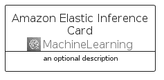
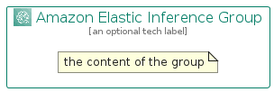

# AmazonElasticInference


```text
aws-q2-2022/Architecture/MachineLearning/AmazonElasticInference
```

```text
include('aws-q2-2022/Architecture/MachineLearning/AmazonElasticInference')
```


| Illustration | AmazonElasticInference | AmazonElasticInferenceCard | AmazonElasticInferenceGroup |
| :---: | :---: | :---: | :---: |
|  |  |  |  |


## AmazonElasticInference

### Load remotely
```plantuml
@startuml
' configures the library
!global $LIB_BASE_LOCATION="https://raw.githubusercontent.com/tmorin/plantuml-libs/master/distribution"

' loads the library's bootstrap
!include $LIB_BASE_LOCATION/bootstrap.puml

' loads the package bootstrap
include('aws-q2-2022/bootstrap')

' loads the Item which embeds the element AmazonElasticInference
include('aws-q2-2022/Architecture/MachineLearning/AmazonElasticInference')

' renders the element
AmazonElasticInference('AmazonElasticInference', 'Amazon Elastic Inference', 'an optional tech label', 'an optional description')
@enduml
```

### Load locally
```plantuml
@startuml
' configures the library
!global $INCLUSION_MODE="local"
!global $LIB_BASE_LOCATION="../../.."

' loads the library's bootstrap
!include $LIB_BASE_LOCATION/bootstrap.puml

' loads the package bootstrap
include('aws-q2-2022/bootstrap')

' loads the Item which embeds the element AmazonElasticInference
include('aws-q2-2022/Architecture/MachineLearning/AmazonElasticInference')

' renders the element
AmazonElasticInference('AmazonElasticInference', 'Amazon Elastic Inference', 'an optional tech label', 'an optional description')
@enduml
```

## AmazonElasticInferenceCard

### Load remotely
```plantuml
@startuml
' configures the library
!global $LIB_BASE_LOCATION="https://raw.githubusercontent.com/tmorin/plantuml-libs/master/distribution"

' loads the library's bootstrap
!include $LIB_BASE_LOCATION/bootstrap.puml

' loads the package bootstrap
include('aws-q2-2022/bootstrap')

' loads the Item which embeds the element AmazonElasticInferenceCard
include('aws-q2-2022/Architecture/MachineLearning/AmazonElasticInference')

' renders the element
AmazonElasticInferenceCard('AmazonElasticInferenceCard', 'Amazon Elastic Inference Card', 'an optional description')
@enduml
```

### Load locally
```plantuml
@startuml
' configures the library
!global $INCLUSION_MODE="local"
!global $LIB_BASE_LOCATION="../../.."

' loads the library's bootstrap
!include $LIB_BASE_LOCATION/bootstrap.puml

' loads the package bootstrap
include('aws-q2-2022/bootstrap')

' loads the Item which embeds the element AmazonElasticInferenceCard
include('aws-q2-2022/Architecture/MachineLearning/AmazonElasticInference')

' renders the element
AmazonElasticInferenceCard('AmazonElasticInferenceCard', 'Amazon Elastic Inference Card', 'an optional description')
@enduml
```

## AmazonElasticInferenceGroup

### Load remotely
```plantuml
@startuml
' configures the library
!global $LIB_BASE_LOCATION="https://raw.githubusercontent.com/tmorin/plantuml-libs/master/distribution"

' loads the library's bootstrap
!include $LIB_BASE_LOCATION/bootstrap.puml

' loads the package bootstrap
include('aws-q2-2022/bootstrap')

' loads the Item which embeds the element AmazonElasticInferenceGroup
include('aws-q2-2022/Architecture/MachineLearning/AmazonElasticInference')

' renders the element
AmazonElasticInferenceGroup('AmazonElasticInferenceGroup', 'Amazon Elastic Inference Group', 'an optional tech label') {
    note as note
        the content of the group
    end note
}
@enduml
```

### Load locally
```plantuml
@startuml
' configures the library
!global $INCLUSION_MODE="local"
!global $LIB_BASE_LOCATION="../../.."

' loads the library's bootstrap
!include $LIB_BASE_LOCATION/bootstrap.puml

' loads the package bootstrap
include('aws-q2-2022/bootstrap')

' loads the Item which embeds the element AmazonElasticInferenceGroup
include('aws-q2-2022/Architecture/MachineLearning/AmazonElasticInference')

' renders the element
AmazonElasticInferenceGroup('AmazonElasticInferenceGroup', 'Amazon Elastic Inference Group', 'an optional tech label') {
    note as note
        the content of the group
    end note
}
@enduml
```

