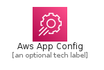
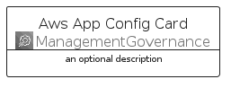

# AwsAppConfig


```text
aws-q2-2022/Architecture/ManagementGovernance/AwsAppConfig
```

```text
include('aws-q2-2022/Architecture/ManagementGovernance/AwsAppConfig')
```


| Illustration | AwsAppConfig | AwsAppConfigCard | AwsAppConfigGroup |
| :---: | :---: | :---: | :---: |
|  |  |  |  |


## AwsAppConfig

### Load remotely
```plantuml
@startuml
' configures the library
!global $LIB_BASE_LOCATION="https://raw.githubusercontent.com/tmorin/plantuml-libs/master/distribution"

' loads the library's bootstrap
!include $LIB_BASE_LOCATION/bootstrap.puml

' loads the package bootstrap
include('aws-q2-2022/bootstrap')

' loads the Item which embeds the element AwsAppConfig
include('aws-q2-2022/Architecture/ManagementGovernance/AwsAppConfig')

' renders the element
AwsAppConfig('AwsAppConfig', 'Aws App Config', 'an optional tech label', 'an optional description')
@enduml
```

### Load locally
```plantuml
@startuml
' configures the library
!global $INCLUSION_MODE="local"
!global $LIB_BASE_LOCATION="../../.."

' loads the library's bootstrap
!include $LIB_BASE_LOCATION/bootstrap.puml

' loads the package bootstrap
include('aws-q2-2022/bootstrap')

' loads the Item which embeds the element AwsAppConfig
include('aws-q2-2022/Architecture/ManagementGovernance/AwsAppConfig')

' renders the element
AwsAppConfig('AwsAppConfig', 'Aws App Config', 'an optional tech label', 'an optional description')
@enduml
```

## AwsAppConfigCard

### Load remotely
```plantuml
@startuml
' configures the library
!global $LIB_BASE_LOCATION="https://raw.githubusercontent.com/tmorin/plantuml-libs/master/distribution"

' loads the library's bootstrap
!include $LIB_BASE_LOCATION/bootstrap.puml

' loads the package bootstrap
include('aws-q2-2022/bootstrap')

' loads the Item which embeds the element AwsAppConfigCard
include('aws-q2-2022/Architecture/ManagementGovernance/AwsAppConfig')

' renders the element
AwsAppConfigCard('AwsAppConfigCard', 'Aws App Config Card', 'an optional description')
@enduml
```

### Load locally
```plantuml
@startuml
' configures the library
!global $INCLUSION_MODE="local"
!global $LIB_BASE_LOCATION="../../.."

' loads the library's bootstrap
!include $LIB_BASE_LOCATION/bootstrap.puml

' loads the package bootstrap
include('aws-q2-2022/bootstrap')

' loads the Item which embeds the element AwsAppConfigCard
include('aws-q2-2022/Architecture/ManagementGovernance/AwsAppConfig')

' renders the element
AwsAppConfigCard('AwsAppConfigCard', 'Aws App Config Card', 'an optional description')
@enduml
```

## AwsAppConfigGroup

### Load remotely
```plantuml
@startuml
' configures the library
!global $LIB_BASE_LOCATION="https://raw.githubusercontent.com/tmorin/plantuml-libs/master/distribution"

' loads the library's bootstrap
!include $LIB_BASE_LOCATION/bootstrap.puml

' loads the package bootstrap
include('aws-q2-2022/bootstrap')

' loads the Item which embeds the element AwsAppConfigGroup
include('aws-q2-2022/Architecture/ManagementGovernance/AwsAppConfig')

' renders the element
AwsAppConfigGroup('AwsAppConfigGroup', 'Aws App Config Group', 'an optional tech label') {
    note as note
        the content of the group
    end note
}
@enduml
```

### Load locally
```plantuml
@startuml
' configures the library
!global $INCLUSION_MODE="local"
!global $LIB_BASE_LOCATION="../../.."

' loads the library's bootstrap
!include $LIB_BASE_LOCATION/bootstrap.puml

' loads the package bootstrap
include('aws-q2-2022/bootstrap')

' loads the Item which embeds the element AwsAppConfigGroup
include('aws-q2-2022/Architecture/ManagementGovernance/AwsAppConfig')

' renders the element
AwsAppConfigGroup('AwsAppConfigGroup', 'Aws App Config Group', 'an optional tech label') {
    note as note
        the content of the group
    end note
}
@enduml
```

