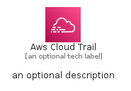
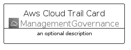
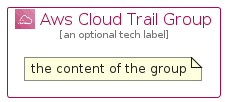

# AwsCloudTrail


```text
aws-q2-2022/Architecture/ManagementGovernance/AwsCloudTrail
```

```text
include('aws-q2-2022/Architecture/ManagementGovernance/AwsCloudTrail')
```


| Illustration | AwsCloudTrail | AwsCloudTrailCard | AwsCloudTrailGroup |
| :---: | :---: | :---: | :---: |
|  |  |  |  |


## AwsCloudTrail

### Load remotely
```plantuml
@startuml
' configures the library
!global $LIB_BASE_LOCATION="https://raw.githubusercontent.com/tmorin/plantuml-libs/master/distribution"

' loads the library's bootstrap
!include $LIB_BASE_LOCATION/bootstrap.puml

' loads the package bootstrap
include('aws-q2-2022/bootstrap')

' loads the Item which embeds the element AwsCloudTrail
include('aws-q2-2022/Architecture/ManagementGovernance/AwsCloudTrail')

' renders the element
AwsCloudTrail('AwsCloudTrail', 'Aws Cloud Trail', 'an optional tech label', 'an optional description')
@enduml
```

### Load locally
```plantuml
@startuml
' configures the library
!global $INCLUSION_MODE="local"
!global $LIB_BASE_LOCATION="../../.."

' loads the library's bootstrap
!include $LIB_BASE_LOCATION/bootstrap.puml

' loads the package bootstrap
include('aws-q2-2022/bootstrap')

' loads the Item which embeds the element AwsCloudTrail
include('aws-q2-2022/Architecture/ManagementGovernance/AwsCloudTrail')

' renders the element
AwsCloudTrail('AwsCloudTrail', 'Aws Cloud Trail', 'an optional tech label', 'an optional description')
@enduml
```

## AwsCloudTrailCard

### Load remotely
```plantuml
@startuml
' configures the library
!global $LIB_BASE_LOCATION="https://raw.githubusercontent.com/tmorin/plantuml-libs/master/distribution"

' loads the library's bootstrap
!include $LIB_BASE_LOCATION/bootstrap.puml

' loads the package bootstrap
include('aws-q2-2022/bootstrap')

' loads the Item which embeds the element AwsCloudTrailCard
include('aws-q2-2022/Architecture/ManagementGovernance/AwsCloudTrail')

' renders the element
AwsCloudTrailCard('AwsCloudTrailCard', 'Aws Cloud Trail Card', 'an optional description')
@enduml
```

### Load locally
```plantuml
@startuml
' configures the library
!global $INCLUSION_MODE="local"
!global $LIB_BASE_LOCATION="../../.."

' loads the library's bootstrap
!include $LIB_BASE_LOCATION/bootstrap.puml

' loads the package bootstrap
include('aws-q2-2022/bootstrap')

' loads the Item which embeds the element AwsCloudTrailCard
include('aws-q2-2022/Architecture/ManagementGovernance/AwsCloudTrail')

' renders the element
AwsCloudTrailCard('AwsCloudTrailCard', 'Aws Cloud Trail Card', 'an optional description')
@enduml
```

## AwsCloudTrailGroup

### Load remotely
```plantuml
@startuml
' configures the library
!global $LIB_BASE_LOCATION="https://raw.githubusercontent.com/tmorin/plantuml-libs/master/distribution"

' loads the library's bootstrap
!include $LIB_BASE_LOCATION/bootstrap.puml

' loads the package bootstrap
include('aws-q2-2022/bootstrap')

' loads the Item which embeds the element AwsCloudTrailGroup
include('aws-q2-2022/Architecture/ManagementGovernance/AwsCloudTrail')

' renders the element
AwsCloudTrailGroup('AwsCloudTrailGroup', 'Aws Cloud Trail Group', 'an optional tech label') {
    note as note
        the content of the group
    end note
}
@enduml
```

### Load locally
```plantuml
@startuml
' configures the library
!global $INCLUSION_MODE="local"
!global $LIB_BASE_LOCATION="../../.."

' loads the library's bootstrap
!include $LIB_BASE_LOCATION/bootstrap.puml

' loads the package bootstrap
include('aws-q2-2022/bootstrap')

' loads the Item which embeds the element AwsCloudTrailGroup
include('aws-q2-2022/Architecture/ManagementGovernance/AwsCloudTrail')

' renders the element
AwsCloudTrailGroup('AwsCloudTrailGroup', 'Aws Cloud Trail Group', 'an optional tech label') {
    note as note
        the content of the group
    end note
}
@enduml
```

