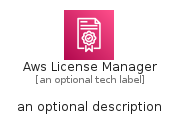
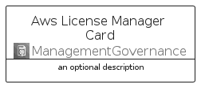
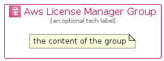

# AwsLicenseManager


```text
aws-q2-2022/Architecture/ManagementGovernance/AwsLicenseManager
```

```text
include('aws-q2-2022/Architecture/ManagementGovernance/AwsLicenseManager')
```


| Illustration | AwsLicenseManager | AwsLicenseManagerCard | AwsLicenseManagerGroup |
| :---: | :---: | :---: | :---: |
|  |  |  |  |


## AwsLicenseManager

### Load remotely
```plantuml
@startuml
' configures the library
!global $LIB_BASE_LOCATION="https://raw.githubusercontent.com/tmorin/plantuml-libs/master/distribution"

' loads the library's bootstrap
!include $LIB_BASE_LOCATION/bootstrap.puml

' loads the package bootstrap
include('aws-q2-2022/bootstrap')

' loads the Item which embeds the element AwsLicenseManager
include('aws-q2-2022/Architecture/ManagementGovernance/AwsLicenseManager')

' renders the element
AwsLicenseManager('AwsLicenseManager', 'Aws License Manager', 'an optional tech label', 'an optional description')
@enduml
```

### Load locally
```plantuml
@startuml
' configures the library
!global $INCLUSION_MODE="local"
!global $LIB_BASE_LOCATION="../../.."

' loads the library's bootstrap
!include $LIB_BASE_LOCATION/bootstrap.puml

' loads the package bootstrap
include('aws-q2-2022/bootstrap')

' loads the Item which embeds the element AwsLicenseManager
include('aws-q2-2022/Architecture/ManagementGovernance/AwsLicenseManager')

' renders the element
AwsLicenseManager('AwsLicenseManager', 'Aws License Manager', 'an optional tech label', 'an optional description')
@enduml
```

## AwsLicenseManagerCard

### Load remotely
```plantuml
@startuml
' configures the library
!global $LIB_BASE_LOCATION="https://raw.githubusercontent.com/tmorin/plantuml-libs/master/distribution"

' loads the library's bootstrap
!include $LIB_BASE_LOCATION/bootstrap.puml

' loads the package bootstrap
include('aws-q2-2022/bootstrap')

' loads the Item which embeds the element AwsLicenseManagerCard
include('aws-q2-2022/Architecture/ManagementGovernance/AwsLicenseManager')

' renders the element
AwsLicenseManagerCard('AwsLicenseManagerCard', 'Aws License Manager Card', 'an optional description')
@enduml
```

### Load locally
```plantuml
@startuml
' configures the library
!global $INCLUSION_MODE="local"
!global $LIB_BASE_LOCATION="../../.."

' loads the library's bootstrap
!include $LIB_BASE_LOCATION/bootstrap.puml

' loads the package bootstrap
include('aws-q2-2022/bootstrap')

' loads the Item which embeds the element AwsLicenseManagerCard
include('aws-q2-2022/Architecture/ManagementGovernance/AwsLicenseManager')

' renders the element
AwsLicenseManagerCard('AwsLicenseManagerCard', 'Aws License Manager Card', 'an optional description')
@enduml
```

## AwsLicenseManagerGroup

### Load remotely
```plantuml
@startuml
' configures the library
!global $LIB_BASE_LOCATION="https://raw.githubusercontent.com/tmorin/plantuml-libs/master/distribution"

' loads the library's bootstrap
!include $LIB_BASE_LOCATION/bootstrap.puml

' loads the package bootstrap
include('aws-q2-2022/bootstrap')

' loads the Item which embeds the element AwsLicenseManagerGroup
include('aws-q2-2022/Architecture/ManagementGovernance/AwsLicenseManager')

' renders the element
AwsLicenseManagerGroup('AwsLicenseManagerGroup', 'Aws License Manager Group', 'an optional tech label') {
    note as note
        the content of the group
    end note
}
@enduml
```

### Load locally
```plantuml
@startuml
' configures the library
!global $INCLUSION_MODE="local"
!global $LIB_BASE_LOCATION="../../.."

' loads the library's bootstrap
!include $LIB_BASE_LOCATION/bootstrap.puml

' loads the package bootstrap
include('aws-q2-2022/bootstrap')

' loads the Item which embeds the element AwsLicenseManagerGroup
include('aws-q2-2022/Architecture/ManagementGovernance/AwsLicenseManager')

' renders the element
AwsLicenseManagerGroup('AwsLicenseManagerGroup', 'Aws License Manager Group', 'an optional tech label') {
    note as note
        the content of the group
    end note
}
@enduml
```

