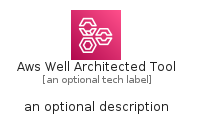
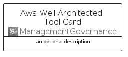
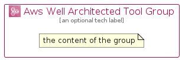

# AwsWellArchitectedTool


```text
aws-q2-2022/Architecture/ManagementGovernance/AwsWellArchitectedTool
```

```text
include('aws-q2-2022/Architecture/ManagementGovernance/AwsWellArchitectedTool')
```


| Illustration | AwsWellArchitectedTool | AwsWellArchitectedToolCard | AwsWellArchitectedToolGroup |
| :---: | :---: | :---: | :---: |
|  |  |  |  |


## AwsWellArchitectedTool

### Load remotely
```plantuml
@startuml
' configures the library
!global $LIB_BASE_LOCATION="https://raw.githubusercontent.com/tmorin/plantuml-libs/master/distribution"

' loads the library's bootstrap
!include $LIB_BASE_LOCATION/bootstrap.puml

' loads the package bootstrap
include('aws-q2-2022/bootstrap')

' loads the Item which embeds the element AwsWellArchitectedTool
include('aws-q2-2022/Architecture/ManagementGovernance/AwsWellArchitectedTool')

' renders the element
AwsWellArchitectedTool('AwsWellArchitectedTool', 'Aws Well Architected Tool', 'an optional tech label', 'an optional description')
@enduml
```

### Load locally
```plantuml
@startuml
' configures the library
!global $INCLUSION_MODE="local"
!global $LIB_BASE_LOCATION="../../.."

' loads the library's bootstrap
!include $LIB_BASE_LOCATION/bootstrap.puml

' loads the package bootstrap
include('aws-q2-2022/bootstrap')

' loads the Item which embeds the element AwsWellArchitectedTool
include('aws-q2-2022/Architecture/ManagementGovernance/AwsWellArchitectedTool')

' renders the element
AwsWellArchitectedTool('AwsWellArchitectedTool', 'Aws Well Architected Tool', 'an optional tech label', 'an optional description')
@enduml
```

## AwsWellArchitectedToolCard

### Load remotely
```plantuml
@startuml
' configures the library
!global $LIB_BASE_LOCATION="https://raw.githubusercontent.com/tmorin/plantuml-libs/master/distribution"

' loads the library's bootstrap
!include $LIB_BASE_LOCATION/bootstrap.puml

' loads the package bootstrap
include('aws-q2-2022/bootstrap')

' loads the Item which embeds the element AwsWellArchitectedToolCard
include('aws-q2-2022/Architecture/ManagementGovernance/AwsWellArchitectedTool')

' renders the element
AwsWellArchitectedToolCard('AwsWellArchitectedToolCard', 'Aws Well Architected Tool Card', 'an optional description')
@enduml
```

### Load locally
```plantuml
@startuml
' configures the library
!global $INCLUSION_MODE="local"
!global $LIB_BASE_LOCATION="../../.."

' loads the library's bootstrap
!include $LIB_BASE_LOCATION/bootstrap.puml

' loads the package bootstrap
include('aws-q2-2022/bootstrap')

' loads the Item which embeds the element AwsWellArchitectedToolCard
include('aws-q2-2022/Architecture/ManagementGovernance/AwsWellArchitectedTool')

' renders the element
AwsWellArchitectedToolCard('AwsWellArchitectedToolCard', 'Aws Well Architected Tool Card', 'an optional description')
@enduml
```

## AwsWellArchitectedToolGroup

### Load remotely
```plantuml
@startuml
' configures the library
!global $LIB_BASE_LOCATION="https://raw.githubusercontent.com/tmorin/plantuml-libs/master/distribution"

' loads the library's bootstrap
!include $LIB_BASE_LOCATION/bootstrap.puml

' loads the package bootstrap
include('aws-q2-2022/bootstrap')

' loads the Item which embeds the element AwsWellArchitectedToolGroup
include('aws-q2-2022/Architecture/ManagementGovernance/AwsWellArchitectedTool')

' renders the element
AwsWellArchitectedToolGroup('AwsWellArchitectedToolGroup', 'Aws Well Architected Tool Group', 'an optional tech label') {
    note as note
        the content of the group
    end note
}
@enduml
```

### Load locally
```plantuml
@startuml
' configures the library
!global $INCLUSION_MODE="local"
!global $LIB_BASE_LOCATION="../../.."

' loads the library's bootstrap
!include $LIB_BASE_LOCATION/bootstrap.puml

' loads the package bootstrap
include('aws-q2-2022/bootstrap')

' loads the Item which embeds the element AwsWellArchitectedToolGroup
include('aws-q2-2022/Architecture/ManagementGovernance/AwsWellArchitectedTool')

' renders the element
AwsWellArchitectedToolGroup('AwsWellArchitectedToolGroup', 'Aws Well Architected Tool Group', 'an optional tech label') {
    note as note
        the content of the group
    end note
}
@enduml
```

