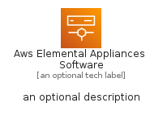
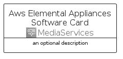

# AwsElementalAppliancesSoftware


```text
aws-q2-2022/Architecture/MediaServices/AwsElementalAppliancesSoftware
```

```text
include('aws-q2-2022/Architecture/MediaServices/AwsElementalAppliancesSoftware')
```


| Illustration | AwsElementalAppliancesSoftware | AwsElementalAppliancesSoftwareCard | AwsElementalAppliancesSoftwareGroup |
| :---: | :---: | :---: | :---: |
|  |  |  |  |


## AwsElementalAppliancesSoftware

### Load remotely
```plantuml
@startuml
' configures the library
!global $LIB_BASE_LOCATION="https://raw.githubusercontent.com/tmorin/plantuml-libs/master/distribution"

' loads the library's bootstrap
!include $LIB_BASE_LOCATION/bootstrap.puml

' loads the package bootstrap
include('aws-q2-2022/bootstrap')

' loads the Item which embeds the element AwsElementalAppliancesSoftware
include('aws-q2-2022/Architecture/MediaServices/AwsElementalAppliancesSoftware')

' renders the element
AwsElementalAppliancesSoftware('AwsElementalAppliancesSoftware', 'Aws Elemental Appliances Software', 'an optional tech label', 'an optional description')
@enduml
```

### Load locally
```plantuml
@startuml
' configures the library
!global $INCLUSION_MODE="local"
!global $LIB_BASE_LOCATION="../../.."

' loads the library's bootstrap
!include $LIB_BASE_LOCATION/bootstrap.puml

' loads the package bootstrap
include('aws-q2-2022/bootstrap')

' loads the Item which embeds the element AwsElementalAppliancesSoftware
include('aws-q2-2022/Architecture/MediaServices/AwsElementalAppliancesSoftware')

' renders the element
AwsElementalAppliancesSoftware('AwsElementalAppliancesSoftware', 'Aws Elemental Appliances Software', 'an optional tech label', 'an optional description')
@enduml
```

## AwsElementalAppliancesSoftwareCard

### Load remotely
```plantuml
@startuml
' configures the library
!global $LIB_BASE_LOCATION="https://raw.githubusercontent.com/tmorin/plantuml-libs/master/distribution"

' loads the library's bootstrap
!include $LIB_BASE_LOCATION/bootstrap.puml

' loads the package bootstrap
include('aws-q2-2022/bootstrap')

' loads the Item which embeds the element AwsElementalAppliancesSoftwareCard
include('aws-q2-2022/Architecture/MediaServices/AwsElementalAppliancesSoftware')

' renders the element
AwsElementalAppliancesSoftwareCard('AwsElementalAppliancesSoftwareCard', 'Aws Elemental Appliances Software Card', 'an optional description')
@enduml
```

### Load locally
```plantuml
@startuml
' configures the library
!global $INCLUSION_MODE="local"
!global $LIB_BASE_LOCATION="../../.."

' loads the library's bootstrap
!include $LIB_BASE_LOCATION/bootstrap.puml

' loads the package bootstrap
include('aws-q2-2022/bootstrap')

' loads the Item which embeds the element AwsElementalAppliancesSoftwareCard
include('aws-q2-2022/Architecture/MediaServices/AwsElementalAppliancesSoftware')

' renders the element
AwsElementalAppliancesSoftwareCard('AwsElementalAppliancesSoftwareCard', 'Aws Elemental Appliances Software Card', 'an optional description')
@enduml
```

## AwsElementalAppliancesSoftwareGroup

### Load remotely
```plantuml
@startuml
' configures the library
!global $LIB_BASE_LOCATION="https://raw.githubusercontent.com/tmorin/plantuml-libs/master/distribution"

' loads the library's bootstrap
!include $LIB_BASE_LOCATION/bootstrap.puml

' loads the package bootstrap
include('aws-q2-2022/bootstrap')

' loads the Item which embeds the element AwsElementalAppliancesSoftwareGroup
include('aws-q2-2022/Architecture/MediaServices/AwsElementalAppliancesSoftware')

' renders the element
AwsElementalAppliancesSoftwareGroup('AwsElementalAppliancesSoftwareGroup', 'Aws Elemental Appliances Software Group', 'an optional tech label') {
    note as note
        the content of the group
    end note
}
@enduml
```

### Load locally
```plantuml
@startuml
' configures the library
!global $INCLUSION_MODE="local"
!global $LIB_BASE_LOCATION="../../.."

' loads the library's bootstrap
!include $LIB_BASE_LOCATION/bootstrap.puml

' loads the package bootstrap
include('aws-q2-2022/bootstrap')

' loads the Item which embeds the element AwsElementalAppliancesSoftwareGroup
include('aws-q2-2022/Architecture/MediaServices/AwsElementalAppliancesSoftware')

' renders the element
AwsElementalAppliancesSoftwareGroup('AwsElementalAppliancesSoftwareGroup', 'Aws Elemental Appliances Software Group', 'an optional tech label') {
    note as note
        the content of the group
    end note
}
@enduml
```

