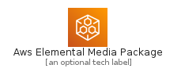
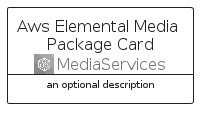
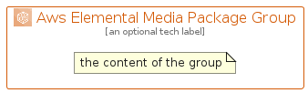

# AwsElementalMediaPackage


```text
aws-q2-2022/Architecture/MediaServices/AwsElementalMediaPackage
```

```text
include('aws-q2-2022/Architecture/MediaServices/AwsElementalMediaPackage')
```


| Illustration | AwsElementalMediaPackage | AwsElementalMediaPackageCard | AwsElementalMediaPackageGroup |
| :---: | :---: | :---: | :---: |
|  |  |  |  |


## AwsElementalMediaPackage

### Load remotely
```plantuml
@startuml
' configures the library
!global $LIB_BASE_LOCATION="https://raw.githubusercontent.com/tmorin/plantuml-libs/master/distribution"

' loads the library's bootstrap
!include $LIB_BASE_LOCATION/bootstrap.puml

' loads the package bootstrap
include('aws-q2-2022/bootstrap')

' loads the Item which embeds the element AwsElementalMediaPackage
include('aws-q2-2022/Architecture/MediaServices/AwsElementalMediaPackage')

' renders the element
AwsElementalMediaPackage('AwsElementalMediaPackage', 'Aws Elemental Media Package', 'an optional tech label')
@enduml
```

### Load locally
```plantuml
@startuml
' configures the library
!global $INCLUSION_MODE="local"
!global $LIB_BASE_LOCATION="../../.."

' loads the library's bootstrap
!include $LIB_BASE_LOCATION/bootstrap.puml

' loads the package bootstrap
include('aws-q2-2022/bootstrap')

' loads the Item which embeds the element AwsElementalMediaPackage
include('aws-q2-2022/Architecture/MediaServices/AwsElementalMediaPackage')

' renders the element
AwsElementalMediaPackage('AwsElementalMediaPackage', 'Aws Elemental Media Package', 'an optional tech label')
@enduml
```

## AwsElementalMediaPackageCard

### Load remotely
```plantuml
@startuml
' configures the library
!global $LIB_BASE_LOCATION="https://raw.githubusercontent.com/tmorin/plantuml-libs/master/distribution"

' loads the library's bootstrap
!include $LIB_BASE_LOCATION/bootstrap.puml

' loads the package bootstrap
include('aws-q2-2022/bootstrap')

' loads the Item which embeds the element AwsElementalMediaPackageCard
include('aws-q2-2022/Architecture/MediaServices/AwsElementalMediaPackage')

' renders the element
AwsElementalMediaPackageCard('AwsElementalMediaPackageCard', 'Aws Elemental Media Package Card', 'an optional description')
@enduml
```

### Load locally
```plantuml
@startuml
' configures the library
!global $INCLUSION_MODE="local"
!global $LIB_BASE_LOCATION="../../.."

' loads the library's bootstrap
!include $LIB_BASE_LOCATION/bootstrap.puml

' loads the package bootstrap
include('aws-q2-2022/bootstrap')

' loads the Item which embeds the element AwsElementalMediaPackageCard
include('aws-q2-2022/Architecture/MediaServices/AwsElementalMediaPackage')

' renders the element
AwsElementalMediaPackageCard('AwsElementalMediaPackageCard', 'Aws Elemental Media Package Card', 'an optional description')
@enduml
```

## AwsElementalMediaPackageGroup

### Load remotely
```plantuml
@startuml
' configures the library
!global $LIB_BASE_LOCATION="https://raw.githubusercontent.com/tmorin/plantuml-libs/master/distribution"

' loads the library's bootstrap
!include $LIB_BASE_LOCATION/bootstrap.puml

' loads the package bootstrap
include('aws-q2-2022/bootstrap')

' loads the Item which embeds the element AwsElementalMediaPackageGroup
include('aws-q2-2022/Architecture/MediaServices/AwsElementalMediaPackage')

' renders the element
AwsElementalMediaPackageGroup('AwsElementalMediaPackageGroup', 'Aws Elemental Media Package Group', 'an optional tech label') {
    note as note
        the content of the group
    end note
}
@enduml
```

### Load locally
```plantuml
@startuml
' configures the library
!global $INCLUSION_MODE="local"
!global $LIB_BASE_LOCATION="../../.."

' loads the library's bootstrap
!include $LIB_BASE_LOCATION/bootstrap.puml

' loads the package bootstrap
include('aws-q2-2022/bootstrap')

' loads the Item which embeds the element AwsElementalMediaPackageGroup
include('aws-q2-2022/Architecture/MediaServices/AwsElementalMediaPackage')

' renders the element
AwsElementalMediaPackageGroup('AwsElementalMediaPackageGroup', 'Aws Elemental Media Package Group', 'an optional tech label') {
    note as note
        the content of the group
    end note
}
@enduml
```

