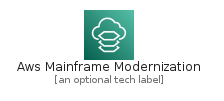
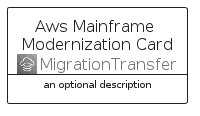
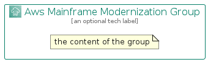

# AwsMainframeModernization


```text
aws-q2-2022/Architecture/MigrationTransfer/AwsMainframeModernization
```

```text
include('aws-q2-2022/Architecture/MigrationTransfer/AwsMainframeModernization')
```


| Illustration | AwsMainframeModernization | AwsMainframeModernizationCard | AwsMainframeModernizationGroup |
| :---: | :---: | :---: | :---: |
|  |  |  |  |


## AwsMainframeModernization

### Load remotely
```plantuml
@startuml
' configures the library
!global $LIB_BASE_LOCATION="https://raw.githubusercontent.com/tmorin/plantuml-libs/master/distribution"

' loads the library's bootstrap
!include $LIB_BASE_LOCATION/bootstrap.puml

' loads the package bootstrap
include('aws-q2-2022/bootstrap')

' loads the Item which embeds the element AwsMainframeModernization
include('aws-q2-2022/Architecture/MigrationTransfer/AwsMainframeModernization')

' renders the element
AwsMainframeModernization('AwsMainframeModernization', 'Aws Mainframe Modernization', 'an optional tech label', 'an optional description')
@enduml
```

### Load locally
```plantuml
@startuml
' configures the library
!global $INCLUSION_MODE="local"
!global $LIB_BASE_LOCATION="../../.."

' loads the library's bootstrap
!include $LIB_BASE_LOCATION/bootstrap.puml

' loads the package bootstrap
include('aws-q2-2022/bootstrap')

' loads the Item which embeds the element AwsMainframeModernization
include('aws-q2-2022/Architecture/MigrationTransfer/AwsMainframeModernization')

' renders the element
AwsMainframeModernization('AwsMainframeModernization', 'Aws Mainframe Modernization', 'an optional tech label', 'an optional description')
@enduml
```

## AwsMainframeModernizationCard

### Load remotely
```plantuml
@startuml
' configures the library
!global $LIB_BASE_LOCATION="https://raw.githubusercontent.com/tmorin/plantuml-libs/master/distribution"

' loads the library's bootstrap
!include $LIB_BASE_LOCATION/bootstrap.puml

' loads the package bootstrap
include('aws-q2-2022/bootstrap')

' loads the Item which embeds the element AwsMainframeModernizationCard
include('aws-q2-2022/Architecture/MigrationTransfer/AwsMainframeModernization')

' renders the element
AwsMainframeModernizationCard('AwsMainframeModernizationCard', 'Aws Mainframe Modernization Card', 'an optional description')
@enduml
```

### Load locally
```plantuml
@startuml
' configures the library
!global $INCLUSION_MODE="local"
!global $LIB_BASE_LOCATION="../../.."

' loads the library's bootstrap
!include $LIB_BASE_LOCATION/bootstrap.puml

' loads the package bootstrap
include('aws-q2-2022/bootstrap')

' loads the Item which embeds the element AwsMainframeModernizationCard
include('aws-q2-2022/Architecture/MigrationTransfer/AwsMainframeModernization')

' renders the element
AwsMainframeModernizationCard('AwsMainframeModernizationCard', 'Aws Mainframe Modernization Card', 'an optional description')
@enduml
```

## AwsMainframeModernizationGroup

### Load remotely
```plantuml
@startuml
' configures the library
!global $LIB_BASE_LOCATION="https://raw.githubusercontent.com/tmorin/plantuml-libs/master/distribution"

' loads the library's bootstrap
!include $LIB_BASE_LOCATION/bootstrap.puml

' loads the package bootstrap
include('aws-q2-2022/bootstrap')

' loads the Item which embeds the element AwsMainframeModernizationGroup
include('aws-q2-2022/Architecture/MigrationTransfer/AwsMainframeModernization')

' renders the element
AwsMainframeModernizationGroup('AwsMainframeModernizationGroup', 'Aws Mainframe Modernization Group', 'an optional tech label') {
    note as note
        the content of the group
    end note
}
@enduml
```

### Load locally
```plantuml
@startuml
' configures the library
!global $INCLUSION_MODE="local"
!global $LIB_BASE_LOCATION="../../.."

' loads the library's bootstrap
!include $LIB_BASE_LOCATION/bootstrap.puml

' loads the package bootstrap
include('aws-q2-2022/bootstrap')

' loads the Item which embeds the element AwsMainframeModernizationGroup
include('aws-q2-2022/Architecture/MigrationTransfer/AwsMainframeModernization')

' renders the element
AwsMainframeModernizationGroup('AwsMainframeModernizationGroup', 'Aws Mainframe Modernization Group', 'an optional tech label') {
    note as note
        the content of the group
    end note
}
@enduml
```

