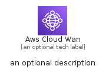
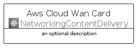
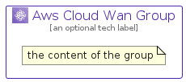

# AwsCloudWan


```text
aws-q2-2022/Architecture/NetworkingContentDelivery/AwsCloudWan
```

```text
include('aws-q2-2022/Architecture/NetworkingContentDelivery/AwsCloudWan')
```


| Illustration | AwsCloudWan | AwsCloudWanCard | AwsCloudWanGroup |
| :---: | :---: | :---: | :---: |
|  |  |  |  |


## AwsCloudWan

### Load remotely
```plantuml
@startuml
' configures the library
!global $LIB_BASE_LOCATION="https://raw.githubusercontent.com/tmorin/plantuml-libs/master/distribution"

' loads the library's bootstrap
!include $LIB_BASE_LOCATION/bootstrap.puml

' loads the package bootstrap
include('aws-q2-2022/bootstrap')

' loads the Item which embeds the element AwsCloudWan
include('aws-q2-2022/Architecture/NetworkingContentDelivery/AwsCloudWan')

' renders the element
AwsCloudWan('AwsCloudWan', 'Aws Cloud Wan', 'an optional tech label', 'an optional description')
@enduml
```

### Load locally
```plantuml
@startuml
' configures the library
!global $INCLUSION_MODE="local"
!global $LIB_BASE_LOCATION="../../.."

' loads the library's bootstrap
!include $LIB_BASE_LOCATION/bootstrap.puml

' loads the package bootstrap
include('aws-q2-2022/bootstrap')

' loads the Item which embeds the element AwsCloudWan
include('aws-q2-2022/Architecture/NetworkingContentDelivery/AwsCloudWan')

' renders the element
AwsCloudWan('AwsCloudWan', 'Aws Cloud Wan', 'an optional tech label', 'an optional description')
@enduml
```

## AwsCloudWanCard

### Load remotely
```plantuml
@startuml
' configures the library
!global $LIB_BASE_LOCATION="https://raw.githubusercontent.com/tmorin/plantuml-libs/master/distribution"

' loads the library's bootstrap
!include $LIB_BASE_LOCATION/bootstrap.puml

' loads the package bootstrap
include('aws-q2-2022/bootstrap')

' loads the Item which embeds the element AwsCloudWanCard
include('aws-q2-2022/Architecture/NetworkingContentDelivery/AwsCloudWan')

' renders the element
AwsCloudWanCard('AwsCloudWanCard', 'Aws Cloud Wan Card', 'an optional description')
@enduml
```

### Load locally
```plantuml
@startuml
' configures the library
!global $INCLUSION_MODE="local"
!global $LIB_BASE_LOCATION="../../.."

' loads the library's bootstrap
!include $LIB_BASE_LOCATION/bootstrap.puml

' loads the package bootstrap
include('aws-q2-2022/bootstrap')

' loads the Item which embeds the element AwsCloudWanCard
include('aws-q2-2022/Architecture/NetworkingContentDelivery/AwsCloudWan')

' renders the element
AwsCloudWanCard('AwsCloudWanCard', 'Aws Cloud Wan Card', 'an optional description')
@enduml
```

## AwsCloudWanGroup

### Load remotely
```plantuml
@startuml
' configures the library
!global $LIB_BASE_LOCATION="https://raw.githubusercontent.com/tmorin/plantuml-libs/master/distribution"

' loads the library's bootstrap
!include $LIB_BASE_LOCATION/bootstrap.puml

' loads the package bootstrap
include('aws-q2-2022/bootstrap')

' loads the Item which embeds the element AwsCloudWanGroup
include('aws-q2-2022/Architecture/NetworkingContentDelivery/AwsCloudWan')

' renders the element
AwsCloudWanGroup('AwsCloudWanGroup', 'Aws Cloud Wan Group', 'an optional tech label') {
    note as note
        the content of the group
    end note
}
@enduml
```

### Load locally
```plantuml
@startuml
' configures the library
!global $INCLUSION_MODE="local"
!global $LIB_BASE_LOCATION="../../.."

' loads the library's bootstrap
!include $LIB_BASE_LOCATION/bootstrap.puml

' loads the package bootstrap
include('aws-q2-2022/bootstrap')

' loads the Item which embeds the element AwsCloudWanGroup
include('aws-q2-2022/Architecture/NetworkingContentDelivery/AwsCloudWan')

' renders the element
AwsCloudWanGroup('AwsCloudWanGroup', 'Aws Cloud Wan Group', 'an optional tech label') {
    note as note
        the content of the group
    end note
}
@enduml
```

