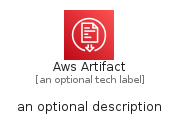
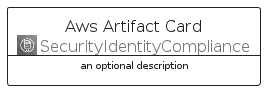
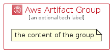

# AwsArtifact


```text
aws-q2-2022/Architecture/SecurityIdentityCompliance/AwsArtifact
```

```text
include('aws-q2-2022/Architecture/SecurityIdentityCompliance/AwsArtifact')
```


| Illustration | AwsArtifact | AwsArtifactCard | AwsArtifactGroup |
| :---: | :---: | :---: | :---: |
|  |  |  |  |


## AwsArtifact

### Load remotely
```plantuml
@startuml
' configures the library
!global $LIB_BASE_LOCATION="https://raw.githubusercontent.com/tmorin/plantuml-libs/master/distribution"

' loads the library's bootstrap
!include $LIB_BASE_LOCATION/bootstrap.puml

' loads the package bootstrap
include('aws-q2-2022/bootstrap')

' loads the Item which embeds the element AwsArtifact
include('aws-q2-2022/Architecture/SecurityIdentityCompliance/AwsArtifact')

' renders the element
AwsArtifact('AwsArtifact', 'Aws Artifact', 'an optional tech label')
@enduml
```

### Load locally
```plantuml
@startuml
' configures the library
!global $INCLUSION_MODE="local"
!global $LIB_BASE_LOCATION="../../.."

' loads the library's bootstrap
!include $LIB_BASE_LOCATION/bootstrap.puml

' loads the package bootstrap
include('aws-q2-2022/bootstrap')

' loads the Item which embeds the element AwsArtifact
include('aws-q2-2022/Architecture/SecurityIdentityCompliance/AwsArtifact')

' renders the element
AwsArtifact('AwsArtifact', 'Aws Artifact', 'an optional tech label')
@enduml
```

## AwsArtifactCard

### Load remotely
```plantuml
@startuml
' configures the library
!global $LIB_BASE_LOCATION="https://raw.githubusercontent.com/tmorin/plantuml-libs/master/distribution"

' loads the library's bootstrap
!include $LIB_BASE_LOCATION/bootstrap.puml

' loads the package bootstrap
include('aws-q2-2022/bootstrap')

' loads the Item which embeds the element AwsArtifactCard
include('aws-q2-2022/Architecture/SecurityIdentityCompliance/AwsArtifact')

' renders the element
AwsArtifactCard('AwsArtifactCard', 'Aws Artifact Card', 'an optional description')
@enduml
```

### Load locally
```plantuml
@startuml
' configures the library
!global $INCLUSION_MODE="local"
!global $LIB_BASE_LOCATION="../../.."

' loads the library's bootstrap
!include $LIB_BASE_LOCATION/bootstrap.puml

' loads the package bootstrap
include('aws-q2-2022/bootstrap')

' loads the Item which embeds the element AwsArtifactCard
include('aws-q2-2022/Architecture/SecurityIdentityCompliance/AwsArtifact')

' renders the element
AwsArtifactCard('AwsArtifactCard', 'Aws Artifact Card', 'an optional description')
@enduml
```

## AwsArtifactGroup

### Load remotely
```plantuml
@startuml
' configures the library
!global $LIB_BASE_LOCATION="https://raw.githubusercontent.com/tmorin/plantuml-libs/master/distribution"

' loads the library's bootstrap
!include $LIB_BASE_LOCATION/bootstrap.puml

' loads the package bootstrap
include('aws-q2-2022/bootstrap')

' loads the Item which embeds the element AwsArtifactGroup
include('aws-q2-2022/Architecture/SecurityIdentityCompliance/AwsArtifact')

' renders the element
AwsArtifactGroup('AwsArtifactGroup', 'Aws Artifact Group', 'an optional tech label') {
    note as note
        the content of the group
    end note
}
@enduml
```

### Load locally
```plantuml
@startuml
' configures the library
!global $INCLUSION_MODE="local"
!global $LIB_BASE_LOCATION="../../.."

' loads the library's bootstrap
!include $LIB_BASE_LOCATION/bootstrap.puml

' loads the package bootstrap
include('aws-q2-2022/bootstrap')

' loads the Item which embeds the element AwsArtifactGroup
include('aws-q2-2022/Architecture/SecurityIdentityCompliance/AwsArtifact')

' renders the element
AwsArtifactGroup('AwsArtifactGroup', 'Aws Artifact Group', 'an optional tech label') {
    note as note
        the content of the group
    end note
}
@enduml
```

