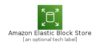
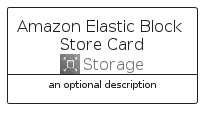
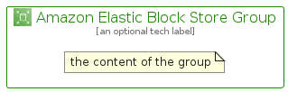

# AmazonElasticBlockStore


```text
aws-q2-2022/Architecture/Storage/AmazonElasticBlockStore
```

```text
include('aws-q2-2022/Architecture/Storage/AmazonElasticBlockStore')
```


| Illustration | AmazonElasticBlockStore | AmazonElasticBlockStoreCard | AmazonElasticBlockStoreGroup |
| :---: | :---: | :---: | :---: |
|  |  |  |  |


## AmazonElasticBlockStore

### Load remotely
```plantuml
@startuml
' configures the library
!global $LIB_BASE_LOCATION="https://raw.githubusercontent.com/tmorin/plantuml-libs/master/distribution"

' loads the library's bootstrap
!include $LIB_BASE_LOCATION/bootstrap.puml

' loads the package bootstrap
include('aws-q2-2022/bootstrap')

' loads the Item which embeds the element AmazonElasticBlockStore
include('aws-q2-2022/Architecture/Storage/AmazonElasticBlockStore')

' renders the element
AmazonElasticBlockStore('AmazonElasticBlockStore', 'Amazon Elastic Block Store', 'an optional tech label', 'an optional description')
@enduml
```

### Load locally
```plantuml
@startuml
' configures the library
!global $INCLUSION_MODE="local"
!global $LIB_BASE_LOCATION="../../.."

' loads the library's bootstrap
!include $LIB_BASE_LOCATION/bootstrap.puml

' loads the package bootstrap
include('aws-q2-2022/bootstrap')

' loads the Item which embeds the element AmazonElasticBlockStore
include('aws-q2-2022/Architecture/Storage/AmazonElasticBlockStore')

' renders the element
AmazonElasticBlockStore('AmazonElasticBlockStore', 'Amazon Elastic Block Store', 'an optional tech label', 'an optional description')
@enduml
```

## AmazonElasticBlockStoreCard

### Load remotely
```plantuml
@startuml
' configures the library
!global $LIB_BASE_LOCATION="https://raw.githubusercontent.com/tmorin/plantuml-libs/master/distribution"

' loads the library's bootstrap
!include $LIB_BASE_LOCATION/bootstrap.puml

' loads the package bootstrap
include('aws-q2-2022/bootstrap')

' loads the Item which embeds the element AmazonElasticBlockStoreCard
include('aws-q2-2022/Architecture/Storage/AmazonElasticBlockStore')

' renders the element
AmazonElasticBlockStoreCard('AmazonElasticBlockStoreCard', 'Amazon Elastic Block Store Card', 'an optional description')
@enduml
```

### Load locally
```plantuml
@startuml
' configures the library
!global $INCLUSION_MODE="local"
!global $LIB_BASE_LOCATION="../../.."

' loads the library's bootstrap
!include $LIB_BASE_LOCATION/bootstrap.puml

' loads the package bootstrap
include('aws-q2-2022/bootstrap')

' loads the Item which embeds the element AmazonElasticBlockStoreCard
include('aws-q2-2022/Architecture/Storage/AmazonElasticBlockStore')

' renders the element
AmazonElasticBlockStoreCard('AmazonElasticBlockStoreCard', 'Amazon Elastic Block Store Card', 'an optional description')
@enduml
```

## AmazonElasticBlockStoreGroup

### Load remotely
```plantuml
@startuml
' configures the library
!global $LIB_BASE_LOCATION="https://raw.githubusercontent.com/tmorin/plantuml-libs/master/distribution"

' loads the library's bootstrap
!include $LIB_BASE_LOCATION/bootstrap.puml

' loads the package bootstrap
include('aws-q2-2022/bootstrap')

' loads the Item which embeds the element AmazonElasticBlockStoreGroup
include('aws-q2-2022/Architecture/Storage/AmazonElasticBlockStore')

' renders the element
AmazonElasticBlockStoreGroup('AmazonElasticBlockStoreGroup', 'Amazon Elastic Block Store Group', 'an optional tech label') {
    note as note
        the content of the group
    end note
}
@enduml
```

### Load locally
```plantuml
@startuml
' configures the library
!global $INCLUSION_MODE="local"
!global $LIB_BASE_LOCATION="../../.."

' loads the library's bootstrap
!include $LIB_BASE_LOCATION/bootstrap.puml

' loads the package bootstrap
include('aws-q2-2022/bootstrap')

' loads the Item which embeds the element AmazonElasticBlockStoreGroup
include('aws-q2-2022/Architecture/Storage/AmazonElasticBlockStore')

' renders the element
AmazonElasticBlockStoreGroup('AmazonElasticBlockStoreGroup', 'Amazon Elastic Block Store Group', 'an optional tech label') {
    note as note
        the content of the group
    end note
}
@enduml
```

