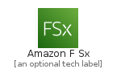
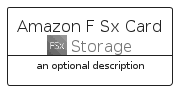
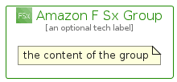

# AmazonFSx


```text
aws-q2-2022/Architecture/Storage/AmazonFSx
```

```text
include('aws-q2-2022/Architecture/Storage/AmazonFSx')
```


| Illustration | AmazonFSx | AmazonFSxCard | AmazonFSxGroup |
| :---: | :---: | :---: | :---: |
|  |  |  |  |


## AmazonFSx

### Load remotely
```plantuml
@startuml
' configures the library
!global $LIB_BASE_LOCATION="https://raw.githubusercontent.com/tmorin/plantuml-libs/master/distribution"

' loads the library's bootstrap
!include $LIB_BASE_LOCATION/bootstrap.puml

' loads the package bootstrap
include('aws-q2-2022/bootstrap')

' loads the Item which embeds the element AmazonFSx
include('aws-q2-2022/Architecture/Storage/AmazonFSx')

' renders the element
AmazonFSx('AmazonFSx', 'Amazon F Sx', 'an optional tech label')
@enduml
```

### Load locally
```plantuml
@startuml
' configures the library
!global $INCLUSION_MODE="local"
!global $LIB_BASE_LOCATION="../../.."

' loads the library's bootstrap
!include $LIB_BASE_LOCATION/bootstrap.puml

' loads the package bootstrap
include('aws-q2-2022/bootstrap')

' loads the Item which embeds the element AmazonFSx
include('aws-q2-2022/Architecture/Storage/AmazonFSx')

' renders the element
AmazonFSx('AmazonFSx', 'Amazon F Sx', 'an optional tech label')
@enduml
```

## AmazonFSxCard

### Load remotely
```plantuml
@startuml
' configures the library
!global $LIB_BASE_LOCATION="https://raw.githubusercontent.com/tmorin/plantuml-libs/master/distribution"

' loads the library's bootstrap
!include $LIB_BASE_LOCATION/bootstrap.puml

' loads the package bootstrap
include('aws-q2-2022/bootstrap')

' loads the Item which embeds the element AmazonFSxCard
include('aws-q2-2022/Architecture/Storage/AmazonFSx')

' renders the element
AmazonFSxCard('AmazonFSxCard', 'Amazon F Sx Card', 'an optional description')
@enduml
```

### Load locally
```plantuml
@startuml
' configures the library
!global $INCLUSION_MODE="local"
!global $LIB_BASE_LOCATION="../../.."

' loads the library's bootstrap
!include $LIB_BASE_LOCATION/bootstrap.puml

' loads the package bootstrap
include('aws-q2-2022/bootstrap')

' loads the Item which embeds the element AmazonFSxCard
include('aws-q2-2022/Architecture/Storage/AmazonFSx')

' renders the element
AmazonFSxCard('AmazonFSxCard', 'Amazon F Sx Card', 'an optional description')
@enduml
```

## AmazonFSxGroup

### Load remotely
```plantuml
@startuml
' configures the library
!global $LIB_BASE_LOCATION="https://raw.githubusercontent.com/tmorin/plantuml-libs/master/distribution"

' loads the library's bootstrap
!include $LIB_BASE_LOCATION/bootstrap.puml

' loads the package bootstrap
include('aws-q2-2022/bootstrap')

' loads the Item which embeds the element AmazonFSxGroup
include('aws-q2-2022/Architecture/Storage/AmazonFSx')

' renders the element
AmazonFSxGroup('AmazonFSxGroup', 'Amazon F Sx Group', 'an optional tech label') {
    note as note
        the content of the group
    end note
}
@enduml
```

### Load locally
```plantuml
@startuml
' configures the library
!global $INCLUSION_MODE="local"
!global $LIB_BASE_LOCATION="../../.."

' loads the library's bootstrap
!include $LIB_BASE_LOCATION/bootstrap.puml

' loads the package bootstrap
include('aws-q2-2022/bootstrap')

' loads the Item which embeds the element AmazonFSxGroup
include('aws-q2-2022/Architecture/Storage/AmazonFSx')

' renders the element
AmazonFSxGroup('AmazonFSxGroup', 'Amazon F Sx Group', 'an optional tech label') {
    note as note
        the content of the group
    end note
}
@enduml
```

