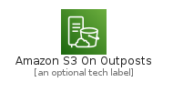
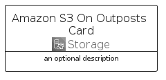
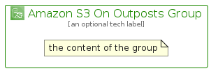

# AmazonS3OnOutposts


```text
aws-q2-2022/Architecture/Storage/AmazonS3OnOutposts
```

```text
include('aws-q2-2022/Architecture/Storage/AmazonS3OnOutposts')
```


| Illustration | AmazonS3OnOutposts | AmazonS3OnOutpostsCard | AmazonS3OnOutpostsGroup |
| :---: | :---: | :---: | :---: |
|  |  |  |  |


## AmazonS3OnOutposts

### Load remotely
```plantuml
@startuml
' configures the library
!global $LIB_BASE_LOCATION="https://raw.githubusercontent.com/tmorin/plantuml-libs/master/distribution"

' loads the library's bootstrap
!include $LIB_BASE_LOCATION/bootstrap.puml

' loads the package bootstrap
include('aws-q2-2022/bootstrap')

' loads the Item which embeds the element AmazonS3OnOutposts
include('aws-q2-2022/Architecture/Storage/AmazonS3OnOutposts')

' renders the element
AmazonS3OnOutposts('AmazonS3OnOutposts', 'Amazon S3 On Outposts', 'an optional tech label', 'an optional description')
@enduml
```

### Load locally
```plantuml
@startuml
' configures the library
!global $INCLUSION_MODE="local"
!global $LIB_BASE_LOCATION="../../.."

' loads the library's bootstrap
!include $LIB_BASE_LOCATION/bootstrap.puml

' loads the package bootstrap
include('aws-q2-2022/bootstrap')

' loads the Item which embeds the element AmazonS3OnOutposts
include('aws-q2-2022/Architecture/Storage/AmazonS3OnOutposts')

' renders the element
AmazonS3OnOutposts('AmazonS3OnOutposts', 'Amazon S3 On Outposts', 'an optional tech label', 'an optional description')
@enduml
```

## AmazonS3OnOutpostsCard

### Load remotely
```plantuml
@startuml
' configures the library
!global $LIB_BASE_LOCATION="https://raw.githubusercontent.com/tmorin/plantuml-libs/master/distribution"

' loads the library's bootstrap
!include $LIB_BASE_LOCATION/bootstrap.puml

' loads the package bootstrap
include('aws-q2-2022/bootstrap')

' loads the Item which embeds the element AmazonS3OnOutpostsCard
include('aws-q2-2022/Architecture/Storage/AmazonS3OnOutposts')

' renders the element
AmazonS3OnOutpostsCard('AmazonS3OnOutpostsCard', 'Amazon S3 On Outposts Card', 'an optional description')
@enduml
```

### Load locally
```plantuml
@startuml
' configures the library
!global $INCLUSION_MODE="local"
!global $LIB_BASE_LOCATION="../../.."

' loads the library's bootstrap
!include $LIB_BASE_LOCATION/bootstrap.puml

' loads the package bootstrap
include('aws-q2-2022/bootstrap')

' loads the Item which embeds the element AmazonS3OnOutpostsCard
include('aws-q2-2022/Architecture/Storage/AmazonS3OnOutposts')

' renders the element
AmazonS3OnOutpostsCard('AmazonS3OnOutpostsCard', 'Amazon S3 On Outposts Card', 'an optional description')
@enduml
```

## AmazonS3OnOutpostsGroup

### Load remotely
```plantuml
@startuml
' configures the library
!global $LIB_BASE_LOCATION="https://raw.githubusercontent.com/tmorin/plantuml-libs/master/distribution"

' loads the library's bootstrap
!include $LIB_BASE_LOCATION/bootstrap.puml

' loads the package bootstrap
include('aws-q2-2022/bootstrap')

' loads the Item which embeds the element AmazonS3OnOutpostsGroup
include('aws-q2-2022/Architecture/Storage/AmazonS3OnOutposts')

' renders the element
AmazonS3OnOutpostsGroup('AmazonS3OnOutpostsGroup', 'Amazon S3 On Outposts Group', 'an optional tech label') {
    note as note
        the content of the group
    end note
}
@enduml
```

### Load locally
```plantuml
@startuml
' configures the library
!global $INCLUSION_MODE="local"
!global $LIB_BASE_LOCATION="../../.."

' loads the library's bootstrap
!include $LIB_BASE_LOCATION/bootstrap.puml

' loads the package bootstrap
include('aws-q2-2022/bootstrap')

' loads the Item which embeds the element AmazonS3OnOutpostsGroup
include('aws-q2-2022/Architecture/Storage/AmazonS3OnOutposts')

' renders the element
AmazonS3OnOutpostsGroup('AmazonS3OnOutpostsGroup', 'Amazon S3 On Outposts Group', 'an optional tech label') {
    note as note
        the content of the group
    end note
}
@enduml
```

