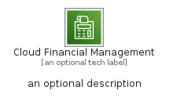
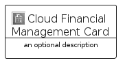
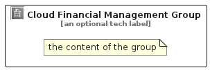

# CloudFinancialManagement


```text
aws-q2-2022/Category/CloudFinancialManagement
```

```text
include('aws-q2-2022/Category/CloudFinancialManagement')
```


| Illustration | CloudFinancialManagement | CloudFinancialManagementCard | CloudFinancialManagementGroup |
| :---: | :---: | :---: | :---: |
|  |  |  |  |


## CloudFinancialManagement

### Load remotely
```plantuml
@startuml
' configures the library
!global $LIB_BASE_LOCATION="https://raw.githubusercontent.com/tmorin/plantuml-libs/master/distribution"

' loads the library's bootstrap
!include $LIB_BASE_LOCATION/bootstrap.puml

' loads the package bootstrap
include('aws-q2-2022/bootstrap')

' loads the Item which embeds the element CloudFinancialManagement
include('aws-q2-2022/Category/CloudFinancialManagement')

' renders the element
CloudFinancialManagement('CloudFinancialManagement', 'Cloud Financial Management', 'an optional tech label', 'an optional description')
@enduml
```

### Load locally
```plantuml
@startuml
' configures the library
!global $INCLUSION_MODE="local"
!global $LIB_BASE_LOCATION="../.."

' loads the library's bootstrap
!include $LIB_BASE_LOCATION/bootstrap.puml

' loads the package bootstrap
include('aws-q2-2022/bootstrap')

' loads the Item which embeds the element CloudFinancialManagement
include('aws-q2-2022/Category/CloudFinancialManagement')

' renders the element
CloudFinancialManagement('CloudFinancialManagement', 'Cloud Financial Management', 'an optional tech label', 'an optional description')
@enduml
```

## CloudFinancialManagementCard

### Load remotely
```plantuml
@startuml
' configures the library
!global $LIB_BASE_LOCATION="https://raw.githubusercontent.com/tmorin/plantuml-libs/master/distribution"

' loads the library's bootstrap
!include $LIB_BASE_LOCATION/bootstrap.puml

' loads the package bootstrap
include('aws-q2-2022/bootstrap')

' loads the Item which embeds the element CloudFinancialManagementCard
include('aws-q2-2022/Category/CloudFinancialManagement')

' renders the element
CloudFinancialManagementCard('CloudFinancialManagementCard', 'Cloud Financial Management Card', 'an optional description')
@enduml
```

### Load locally
```plantuml
@startuml
' configures the library
!global $INCLUSION_MODE="local"
!global $LIB_BASE_LOCATION="../.."

' loads the library's bootstrap
!include $LIB_BASE_LOCATION/bootstrap.puml

' loads the package bootstrap
include('aws-q2-2022/bootstrap')

' loads the Item which embeds the element CloudFinancialManagementCard
include('aws-q2-2022/Category/CloudFinancialManagement')

' renders the element
CloudFinancialManagementCard('CloudFinancialManagementCard', 'Cloud Financial Management Card', 'an optional description')
@enduml
```

## CloudFinancialManagementGroup

### Load remotely
```plantuml
@startuml
' configures the library
!global $LIB_BASE_LOCATION="https://raw.githubusercontent.com/tmorin/plantuml-libs/master/distribution"

' loads the library's bootstrap
!include $LIB_BASE_LOCATION/bootstrap.puml

' loads the package bootstrap
include('aws-q2-2022/bootstrap')

' loads the Item which embeds the element CloudFinancialManagementGroup
include('aws-q2-2022/Category/CloudFinancialManagement')

' renders the element
CloudFinancialManagementGroup('CloudFinancialManagementGroup', 'Cloud Financial Management Group', 'an optional tech label') {
    note as note
        the content of the group
    end note
}
@enduml
```

### Load locally
```plantuml
@startuml
' configures the library
!global $INCLUSION_MODE="local"
!global $LIB_BASE_LOCATION="../.."

' loads the library's bootstrap
!include $LIB_BASE_LOCATION/bootstrap.puml

' loads the package bootstrap
include('aws-q2-2022/bootstrap')

' loads the Item which embeds the element CloudFinancialManagementGroup
include('aws-q2-2022/Category/CloudFinancialManagement')

' renders the element
CloudFinancialManagementGroup('CloudFinancialManagementGroup', 'Cloud Financial Management Group', 'an optional tech label') {
    note as note
        the content of the group
    end note
}
@enduml
```

