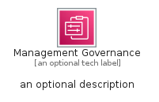
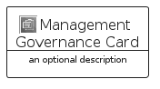
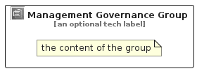

# ManagementGovernance


```text
aws-q2-2022/Category/ManagementGovernance
```

```text
include('aws-q2-2022/Category/ManagementGovernance')
```


| Illustration | ManagementGovernance | ManagementGovernanceCard | ManagementGovernanceGroup |
| :---: | :---: | :---: | :---: |
|  |  |  |  |


## ManagementGovernance

### Load remotely
```plantuml
@startuml
' configures the library
!global $LIB_BASE_LOCATION="https://raw.githubusercontent.com/tmorin/plantuml-libs/master/distribution"

' loads the library's bootstrap
!include $LIB_BASE_LOCATION/bootstrap.puml

' loads the package bootstrap
include('aws-q2-2022/bootstrap')

' loads the Item which embeds the element ManagementGovernance
include('aws-q2-2022/Category/ManagementGovernance')

' renders the element
ManagementGovernance('ManagementGovernance', 'Management Governance', 'an optional tech label')
@enduml
```

### Load locally
```plantuml
@startuml
' configures the library
!global $INCLUSION_MODE="local"
!global $LIB_BASE_LOCATION="../.."

' loads the library's bootstrap
!include $LIB_BASE_LOCATION/bootstrap.puml

' loads the package bootstrap
include('aws-q2-2022/bootstrap')

' loads the Item which embeds the element ManagementGovernance
include('aws-q2-2022/Category/ManagementGovernance')

' renders the element
ManagementGovernance('ManagementGovernance', 'Management Governance', 'an optional tech label')
@enduml
```

## ManagementGovernanceCard

### Load remotely
```plantuml
@startuml
' configures the library
!global $LIB_BASE_LOCATION="https://raw.githubusercontent.com/tmorin/plantuml-libs/master/distribution"

' loads the library's bootstrap
!include $LIB_BASE_LOCATION/bootstrap.puml

' loads the package bootstrap
include('aws-q2-2022/bootstrap')

' loads the Item which embeds the element ManagementGovernanceCard
include('aws-q2-2022/Category/ManagementGovernance')

' renders the element
ManagementGovernanceCard('ManagementGovernanceCard', 'Management Governance Card', 'an optional description')
@enduml
```

### Load locally
```plantuml
@startuml
' configures the library
!global $INCLUSION_MODE="local"
!global $LIB_BASE_LOCATION="../.."

' loads the library's bootstrap
!include $LIB_BASE_LOCATION/bootstrap.puml

' loads the package bootstrap
include('aws-q2-2022/bootstrap')

' loads the Item which embeds the element ManagementGovernanceCard
include('aws-q2-2022/Category/ManagementGovernance')

' renders the element
ManagementGovernanceCard('ManagementGovernanceCard', 'Management Governance Card', 'an optional description')
@enduml
```

## ManagementGovernanceGroup

### Load remotely
```plantuml
@startuml
' configures the library
!global $LIB_BASE_LOCATION="https://raw.githubusercontent.com/tmorin/plantuml-libs/master/distribution"

' loads the library's bootstrap
!include $LIB_BASE_LOCATION/bootstrap.puml

' loads the package bootstrap
include('aws-q2-2022/bootstrap')

' loads the Item which embeds the element ManagementGovernanceGroup
include('aws-q2-2022/Category/ManagementGovernance')

' renders the element
ManagementGovernanceGroup('ManagementGovernanceGroup', 'Management Governance Group', 'an optional tech label') {
    note as note
        the content of the group
    end note
}
@enduml
```

### Load locally
```plantuml
@startuml
' configures the library
!global $INCLUSION_MODE="local"
!global $LIB_BASE_LOCATION="../.."

' loads the library's bootstrap
!include $LIB_BASE_LOCATION/bootstrap.puml

' loads the package bootstrap
include('aws-q2-2022/bootstrap')

' loads the Item which embeds the element ManagementGovernanceGroup
include('aws-q2-2022/Category/ManagementGovernance')

' renders the element
ManagementGovernanceGroup('ManagementGovernanceGroup', 'Management Governance Group', 'an optional tech label') {
    note as note
        the content of the group
    end note
}
@enduml
```

