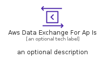
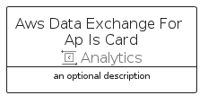
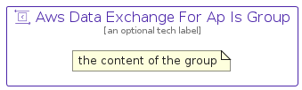

# AwsDataExchangeForApIs


```text
aws-q2-2022/Resource/Analytics/AwsDataExchangeForApIs
```

```text
include('aws-q2-2022/Resource/Analytics/AwsDataExchangeForApIs')
```


| Illustration | AwsDataExchangeForApIs | AwsDataExchangeForApIsCard | AwsDataExchangeForApIsGroup |
| :---: | :---: | :---: | :---: |
|  |  |  |  |


## AwsDataExchangeForApIs

### Load remotely
```plantuml
@startuml
' configures the library
!global $LIB_BASE_LOCATION="https://raw.githubusercontent.com/tmorin/plantuml-libs/master/distribution"

' loads the library's bootstrap
!include $LIB_BASE_LOCATION/bootstrap.puml

' loads the package bootstrap
include('aws-q2-2022/bootstrap')

' loads the Item which embeds the element AwsDataExchangeForApIs
include('aws-q2-2022/Resource/Analytics/AwsDataExchangeForApIs')

' renders the element
AwsDataExchangeForApIs('AwsDataExchangeForApIs', 'Aws Data Exchange For Ap Is', 'an optional tech label')
@enduml
```

### Load locally
```plantuml
@startuml
' configures the library
!global $INCLUSION_MODE="local"
!global $LIB_BASE_LOCATION="../../.."

' loads the library's bootstrap
!include $LIB_BASE_LOCATION/bootstrap.puml

' loads the package bootstrap
include('aws-q2-2022/bootstrap')

' loads the Item which embeds the element AwsDataExchangeForApIs
include('aws-q2-2022/Resource/Analytics/AwsDataExchangeForApIs')

' renders the element
AwsDataExchangeForApIs('AwsDataExchangeForApIs', 'Aws Data Exchange For Ap Is', 'an optional tech label')
@enduml
```

## AwsDataExchangeForApIsCard

### Load remotely
```plantuml
@startuml
' configures the library
!global $LIB_BASE_LOCATION="https://raw.githubusercontent.com/tmorin/plantuml-libs/master/distribution"

' loads the library's bootstrap
!include $LIB_BASE_LOCATION/bootstrap.puml

' loads the package bootstrap
include('aws-q2-2022/bootstrap')

' loads the Item which embeds the element AwsDataExchangeForApIsCard
include('aws-q2-2022/Resource/Analytics/AwsDataExchangeForApIs')

' renders the element
AwsDataExchangeForApIsCard('AwsDataExchangeForApIsCard', 'Aws Data Exchange For Ap Is Card', 'an optional description')
@enduml
```

### Load locally
```plantuml
@startuml
' configures the library
!global $INCLUSION_MODE="local"
!global $LIB_BASE_LOCATION="../../.."

' loads the library's bootstrap
!include $LIB_BASE_LOCATION/bootstrap.puml

' loads the package bootstrap
include('aws-q2-2022/bootstrap')

' loads the Item which embeds the element AwsDataExchangeForApIsCard
include('aws-q2-2022/Resource/Analytics/AwsDataExchangeForApIs')

' renders the element
AwsDataExchangeForApIsCard('AwsDataExchangeForApIsCard', 'Aws Data Exchange For Ap Is Card', 'an optional description')
@enduml
```

## AwsDataExchangeForApIsGroup

### Load remotely
```plantuml
@startuml
' configures the library
!global $LIB_BASE_LOCATION="https://raw.githubusercontent.com/tmorin/plantuml-libs/master/distribution"

' loads the library's bootstrap
!include $LIB_BASE_LOCATION/bootstrap.puml

' loads the package bootstrap
include('aws-q2-2022/bootstrap')

' loads the Item which embeds the element AwsDataExchangeForApIsGroup
include('aws-q2-2022/Resource/Analytics/AwsDataExchangeForApIs')

' renders the element
AwsDataExchangeForApIsGroup('AwsDataExchangeForApIsGroup', 'Aws Data Exchange For Ap Is Group', 'an optional tech label') {
    note as note
        the content of the group
    end note
}
@enduml
```

### Load locally
```plantuml
@startuml
' configures the library
!global $INCLUSION_MODE="local"
!global $LIB_BASE_LOCATION="../../.."

' loads the library's bootstrap
!include $LIB_BASE_LOCATION/bootstrap.puml

' loads the package bootstrap
include('aws-q2-2022/bootstrap')

' loads the Item which embeds the element AwsDataExchangeForApIsGroup
include('aws-q2-2022/Resource/Analytics/AwsDataExchangeForApIs')

' renders the element
AwsDataExchangeForApIsGroup('AwsDataExchangeForApIsGroup', 'Aws Data Exchange For Ap Is Group', 'an optional tech label') {
    note as note
        the content of the group
    end note
}
@enduml
```

