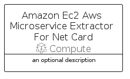

# AmazonEc2AwsMicroserviceExtractorForNet


```text
aws-q2-2022/Resource/Compute/AmazonEc2AwsMicroserviceExtractorForNet
```

```text
include('aws-q2-2022/Resource/Compute/AmazonEc2AwsMicroserviceExtractorForNet')
```


| Illustration | AmazonEc2AwsMicroserviceExtractorForNet | AmazonEc2AwsMicroserviceExtractorForNetCard | AmazonEc2AwsMicroserviceExtractorForNetGroup |
| :---: | :---: | :---: | :---: |
|  |  |  |  |


## AmazonEc2AwsMicroserviceExtractorForNet

### Load remotely
```plantuml
@startuml
' configures the library
!global $LIB_BASE_LOCATION="https://raw.githubusercontent.com/tmorin/plantuml-libs/master/distribution"

' loads the library's bootstrap
!include $LIB_BASE_LOCATION/bootstrap.puml

' loads the package bootstrap
include('aws-q2-2022/bootstrap')

' loads the Item which embeds the element AmazonEc2AwsMicroserviceExtractorForNet
include('aws-q2-2022/Resource/Compute/AmazonEc2AwsMicroserviceExtractorForNet')

' renders the element
AmazonEc2AwsMicroserviceExtractorForNet('AmazonEc2AwsMicroserviceExtractorForNet', 'Amazon Ec2 Aws Microservice Extractor For Net', 'an optional tech label', 'an optional description')
@enduml
```

### Load locally
```plantuml
@startuml
' configures the library
!global $INCLUSION_MODE="local"
!global $LIB_BASE_LOCATION="../../.."

' loads the library's bootstrap
!include $LIB_BASE_LOCATION/bootstrap.puml

' loads the package bootstrap
include('aws-q2-2022/bootstrap')

' loads the Item which embeds the element AmazonEc2AwsMicroserviceExtractorForNet
include('aws-q2-2022/Resource/Compute/AmazonEc2AwsMicroserviceExtractorForNet')

' renders the element
AmazonEc2AwsMicroserviceExtractorForNet('AmazonEc2AwsMicroserviceExtractorForNet', 'Amazon Ec2 Aws Microservice Extractor For Net', 'an optional tech label', 'an optional description')
@enduml
```

## AmazonEc2AwsMicroserviceExtractorForNetCard

### Load remotely
```plantuml
@startuml
' configures the library
!global $LIB_BASE_LOCATION="https://raw.githubusercontent.com/tmorin/plantuml-libs/master/distribution"

' loads the library's bootstrap
!include $LIB_BASE_LOCATION/bootstrap.puml

' loads the package bootstrap
include('aws-q2-2022/bootstrap')

' loads the Item which embeds the element AmazonEc2AwsMicroserviceExtractorForNetCard
include('aws-q2-2022/Resource/Compute/AmazonEc2AwsMicroserviceExtractorForNet')

' renders the element
AmazonEc2AwsMicroserviceExtractorForNetCard('AmazonEc2AwsMicroserviceExtractorForNetCard', 'Amazon Ec2 Aws Microservice Extractor For Net Card', 'an optional description')
@enduml
```

### Load locally
```plantuml
@startuml
' configures the library
!global $INCLUSION_MODE="local"
!global $LIB_BASE_LOCATION="../../.."

' loads the library's bootstrap
!include $LIB_BASE_LOCATION/bootstrap.puml

' loads the package bootstrap
include('aws-q2-2022/bootstrap')

' loads the Item which embeds the element AmazonEc2AwsMicroserviceExtractorForNetCard
include('aws-q2-2022/Resource/Compute/AmazonEc2AwsMicroserviceExtractorForNet')

' renders the element
AmazonEc2AwsMicroserviceExtractorForNetCard('AmazonEc2AwsMicroserviceExtractorForNetCard', 'Amazon Ec2 Aws Microservice Extractor For Net Card', 'an optional description')
@enduml
```

## AmazonEc2AwsMicroserviceExtractorForNetGroup

### Load remotely
```plantuml
@startuml
' configures the library
!global $LIB_BASE_LOCATION="https://raw.githubusercontent.com/tmorin/plantuml-libs/master/distribution"

' loads the library's bootstrap
!include $LIB_BASE_LOCATION/bootstrap.puml

' loads the package bootstrap
include('aws-q2-2022/bootstrap')

' loads the Item which embeds the element AmazonEc2AwsMicroserviceExtractorForNetGroup
include('aws-q2-2022/Resource/Compute/AmazonEc2AwsMicroserviceExtractorForNet')

' renders the element
AmazonEc2AwsMicroserviceExtractorForNetGroup('AmazonEc2AwsMicroserviceExtractorForNetGroup', 'Amazon Ec2 Aws Microservice Extractor For Net Group', 'an optional tech label') {
    note as note
        the content of the group
    end note
}
@enduml
```

### Load locally
```plantuml
@startuml
' configures the library
!global $INCLUSION_MODE="local"
!global $LIB_BASE_LOCATION="../../.."

' loads the library's bootstrap
!include $LIB_BASE_LOCATION/bootstrap.puml

' loads the package bootstrap
include('aws-q2-2022/bootstrap')

' loads the Item which embeds the element AmazonEc2AwsMicroserviceExtractorForNetGroup
include('aws-q2-2022/Resource/Compute/AmazonEc2AwsMicroserviceExtractorForNet')

' renders the element
AmazonEc2AwsMicroserviceExtractorForNetGroup('AmazonEc2AwsMicroserviceExtractorForNetGroup', 'Amazon Ec2 Aws Microservice Extractor For Net Group', 'an optional tech label') {
    note as note
        the content of the group
    end note
}
@enduml
```

