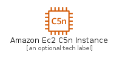
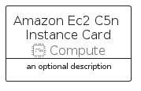
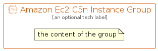

# AmazonEc2C5NInstance


```text
aws-q2-2022/Resource/Compute/AmazonEc2C5NInstance
```

```text
include('aws-q2-2022/Resource/Compute/AmazonEc2C5NInstance')
```


| Illustration | AmazonEc2C5NInstance | AmazonEc2C5NInstanceCard | AmazonEc2C5NInstanceGroup |
| :---: | :---: | :---: | :---: |
|  |  |  |  |


## AmazonEc2C5NInstance

### Load remotely
```plantuml
@startuml
' configures the library
!global $LIB_BASE_LOCATION="https://raw.githubusercontent.com/tmorin/plantuml-libs/master/distribution"

' loads the library's bootstrap
!include $LIB_BASE_LOCATION/bootstrap.puml

' loads the package bootstrap
include('aws-q2-2022/bootstrap')

' loads the Item which embeds the element AmazonEc2C5NInstance
include('aws-q2-2022/Resource/Compute/AmazonEc2C5NInstance')

' renders the element
AmazonEc2C5NInstance('AmazonEc2C5nInstance', 'Amazon Ec2 C5n Instance', 'an optional tech label', 'an optional description')
@enduml
```

### Load locally
```plantuml
@startuml
' configures the library
!global $INCLUSION_MODE="local"
!global $LIB_BASE_LOCATION="../../.."

' loads the library's bootstrap
!include $LIB_BASE_LOCATION/bootstrap.puml

' loads the package bootstrap
include('aws-q2-2022/bootstrap')

' loads the Item which embeds the element AmazonEc2C5NInstance
include('aws-q2-2022/Resource/Compute/AmazonEc2C5NInstance')

' renders the element
AmazonEc2C5NInstance('AmazonEc2C5nInstance', 'Amazon Ec2 C5n Instance', 'an optional tech label', 'an optional description')
@enduml
```

## AmazonEc2C5NInstanceCard

### Load remotely
```plantuml
@startuml
' configures the library
!global $LIB_BASE_LOCATION="https://raw.githubusercontent.com/tmorin/plantuml-libs/master/distribution"

' loads the library's bootstrap
!include $LIB_BASE_LOCATION/bootstrap.puml

' loads the package bootstrap
include('aws-q2-2022/bootstrap')

' loads the Item which embeds the element AmazonEc2C5NInstanceCard
include('aws-q2-2022/Resource/Compute/AmazonEc2C5NInstance')

' renders the element
AmazonEc2C5NInstanceCard('AmazonEc2C5nInstanceCard', 'Amazon Ec2 C5n Instance Card', 'an optional description')
@enduml
```

### Load locally
```plantuml
@startuml
' configures the library
!global $INCLUSION_MODE="local"
!global $LIB_BASE_LOCATION="../../.."

' loads the library's bootstrap
!include $LIB_BASE_LOCATION/bootstrap.puml

' loads the package bootstrap
include('aws-q2-2022/bootstrap')

' loads the Item which embeds the element AmazonEc2C5NInstanceCard
include('aws-q2-2022/Resource/Compute/AmazonEc2C5NInstance')

' renders the element
AmazonEc2C5NInstanceCard('AmazonEc2C5nInstanceCard', 'Amazon Ec2 C5n Instance Card', 'an optional description')
@enduml
```

## AmazonEc2C5NInstanceGroup

### Load remotely
```plantuml
@startuml
' configures the library
!global $LIB_BASE_LOCATION="https://raw.githubusercontent.com/tmorin/plantuml-libs/master/distribution"

' loads the library's bootstrap
!include $LIB_BASE_LOCATION/bootstrap.puml

' loads the package bootstrap
include('aws-q2-2022/bootstrap')

' loads the Item which embeds the element AmazonEc2C5NInstanceGroup
include('aws-q2-2022/Resource/Compute/AmazonEc2C5NInstance')

' renders the element
AmazonEc2C5NInstanceGroup('AmazonEc2C5nInstanceGroup', 'Amazon Ec2 C5n Instance Group', 'an optional tech label') {
    note as note
        the content of the group
    end note
}
@enduml
```

### Load locally
```plantuml
@startuml
' configures the library
!global $INCLUSION_MODE="local"
!global $LIB_BASE_LOCATION="../../.."

' loads the library's bootstrap
!include $LIB_BASE_LOCATION/bootstrap.puml

' loads the package bootstrap
include('aws-q2-2022/bootstrap')

' loads the Item which embeds the element AmazonEc2C5NInstanceGroup
include('aws-q2-2022/Resource/Compute/AmazonEc2C5NInstance')

' renders the element
AmazonEc2C5NInstanceGroup('AmazonEc2C5nInstanceGroup', 'Amazon Ec2 C5n Instance Group', 'an optional tech label') {
    note as note
        the content of the group
    end note
}
@enduml
```

