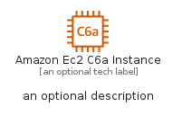
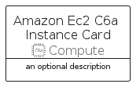
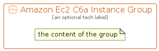

# AmazonEc2C6AInstance


```text
aws-q2-2022/Resource/Compute/AmazonEc2C6AInstance
```

```text
include('aws-q2-2022/Resource/Compute/AmazonEc2C6AInstance')
```


| Illustration | AmazonEc2C6AInstance | AmazonEc2C6AInstanceCard | AmazonEc2C6AInstanceGroup |
| :---: | :---: | :---: | :---: |
|  |  |  |  |


## AmazonEc2C6AInstance

### Load remotely
```plantuml
@startuml
' configures the library
!global $LIB_BASE_LOCATION="https://raw.githubusercontent.com/tmorin/plantuml-libs/master/distribution"

' loads the library's bootstrap
!include $LIB_BASE_LOCATION/bootstrap.puml

' loads the package bootstrap
include('aws-q2-2022/bootstrap')

' loads the Item which embeds the element AmazonEc2C6AInstance
include('aws-q2-2022/Resource/Compute/AmazonEc2C6AInstance')

' renders the element
AmazonEc2C6AInstance('AmazonEc2C6aInstance', 'Amazon Ec2 C6a Instance', 'an optional tech label')
@enduml
```

### Load locally
```plantuml
@startuml
' configures the library
!global $INCLUSION_MODE="local"
!global $LIB_BASE_LOCATION="../../.."

' loads the library's bootstrap
!include $LIB_BASE_LOCATION/bootstrap.puml

' loads the package bootstrap
include('aws-q2-2022/bootstrap')

' loads the Item which embeds the element AmazonEc2C6AInstance
include('aws-q2-2022/Resource/Compute/AmazonEc2C6AInstance')

' renders the element
AmazonEc2C6AInstance('AmazonEc2C6aInstance', 'Amazon Ec2 C6a Instance', 'an optional tech label')
@enduml
```

## AmazonEc2C6AInstanceCard

### Load remotely
```plantuml
@startuml
' configures the library
!global $LIB_BASE_LOCATION="https://raw.githubusercontent.com/tmorin/plantuml-libs/master/distribution"

' loads the library's bootstrap
!include $LIB_BASE_LOCATION/bootstrap.puml

' loads the package bootstrap
include('aws-q2-2022/bootstrap')

' loads the Item which embeds the element AmazonEc2C6AInstanceCard
include('aws-q2-2022/Resource/Compute/AmazonEc2C6AInstance')

' renders the element
AmazonEc2C6AInstanceCard('AmazonEc2C6aInstanceCard', 'Amazon Ec2 C6a Instance Card', 'an optional description')
@enduml
```

### Load locally
```plantuml
@startuml
' configures the library
!global $INCLUSION_MODE="local"
!global $LIB_BASE_LOCATION="../../.."

' loads the library's bootstrap
!include $LIB_BASE_LOCATION/bootstrap.puml

' loads the package bootstrap
include('aws-q2-2022/bootstrap')

' loads the Item which embeds the element AmazonEc2C6AInstanceCard
include('aws-q2-2022/Resource/Compute/AmazonEc2C6AInstance')

' renders the element
AmazonEc2C6AInstanceCard('AmazonEc2C6aInstanceCard', 'Amazon Ec2 C6a Instance Card', 'an optional description')
@enduml
```

## AmazonEc2C6AInstanceGroup

### Load remotely
```plantuml
@startuml
' configures the library
!global $LIB_BASE_LOCATION="https://raw.githubusercontent.com/tmorin/plantuml-libs/master/distribution"

' loads the library's bootstrap
!include $LIB_BASE_LOCATION/bootstrap.puml

' loads the package bootstrap
include('aws-q2-2022/bootstrap')

' loads the Item which embeds the element AmazonEc2C6AInstanceGroup
include('aws-q2-2022/Resource/Compute/AmazonEc2C6AInstance')

' renders the element
AmazonEc2C6AInstanceGroup('AmazonEc2C6aInstanceGroup', 'Amazon Ec2 C6a Instance Group', 'an optional tech label') {
    note as note
        the content of the group
    end note
}
@enduml
```

### Load locally
```plantuml
@startuml
' configures the library
!global $INCLUSION_MODE="local"
!global $LIB_BASE_LOCATION="../../.."

' loads the library's bootstrap
!include $LIB_BASE_LOCATION/bootstrap.puml

' loads the package bootstrap
include('aws-q2-2022/bootstrap')

' loads the Item which embeds the element AmazonEc2C6AInstanceGroup
include('aws-q2-2022/Resource/Compute/AmazonEc2C6AInstance')

' renders the element
AmazonEc2C6AInstanceGroup('AmazonEc2C6aInstanceGroup', 'Amazon Ec2 C6a Instance Group', 'an optional tech label') {
    note as note
        the content of the group
    end note
}
@enduml
```

