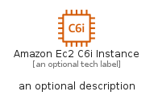
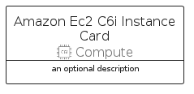
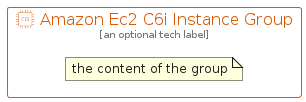

# AmazonEc2C6IInstance


```text
aws-q2-2022/Resource/Compute/AmazonEc2C6IInstance
```

```text
include('aws-q2-2022/Resource/Compute/AmazonEc2C6IInstance')
```


| Illustration | AmazonEc2C6IInstance | AmazonEc2C6IInstanceCard | AmazonEc2C6IInstanceGroup |
| :---: | :---: | :---: | :---: |
|  |  |  |  |


## AmazonEc2C6IInstance

### Load remotely
```plantuml
@startuml
' configures the library
!global $LIB_BASE_LOCATION="https://raw.githubusercontent.com/tmorin/plantuml-libs/master/distribution"

' loads the library's bootstrap
!include $LIB_BASE_LOCATION/bootstrap.puml

' loads the package bootstrap
include('aws-q2-2022/bootstrap')

' loads the Item which embeds the element AmazonEc2C6IInstance
include('aws-q2-2022/Resource/Compute/AmazonEc2C6IInstance')

' renders the element
AmazonEc2C6IInstance('AmazonEc2C6iInstance', 'Amazon Ec2 C6i Instance', 'an optional tech label', 'an optional description')
@enduml
```

### Load locally
```plantuml
@startuml
' configures the library
!global $INCLUSION_MODE="local"
!global $LIB_BASE_LOCATION="../../.."

' loads the library's bootstrap
!include $LIB_BASE_LOCATION/bootstrap.puml

' loads the package bootstrap
include('aws-q2-2022/bootstrap')

' loads the Item which embeds the element AmazonEc2C6IInstance
include('aws-q2-2022/Resource/Compute/AmazonEc2C6IInstance')

' renders the element
AmazonEc2C6IInstance('AmazonEc2C6iInstance', 'Amazon Ec2 C6i Instance', 'an optional tech label', 'an optional description')
@enduml
```

## AmazonEc2C6IInstanceCard

### Load remotely
```plantuml
@startuml
' configures the library
!global $LIB_BASE_LOCATION="https://raw.githubusercontent.com/tmorin/plantuml-libs/master/distribution"

' loads the library's bootstrap
!include $LIB_BASE_LOCATION/bootstrap.puml

' loads the package bootstrap
include('aws-q2-2022/bootstrap')

' loads the Item which embeds the element AmazonEc2C6IInstanceCard
include('aws-q2-2022/Resource/Compute/AmazonEc2C6IInstance')

' renders the element
AmazonEc2C6IInstanceCard('AmazonEc2C6iInstanceCard', 'Amazon Ec2 C6i Instance Card', 'an optional description')
@enduml
```

### Load locally
```plantuml
@startuml
' configures the library
!global $INCLUSION_MODE="local"
!global $LIB_BASE_LOCATION="../../.."

' loads the library's bootstrap
!include $LIB_BASE_LOCATION/bootstrap.puml

' loads the package bootstrap
include('aws-q2-2022/bootstrap')

' loads the Item which embeds the element AmazonEc2C6IInstanceCard
include('aws-q2-2022/Resource/Compute/AmazonEc2C6IInstance')

' renders the element
AmazonEc2C6IInstanceCard('AmazonEc2C6iInstanceCard', 'Amazon Ec2 C6i Instance Card', 'an optional description')
@enduml
```

## AmazonEc2C6IInstanceGroup

### Load remotely
```plantuml
@startuml
' configures the library
!global $LIB_BASE_LOCATION="https://raw.githubusercontent.com/tmorin/plantuml-libs/master/distribution"

' loads the library's bootstrap
!include $LIB_BASE_LOCATION/bootstrap.puml

' loads the package bootstrap
include('aws-q2-2022/bootstrap')

' loads the Item which embeds the element AmazonEc2C6IInstanceGroup
include('aws-q2-2022/Resource/Compute/AmazonEc2C6IInstance')

' renders the element
AmazonEc2C6IInstanceGroup('AmazonEc2C6iInstanceGroup', 'Amazon Ec2 C6i Instance Group', 'an optional tech label') {
    note as note
        the content of the group
    end note
}
@enduml
```

### Load locally
```plantuml
@startuml
' configures the library
!global $INCLUSION_MODE="local"
!global $LIB_BASE_LOCATION="../../.."

' loads the library's bootstrap
!include $LIB_BASE_LOCATION/bootstrap.puml

' loads the package bootstrap
include('aws-q2-2022/bootstrap')

' loads the Item which embeds the element AmazonEc2C6IInstanceGroup
include('aws-q2-2022/Resource/Compute/AmazonEc2C6IInstance')

' renders the element
AmazonEc2C6IInstanceGroup('AmazonEc2C6iInstanceGroup', 'Amazon Ec2 C6i Instance Group', 'an optional tech label') {
    note as note
        the content of the group
    end note
}
@enduml
```

