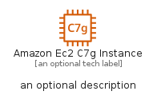
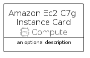
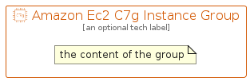

# AmazonEc2C7GInstance


```text
aws-q2-2022/Resource/Compute/AmazonEc2C7GInstance
```

```text
include('aws-q2-2022/Resource/Compute/AmazonEc2C7GInstance')
```


| Illustration | AmazonEc2C7GInstance | AmazonEc2C7GInstanceCard | AmazonEc2C7GInstanceGroup |
| :---: | :---: | :---: | :---: |
|  |  |  |  |


## AmazonEc2C7GInstance

### Load remotely
```plantuml
@startuml
' configures the library
!global $LIB_BASE_LOCATION="https://raw.githubusercontent.com/tmorin/plantuml-libs/master/distribution"

' loads the library's bootstrap
!include $LIB_BASE_LOCATION/bootstrap.puml

' loads the package bootstrap
include('aws-q2-2022/bootstrap')

' loads the Item which embeds the element AmazonEc2C7GInstance
include('aws-q2-2022/Resource/Compute/AmazonEc2C7GInstance')

' renders the element
AmazonEc2C7GInstance('AmazonEc2C7gInstance', 'Amazon Ec2 C7g Instance', 'an optional tech label')
@enduml
```

### Load locally
```plantuml
@startuml
' configures the library
!global $INCLUSION_MODE="local"
!global $LIB_BASE_LOCATION="../../.."

' loads the library's bootstrap
!include $LIB_BASE_LOCATION/bootstrap.puml

' loads the package bootstrap
include('aws-q2-2022/bootstrap')

' loads the Item which embeds the element AmazonEc2C7GInstance
include('aws-q2-2022/Resource/Compute/AmazonEc2C7GInstance')

' renders the element
AmazonEc2C7GInstance('AmazonEc2C7gInstance', 'Amazon Ec2 C7g Instance', 'an optional tech label')
@enduml
```

## AmazonEc2C7GInstanceCard

### Load remotely
```plantuml
@startuml
' configures the library
!global $LIB_BASE_LOCATION="https://raw.githubusercontent.com/tmorin/plantuml-libs/master/distribution"

' loads the library's bootstrap
!include $LIB_BASE_LOCATION/bootstrap.puml

' loads the package bootstrap
include('aws-q2-2022/bootstrap')

' loads the Item which embeds the element AmazonEc2C7GInstanceCard
include('aws-q2-2022/Resource/Compute/AmazonEc2C7GInstance')

' renders the element
AmazonEc2C7GInstanceCard('AmazonEc2C7gInstanceCard', 'Amazon Ec2 C7g Instance Card', 'an optional description')
@enduml
```

### Load locally
```plantuml
@startuml
' configures the library
!global $INCLUSION_MODE="local"
!global $LIB_BASE_LOCATION="../../.."

' loads the library's bootstrap
!include $LIB_BASE_LOCATION/bootstrap.puml

' loads the package bootstrap
include('aws-q2-2022/bootstrap')

' loads the Item which embeds the element AmazonEc2C7GInstanceCard
include('aws-q2-2022/Resource/Compute/AmazonEc2C7GInstance')

' renders the element
AmazonEc2C7GInstanceCard('AmazonEc2C7gInstanceCard', 'Amazon Ec2 C7g Instance Card', 'an optional description')
@enduml
```

## AmazonEc2C7GInstanceGroup

### Load remotely
```plantuml
@startuml
' configures the library
!global $LIB_BASE_LOCATION="https://raw.githubusercontent.com/tmorin/plantuml-libs/master/distribution"

' loads the library's bootstrap
!include $LIB_BASE_LOCATION/bootstrap.puml

' loads the package bootstrap
include('aws-q2-2022/bootstrap')

' loads the Item which embeds the element AmazonEc2C7GInstanceGroup
include('aws-q2-2022/Resource/Compute/AmazonEc2C7GInstance')

' renders the element
AmazonEc2C7GInstanceGroup('AmazonEc2C7gInstanceGroup', 'Amazon Ec2 C7g Instance Group', 'an optional tech label') {
    note as note
        the content of the group
    end note
}
@enduml
```

### Load locally
```plantuml
@startuml
' configures the library
!global $INCLUSION_MODE="local"
!global $LIB_BASE_LOCATION="../../.."

' loads the library's bootstrap
!include $LIB_BASE_LOCATION/bootstrap.puml

' loads the package bootstrap
include('aws-q2-2022/bootstrap')

' loads the Item which embeds the element AmazonEc2C7GInstanceGroup
include('aws-q2-2022/Resource/Compute/AmazonEc2C7GInstance')

' renders the element
AmazonEc2C7GInstanceGroup('AmazonEc2C7gInstanceGroup', 'Amazon Ec2 C7g Instance Group', 'an optional tech label') {
    note as note
        the content of the group
    end note
}
@enduml
```

