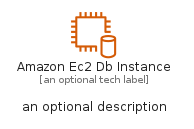
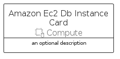

# AmazonEc2DbInstance


```text
aws-q2-2022/Resource/Compute/AmazonEc2DbInstance
```

```text
include('aws-q2-2022/Resource/Compute/AmazonEc2DbInstance')
```


| Illustration | AmazonEc2DbInstance | AmazonEc2DbInstanceCard | AmazonEc2DbInstanceGroup |
| :---: | :---: | :---: | :---: |
|  |  |  |  |


## AmazonEc2DbInstance

### Load remotely
```plantuml
@startuml
' configures the library
!global $LIB_BASE_LOCATION="https://raw.githubusercontent.com/tmorin/plantuml-libs/master/distribution"

' loads the library's bootstrap
!include $LIB_BASE_LOCATION/bootstrap.puml

' loads the package bootstrap
include('aws-q2-2022/bootstrap')

' loads the Item which embeds the element AmazonEc2DbInstance
include('aws-q2-2022/Resource/Compute/AmazonEc2DbInstance')

' renders the element
AmazonEc2DbInstance('AmazonEc2DbInstance', 'Amazon Ec2 Db Instance', 'an optional tech label', 'an optional description')
@enduml
```

### Load locally
```plantuml
@startuml
' configures the library
!global $INCLUSION_MODE="local"
!global $LIB_BASE_LOCATION="../../.."

' loads the library's bootstrap
!include $LIB_BASE_LOCATION/bootstrap.puml

' loads the package bootstrap
include('aws-q2-2022/bootstrap')

' loads the Item which embeds the element AmazonEc2DbInstance
include('aws-q2-2022/Resource/Compute/AmazonEc2DbInstance')

' renders the element
AmazonEc2DbInstance('AmazonEc2DbInstance', 'Amazon Ec2 Db Instance', 'an optional tech label', 'an optional description')
@enduml
```

## AmazonEc2DbInstanceCard

### Load remotely
```plantuml
@startuml
' configures the library
!global $LIB_BASE_LOCATION="https://raw.githubusercontent.com/tmorin/plantuml-libs/master/distribution"

' loads the library's bootstrap
!include $LIB_BASE_LOCATION/bootstrap.puml

' loads the package bootstrap
include('aws-q2-2022/bootstrap')

' loads the Item which embeds the element AmazonEc2DbInstanceCard
include('aws-q2-2022/Resource/Compute/AmazonEc2DbInstance')

' renders the element
AmazonEc2DbInstanceCard('AmazonEc2DbInstanceCard', 'Amazon Ec2 Db Instance Card', 'an optional description')
@enduml
```

### Load locally
```plantuml
@startuml
' configures the library
!global $INCLUSION_MODE="local"
!global $LIB_BASE_LOCATION="../../.."

' loads the library's bootstrap
!include $LIB_BASE_LOCATION/bootstrap.puml

' loads the package bootstrap
include('aws-q2-2022/bootstrap')

' loads the Item which embeds the element AmazonEc2DbInstanceCard
include('aws-q2-2022/Resource/Compute/AmazonEc2DbInstance')

' renders the element
AmazonEc2DbInstanceCard('AmazonEc2DbInstanceCard', 'Amazon Ec2 Db Instance Card', 'an optional description')
@enduml
```

## AmazonEc2DbInstanceGroup

### Load remotely
```plantuml
@startuml
' configures the library
!global $LIB_BASE_LOCATION="https://raw.githubusercontent.com/tmorin/plantuml-libs/master/distribution"

' loads the library's bootstrap
!include $LIB_BASE_LOCATION/bootstrap.puml

' loads the package bootstrap
include('aws-q2-2022/bootstrap')

' loads the Item which embeds the element AmazonEc2DbInstanceGroup
include('aws-q2-2022/Resource/Compute/AmazonEc2DbInstance')

' renders the element
AmazonEc2DbInstanceGroup('AmazonEc2DbInstanceGroup', 'Amazon Ec2 Db Instance Group', 'an optional tech label') {
    note as note
        the content of the group
    end note
}
@enduml
```

### Load locally
```plantuml
@startuml
' configures the library
!global $INCLUSION_MODE="local"
!global $LIB_BASE_LOCATION="../../.."

' loads the library's bootstrap
!include $LIB_BASE_LOCATION/bootstrap.puml

' loads the package bootstrap
include('aws-q2-2022/bootstrap')

' loads the Item which embeds the element AmazonEc2DbInstanceGroup
include('aws-q2-2022/Resource/Compute/AmazonEc2DbInstance')

' renders the element
AmazonEc2DbInstanceGroup('AmazonEc2DbInstanceGroup', 'Amazon Ec2 Db Instance Group', 'an optional tech label') {
    note as note
        the content of the group
    end note
}
@enduml
```

